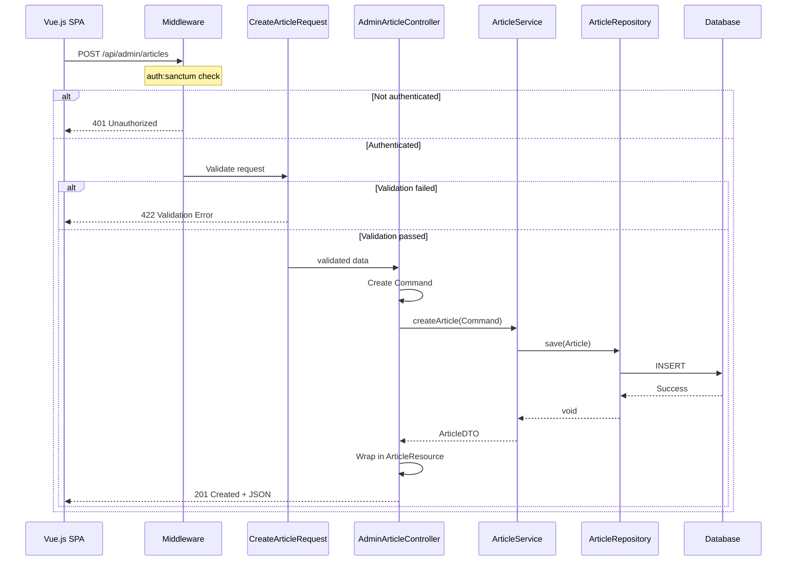
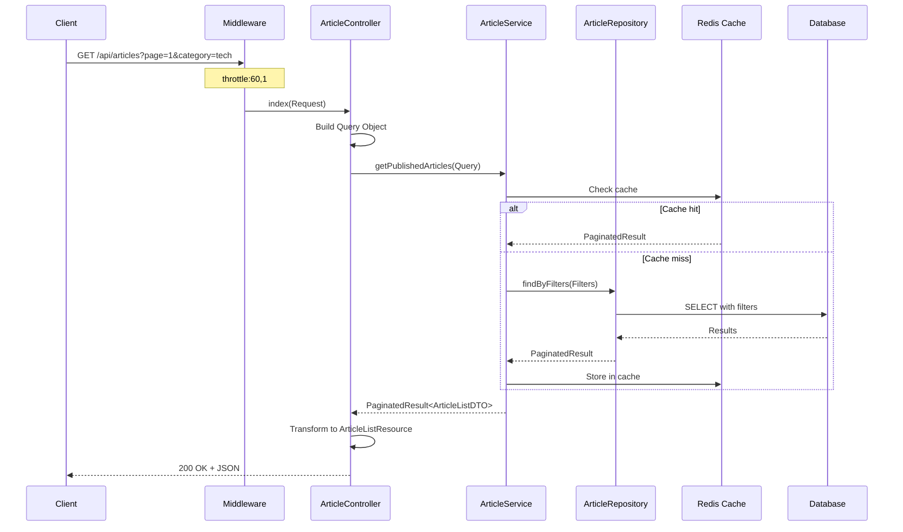

# Design: HTTP Layer (API)

**Дата:** 2026-03-19
**Этап:** Design (2/7)
**Основано на:** research-http-api.md

---

## Обзор

Дизайн HTTP Layer для REST API блога с чётким разделением на Public API и Admin API, Laravel Sanctum для аутентификации и типизированными Request/Response объектами.

**Ключевые решения:**
- Разделение на Public API (без аутентификации) и Admin API (Sanctum)
- Form Request классы для валидации
- API Resources для форматирования ответов
- Cookie-based аутентификация для SPA
- Rate limiting для публичных endpoints

---

## Архитектурный стиль

**Layered Architecture** с чётким разделением ответственности:

```
┌─────────────────────────────────────────────────────────────────┐
│                      HTTP Layer (API)                           │
│  Controllers → Requests → Resources → Middleware                │
├─────────────────────────────────────────────────────────────────┤
│                   Application Layer                              │
│  Services, DTOs, Commands/Queries                               │
├─────────────────────────────────────────────────────────────────┤
│                     Domain Layer                                 │
│  Entities, Value Objects, Repository Interfaces                 │
└─────────────────────────────────────────────────────────────────┘
```

**Flow:**
```
Request → Middleware → Form Request (validation) → Controller → Service → Repository → Database
                                                                    ↓
Response ← API Resource ← DTO ← Service ←─────────────────────────┘
```

---

## Диаграмма компонентов

```mermaid
graph TB
    subgraph "Client"
        SPA[Vue.js SPA]
        PUBLIC[Public Visitors]
    end

    subgraph "HTTP Layer"
        subgraph "Middleware"
            AUTH[auth:sanctum]
            THROTTLE[throttle]
            CSRF[CSRF]
        end

        subgraph "Public API"
            AC[ArticleController]
            CC[CategoryController]
            TC[TagController]
            CONTACTC[ContactController]
            SC[SettingsController]
            HC[HealthController]
        end

        subgraph "Admin API"
            AUTHC[AuthController]
            AAC[AdminArticleController]
            ACC[AdminCategoryController]
            ATC[AdminTagController]
            AMC[AdminMediaController]
            AMSGC[AdminMessageController]
            ASC[AdminSettingsController]
            AUC[AdminUserController]
        end

        subgraph "Requests"
            REQ[Form Requests<br/>CreateArticleRequest<br/>UpdateArticleRequest<br/>ContactRequest<br/>LoginRequest]
        end

        subgraph "Resources"
            RES[API Resources<br/>ArticleResource<br/>ArticleListResource<br/>CategoryResource<br/>TagResource<br/>MediaResource<br/>UserResource<br/>SettingsResource]
        end
    end

    subgraph "Application Layer"
        ARSVC[ArticleService]
        CNSVC[ContactService]
        AUTHSVC[AuthenticationService]
        MEDSVC[MediaService]
        SETSVC[SettingsService]
    end

    PUBLIC --> AC
    PUBLIC --> CC
    PUBLIC --> TC
    PUBLIC --> CONTACTC
    PUBLIC --> SC
    PUBLIC --> HC

    SPA --> AUTHC
    SPA --> AUTH --> AAC
    SPA --> AUTH --> ACC
    SPA --> AUTH --> ATC
    SPA --> AUTH --> AMC
    SPA --> AUTH --> AMSGC
    SPA --> AUTH --> ASC
    SPA --> AUTH --> AUC

    AC --> REQ
    AAC --> REQ
    CONTACTC --> REQ
    AUTHC --> REQ

    AC --> RES
    AAC --> RES
    CC --> RES

    AC --> ARSVC
    AAC --> ARSVC
    CONTACTC --> CNSVC
    AUTHC --> AUTHSVC
    AMC --> MEDSVC
    ASC --> SETSVC
```



---

## Диаграмма последовательности: Создание статьи (Admin)



---

## Диаграмма последовательности: Публичный список статей



---

## Структура директорий

```
laravel/app/Infrastructure/Http/
├── Controllers/
│   ├── Api/
│   │   ├── HealthController.php          # ✅ exists
│   │   ├── ArticleController.php         # Public articles
│   │   ├── CategoryController.php        # Public categories
│   │   ├── TagController.php             # Public tags
│   │   ├── ContactController.php         # Public contact form
│   │   └── SettingsController.php        # Public settings
│   └── Admin/
│       ├── AuthController.php            # Login/Logout
│       ├── AdminArticleController.php    # CRUD + publish/archive
│       ├── AdminCategoryController.php   # CRUD
│       ├── AdminTagController.php        # CRUD
│       ├── AdminMediaController.php      # Upload/Manage
│       ├── AdminMessageController.php    # Read/Delete
│       ├── AdminSettingsController.php   # CRUD
│       └── AdminUserController.php       # CRUD
├── Requests/
│   ├── Api/
│   │   ├── ArticleRequest.php            # Base article validation
│   │   ├── CreateArticleRequest.php      # Create rules
│   │   ├── UpdateArticleRequest.php      # Update rules
│   │   ├── ContactRequest.php            # Contact form validation
│   │   └── SettingsRequest.php           # Settings validation
│   └── Admin/
│       ├── LoginRequest.php              # Auth validation
│       ├── CategoryRequest.php           # Category CRUD
│       ├── TagRequest.php                # Tag CRUD
│       ├── MediaRequest.php              # Media upload
│       └── UserRequest.php               # User CRUD
└── Resources/
    ├── ArticleResource.php               # Single article
    ├── ArticleListResource.php           # Article list item
    ├── CategoryResource.php              # Category with articles count
    ├── CategoryCollectionResource.php    # Category list
    ├── TagResource.php                   # Tag with articles count
    ├── TagCollectionResource.php         # Tag list
    ├── MediaResource.php                 # Media file
    ├── MediaCollectionResource.php       # Media list
    ├── UserResource.php                  # User data
    ├── ContactMessageResource.php        # Contact message
    ├── SettingsResource.php              # Single setting
    ├── SettingsCollectionResource.php    # Settings list
    └── PaginatedResource.php             # Generic pagination wrapper
```

---

## Компоненты

### 1. ArticleController (Public API)

**Расположение:** `Infrastructure/Http/Controllers/Api/ArticleController.php`

**Ответственность:**
- Публичный доступ к опубликованным статьям
- Фильтрация по категории, тегу, поиск
- Кэширование responses

```php
<?php

declare(strict_types=1);

namespace App\Infrastructure\Http\Controllers\Api;

use App\Application\Article\DTOs\ArticleListDTO;
use App\Application\Article\Queries\GetArticleBySlugQuery;
use App\Application\Article\Queries\GetPublishedArticlesQuery;
use App\Application\Article\Services\ArticleService;
use App\Infrastructure\Http\Resources\ArticleListResource;
use App\Infrastructure\Http\Resources\ArticleResource;
use App\Infrastructure\Http\Resources\PaginatedResource;
use Illuminate\Http\JsonResponse;
use Illuminate\Http\Request;
use Illuminate\Http\Response;

final readonly class ArticleController
{
    public function __construct(
        private ArticleService $articleService
    ) {}

    /**
     * Get paginated list of published articles.
     */
    public function index(Request $request): JsonResponse
    {
        $query = new GetPublishedArticlesQuery(
            page: (int) $request->input('page', 1),
            perPage: (int) $request->input('per_page', 15),
            categoryId: $request->input('category'),
            searchTerm: $request->input('search'),
        );

        $result = $this->articleService->getPublishedArticles($query);

        return response()->json(
            new PaginatedResource(
                items: ArticleListResource::collection($result->items),
                meta: [
                    'total' => $result->total,
                    'page' => $result->page,
                    'per_page' => $result->perPage,
                    'last_page' => $result->lastPage,
                    'has_more' => $result->hasMore(),
                ]
            )
        );
    }

    /**
     * Get single article by slug.
     */
    public function show(string $slug): JsonResponse
    {
        $query = new GetArticleBySlugQuery(slug: $slug);

        $article = $this->articleService->getArticleBySlug($query);

        if ($article === null) {
            return response()->json([
                'message' => 'Article not found',
            ], Response::HTTP_NOT_FOUND);
        }

        return response()->json(
            new ArticleResource($article)
        );
    }
}
```

---

### 2. AdminArticleController (Admin API)

**Расположение:** `Infrastructure/Http/Controllers/Admin/AdminArticleController.php`

**Ответственность:**
- CRUD операции для статей
- Публикация/архивирование
- Управление тегами

```php
<?php

declare(strict_types=1);

namespace App\Infrastructure\Http\Controllers\Admin;

use App\Application\Article\Commands\ArchiveArticleCommand;
use App\Application\Article\Commands\CreateArticleCommand;
use App\Application\Article\Commands\PublishArticleCommand;
use App\Application\Article\DTOs\ArticleDTO;
use App\Application\Article\Services\ArticleService;
use App\Domain\Article\ValueObjects\Slug;
use App\Domain\Shared\Uuid;
use App\Infrastructure\Http\Requests\Admin\ArticleTagsRequest;
use App\Infrastructure\Http\Requests\Api\CreateArticleRequest;
use App\Infrastructure\Http\Requests\Api\UpdateArticleRequest;
use App\Infrastructure\Http\Resources\ArticleResource;
use App\Infrastructure\Http\Resources\PaginatedResource;
use Illuminate\Http\JsonResponse;
use Illuminate\Http\Response;

final readonly class AdminArticleController
{
    public function __construct(
        private ArticleService $articleService
    ) {}

    /**
     * List all articles (including drafts) for admin.
     */
    public function index(): JsonResponse
    {
        $result = $this->articleService->getArticlesForAdmin();

        return response()->json(
            new PaginatedResource(/* ... */)
        );
    }

    /**
     * Create new article draft.
     */
    public function store(CreateArticleRequest $request): JsonResponse
    {
        $command = new CreateArticleCommand(
            title: $request->validated('title'),
            content: $request->validated('content'),
            slug: $request->has('slug')
                ? Slug::fromString($request->validated('slug'))
                : null,
            categoryId: $request->has('category_id')
                ? Uuid::fromString($request->validated('category_id'))
                : null,
            authorId: Uuid::fromString($request->user()->id),
        );

        $article = $this->articleService->createArticle($command);

        return response()->json(
            new ArticleResource($article),
            Response::HTTP_CREATED
        );
    }

    /**
     * Get article by ID for editing.
     */
    public function show(string $id): JsonResponse
    {
        $article = $this->articleService->getArticleById(
            Uuid::fromString($id)
        );

        return response()->json(
            new ArticleResource($article)
        );
    }

    /**
     * Update article.
     */
    public function update(UpdateArticleRequest $request, string $id): JsonResponse
    {
        // Update logic...
    }

    /**
     * Delete article.
     */
    public function destroy(string $id): JsonResponse
    {
        $this->articleService->deleteArticle(Uuid::fromString($id));

        return response()->json(null, Response::HTTP_NO_CONTENT);
    }

    /**
     * Publish article.
     */
    public function publish(string $id): JsonResponse
    {
        $command = new PublishArticleCommand(
            articleId: Uuid::fromString($id)
        );

        $article = $this->articleService->publishArticle($command);

        return response()->json(
            new ArticleResource($article)
        );
    }

    /**
     * Archive article.
     */
    public function archive(string $id): JsonResponse
    {
        $command = new ArchiveArticleCommand(
            articleId: Uuid::fromString($id)
        );

        $article = $this->articleService->archiveArticle($command);

        return response()->json(
            new ArticleResource($article)
        );
    }

    /**
     * Sync article tags.
     */
    public function syncTags(ArticleTagsRequest $request, string $id): JsonResponse
    {
        $tagIds = array_map(
            fn(string $tagId) => Uuid::fromString($tagId),
            $request->validated('tag_ids')
        );

        $article = $this->articleService->syncArticleTags(
            articleId: Uuid::fromString($id),
            tagIds: $tagIds
        );

        return response()->json(
            new ArticleResource($article)
        );
    }
}
```

---

### 3. AuthController (Admin API)

**Расположение:** `Infrastructure/Http/Controllers/Admin/AuthController.php`

**Ответственность:**
- Аутентификация пользователей
- Login/Logout
- Получение текущего пользователя

```php
<?php

declare(strict_types=1);

namespace App\Infrastructure\Http\Controllers\Admin;

use App\Application\User\DTOs\AuthRequest;
use App\Application\User\DTOs\UserDTO;
use App\Application\User\Services\AuthenticationService;
use App\Infrastructure\Http\Requests\Admin\LoginRequest;
use App\Infrastructure\Http\Resources\UserResource;
use Illuminate\Http\JsonResponse;
use Illuminate\Http\Response;
use Illuminate\Support\Facades\Auth;

final readonly class AuthController
{
    public function __construct(
        private AuthenticationService $authService
    ) {}

    /**
     * Authenticate user and create session.
     */
    public function login(LoginRequest $request): JsonResponse
    {
        $authRequest = new AuthRequest(
            email: $request->validated('email'),
            password: $request->validated('password')
        );

        $user = $this->authService->login($authRequest);

        if ($user === null) {
            return response()->json([
                'message' => 'Invalid credentials',
            ], Response::HTTP_UNAUTHORIZED);
        }

        // Create session for Sanctum
        $request->session()->regenerate();

        return response()->json([
            'user' => new UserResource($user),
            'message' => 'Authenticated successfully',
        ]);
    }

    /**
     * Logout user and invalidate session.
     */
    public function logout(): JsonResponse
    {
        Auth::guard('web')->logout();

        request()->session()->invalidate();
        request()->session()->regenerateToken();

        return response()->json(null, Response::HTTP_NO_CONTENT);
    }

    /**
     * Get current authenticated user.
     */
    public function user(): JsonResponse
    {
        $user = $this->authService->getUserById(
            Uuid::fromString(Auth::id())
        );

        return response()->json(
            new UserResource($user)
        );
    }
}
```

---

### 4. CreateArticleRequest (Form Request)

**Расположение:** `Infrastructure/Http/Requests/Api/CreateArticleRequest.php`

**Ответственность:**
- Валидация данных для создания статьи
- Авторизация запроса

```php
<?php

declare(strict_types=1);

namespace App\Infrastructure\Http\Requests\Api;

use Illuminate\Contracts\Validation\ValidationRule;
use Illuminate\Foundation\Http\FormRequest;

final class CreateArticleRequest extends FormRequest
{
    /**
     * Determine if the user is authorized to make this request.
     */
    public function authorize(): bool
    {
        // Only authenticated users can create articles
        return $this->user() !== null;
    }

    /**
     * Get the validation rules that apply to the request.
     *
     * @return array<string, ValidationRule|array|string>
     */
    public function rules(): array
    {
        return [
            'title' => ['required', 'string', 'min:1', 'max:255'],
            'content' => ['required', 'string', 'min:1'],
            'slug' => [
                'nullable',
                'string',
                'min:1',
                'max:255',
                'regex:/^[a-z0-9]+(?:-[a-z0-9]+)*$/',
                'unique:articles,slug',
            ],
            'category_id' => ['nullable', 'uuid', 'exists:categories,id'],
            'cover_image_id' => ['nullable', 'uuid', 'exists:media_files,id'],
        ];
    }

    /**
     * Get custom messages for validator errors.
     */
    public function messages(): array
    {
        return [
            'title.required' => 'Article title is required',
            'title.max' => 'Article title cannot exceed 255 characters',
            'content.required' => 'Article content is required',
            'slug.regex' => 'Slug must contain only lowercase letters, numbers, and hyphens',
            'slug.unique' => 'This slug is already taken',
            'category_id.exists' => 'Selected category does not exist',
            'cover_image_id.exists' => 'Selected cover image does not exist',
        ];
    }
}
```

---

### 5. ContactRequest (Form Request)

**Расположение:** `Infrastructure/Http/Requests/Api/ContactRequest.php`

**Ответственность:**
- Валидация контактной формы
- Защита от спама (rate limiting)

```php
<?php

declare(strict_types=1);

namespace App\Infrastructure\Http\Requests\Api;

use Illuminate\Contracts\Validation\ValidationRule;
use Illuminate\Foundation\Http\FormRequest;

final class ContactRequest extends FormRequest
{
    /**
     * Determine if the user is authorized to make this request.
     */
    public function authorize(): bool
    {
        // Public endpoint - always authorized
        return true;
    }

    /**
     * Get the validation rules that apply to the request.
     *
     * @return array<string, ValidationRule|array|string>
     */
    public function rules(): array
    {
        return [
            'name' => ['required', 'string', 'min:1', 'max:100'],
            'email' => ['required', 'email', 'max:254'],
            'subject' => ['required', 'string', 'min:1', 'max:200'],
            'message' => ['required', 'string', 'min:10', 'max:5000'],
        ];
    }

    /**
     * Get custom messages for validator errors.
     */
    public function messages(): array
    {
        return [
            'name.required' => 'Please provide your name',
            'email.required' => 'Email address is required',
            'email.email' => 'Please provide a valid email address',
            'subject.required' => 'Please provide a subject',
            'message.required' => 'Message cannot be empty',
            'message.min' => 'Message must be at least 10 characters',
        ];
    }
}
```

---

### 6. ArticleResource (API Resource)

**Расположение:** `Infrastructure/Http/Resources/ArticleResource.php`

**Ответственность:**
- Трансформация ArticleDTO в JSON response
- Согласованный формат ответа

```php
<?php

declare(strict_types=1);

namespace App\Infrastructure\Http\Resources;

use App\Application\Article\DTOs\ArticleDTO;
use Illuminate\Http\Request;
use Illuminate\Http\Resources\Json\JsonResource;

/**
 * @mixin ArticleDTO
 */
final class ArticleResource extends JsonResource
{
    /**
     * Transform the resource into an array.
     *
     * @return array<string, mixed>
     */
    public function toArray(Request $request): array
    {
        return [
            'id' => $this->id,
            'title' => $this->title,
            'slug' => $this->slug,
            'content' => $this->content,
            'excerpt' => $this->excerpt,
            'status' => $this->status,
            'category_id' => $this->categoryId,
            'author_id' => $this->authorId,
            'cover_image_id' => $this->coverImageId,
            'published_at' => $this->publishedAt,
            'created_at' => $this->createdAt,
            'updated_at' => $this->updatedAt,
            'reading_time' => $this->readingTime,
            'word_count' => $this->wordCount,

            // Conditional includes
            'category' => $this->when(
                $request->has('include_category'),
                fn() => $this->category // Loaded separately
            ),
            'tags' => $this->when(
                $request->has('include_tags'),
                fn() => TagCollectionResource::collection($this->tags)
            ),
            'author' => $this->when(
                $request->has('include_author'),
                fn() => new UserResource($this->author)
            ),
        ];
    }
}
```

---

### 7. ArticleListResource (API Resource)

**Расположение:** `Infrastructure/Http/Resources/ArticleListResource.php`

**Ответственность:**
- Легковесный формат для списков
- Только необходимые поля

```php
<?php

declare(strict_types=1);

namespace App\Infrastructure\Http\Resources;

use App\Application\Article\DTOs\ArticleListDTO;
use Illuminate\Http\Request;
use Illuminate\Http\Resources\Json\JsonResource;

/**
 * @mixin ArticleListDTO
 */
final class ArticleListResource extends JsonResource
{
    /**
     * Transform the resource into an array.
     *
     * @return array<string, mixed>
     */
    public function toArray(Request $request): array
    {
        return [
            'id' => $this->id,
            'title' => $this->title,
            'slug' => $this->slug,
            'excerpt' => $this->excerpt,
            'status' => $this->status,
            'category_id' => $this->categoryId,
            'published_at' => $this->publishedAt,
            'reading_time' => $this->readingTime,

            // Computed URLs
            'url' => url("/articles/{$this->slug}"),
        ];
    }
}
```

---

### 8. PaginatedResource (Generic)

**Расположение:** `Infrastructure/Http/Resources/PaginatedResource.php`

**Ответственность:**
- Универсальная обёртка для пагинированных данных
- Согласованный формат meta

```php
<?php

declare(strict_types=1);

namespace App\Infrastructure\Http\Resources;

use Illuminate\Http\Request;
use Illuminate\Http\Resources\Json\JsonResource;
use Illuminate\Http\Resources\Json\ResourceCollection;

final class PaginatedResource extends JsonResource
{
    /**
     * @param mixed $items Collection of resources or ResourceCollection
     * @param array<string, mixed> $meta Pagination metadata
     */
    public function __construct(
        public readonly mixed $items,
        public readonly array $meta
    ) {
        parent::__construct($items);
    }

    /**
     * Transform the resource into an array.
     *
     * @return array<string, mixed>
     */
    public function toArray(Request $request): array
    {
        return [
            'items' => $this->items,
            'meta' => [
                'total' => $this->meta['total'],
                'page' => $this->meta['page'],
                'per_page' => $this->meta['per_page'],
                'last_page' => $this->meta['last_page'],
                'has_more' => $this->meta['has_more'],
            ],
        ];
    }
}
```

---

## Routes Configuration

### Public API Routes

**Файл:** `routes/api.php`

```php
<?php

declare(strict_types=1);

use App\Infrastructure\Http\Controllers\Api\ArticleController;
use App\Infrastructure\Http\Controllers\Api\CategoryController;
use App\Infrastructure\Http\Controllers\Api\ContactController;
use App\Infrastructure\Http\Controllers\Api\HealthController;
use App\Infrastructure\Http\Controllers\Api\SettingsController;
use App\Infrastructure\Http\Controllers\Api\TagController;
use Illuminate\Support\Facades\Route;

/*
|--------------------------------------------------------------------------
| Public API Routes (no authentication required)
|--------------------------------------------------------------------------
*/

// Health check (no rate limiting)
Route::get('/health', HealthController::class)
    ->name('api.health');

// Articles (public)
Route::middleware(['throttle:60,1'])->group(function () {
    Route::get('/articles', [ArticleController::class, 'index'])
        ->name('api.articles.index');
    Route::get('/articles/{slug}', [ArticleController::class, 'show'])
        ->name('api.articles.show')
        ->where('slug', '[a-z0-9-]+');

    // Categories (public)
    Route::get('/categories', [CategoryController::class, 'index'])
        ->name('api.categories.index');
    Route::get('/categories/{slug}', [CategoryController::class, 'show'])
        ->name('api.categories.show')
        ->where('slug', '[a-z0-9-]+');

    // Tags (public)
    Route::get('/tags', [TagController::class, 'index'])
        ->name('api.tags.index');
    Route::get('/tags/{slug}', [TagController::class, 'show'])
        ->name('api.tags.show')
        ->where('slug', '[a-z0-9-]+');

    // Settings (public)
    Route::get('/settings', [SettingsController::class, 'index'])
        ->name('api.settings.index');

    // Contact form (strict rate limiting)
    Route::post('/contact', [ContactController::class, 'store'])
        ->middleware(['throttle:3,60']) // 3 requests per hour
        ->name('api.contact.store');
});
```

### Admin API Routes

**Файл:** `routes/api.php` (continued)

```php
/*
|--------------------------------------------------------------------------
| Admin API Routes (authentication required)
|--------------------------------------------------------------------------
*/

Route::prefix('admin')->group(function () {

    // Authentication (no auth required for login)
    Route::post('/auth/login', [AuthController::class, 'login'])
        ->name('api.admin.auth.login')
        ->middleware(['throttle:5,1']); // 5 attempts per minute

    Route::post('/auth/logout', [AuthController::class, 'logout'])
        ->name('api.admin.auth.logout');

    Route::get('/user', [AuthController::class, 'user'])
        ->name('api.admin.user');

    // Protected admin routes
    Route::middleware(['auth:sanctum', 'throttle:120,1'])->group(function () {

        // Articles management
        Route::apiResource('articles', AdminArticleController::class)
            ->names('api.admin.articles');
        Route::post('articles/{id}/publish', [AdminArticleController::class, 'publish'])
            ->name('api.admin.articles.publish');
        Route::post('articles/{id}/archive', [AdminArticleController::class, 'archive'])
            ->name('api.admin.articles.archive');
        Route::put('articles/{id}/tags', [AdminArticleController::class, 'syncTags'])
            ->name('api.admin.articles.tags');

        // Categories management
        Route::apiResource('categories', AdminCategoryController::class)
            ->names('api.admin.categories');

        // Tags management
        Route::apiResource('tags', AdminTagController::class)
            ->names('api.admin.tags');

        // Media management
        Route::apiResource('media', AdminMediaController::class)
            ->names('api.admin.media');
        Route::get('media/recent', [AdminMediaController::class, 'recent'])
            ->name('api.admin.media.recent');
        Route::get('media/unused', [AdminMediaController::class, 'unused'])
            ->name('api.admin.media.unused');

        // Contact messages management
        Route::apiResource('messages', AdminMessageController::class)
            ->only(['index', 'show', 'destroy'])
            ->names('api.admin.messages');
        Route::put('messages/{id}/read', [AdminMessageController::class, 'markAsRead'])
            ->name('api.admin.messages.read');
        Route::put('messages/{id}/unread', [AdminMessageController::class, 'markAsUnread'])
            ->name('api.admin.messages.unread');

        // Settings management
        Route::apiResource('settings', AdminSettingsController::class)
            ->only(['index', 'show', 'update', 'destroy'])
            ->names('api.admin.settings');
        Route::get('settings/group/{group}', [AdminSettingsController::class, 'byGroup'])
            ->name('api.admin.settings.group');
        Route::delete('settings/group/{group}', [AdminSettingsController::class, 'deleteGroup'])
            ->name('api.admin.settings.delete-group');

        // Users management
        Route::apiResource('users', AdminUserController::class)
            ->names('api.admin.users');
    });
});
```

---

## Middleware Configuration

### Sanctum Configuration

**Файл:** `config/sanctum.php`

```php
<?php

declare(strict_types=1);

return [
    /*
    |--------------------------------------------------------------------------
    | Stateful Domains
    |--------------------------------------------------------------------------
    |
    | Requests from the following domains / hosts will receive stateful API
    | authentication cookies. Typically, these include your local and
    | production domains which access your API via a frontend SPA.
    |
    */

    'stateful' => explode(',', env('SANCTUM_STATEFUL_DOMAINS', sprintf(
        '%s%s',
        'localhost,localhost:3000,127.0.0.1,127.0.0.1:8000,::1',
        env('APP_URL') ? ','.parse_url(env('APP_URL'), PHP_URL_HOST) : ''
    ))),

    /*
    |--------------------------------------------------------------------------
    | Sanctum Guards
    |--------------------------------------------------------------------------
    |
    | This array contains the authentication guards that will be checked when
    | Sanctum is trying to authenticate a request. If none of these guards
    | are able to authenticate the request, Sanctum will use the bearer
    | token that's present on an incoming request for authentication.
    |
    */

    'guard' => ['web'],

    /*
    |--------------------------------------------------------------------------
    | Expiration Minutes
    |--------------------------------------------------------------------------
    |
    | This value controls the number of minutes until an issued token will be
    | considered expired. If this value is null, personal access tokens do
    | not expire. This won't tweak the lifetime of password-reset tokens.
    |
    */

    'expiration' => null,

    /*
    |--------------------------------------------------------------------------
    | Token Prefix
    |--------------------------------------------------------------------------
    */

    'token_prefix' => env('SANCTUM_TOKEN_PREFIX', ''),

    /*
    |--------------------------------------------------------------------------
    | Sanctum Middleware
    |--------------------------------------------------------------------------
    |
    | The middleware listed here will be attached to every API route that
    | Sanctum registers automatically.
    |
    */

    'middleware' => [
        'authenticate_session' => \Laravel\Sanctum\Http\Middleware\AuthenticateSession::class,
        'encrypt_cookies' => \App\Http\Middleware\EncryptCookies::class,
        'validate_csrf_token' => \App\Http\Middleware\VerifyCsrfToken::class,
    ],
];
```

### Rate Limiting Configuration

**Файл:** `app/Http/Kernel.php` (middleware groups)

```php
protected $middlewareAliases = [
    // ... existing aliases

    'throttle' => \Illuminate\Routing\Middleware\ThrottleRequests::class,
    'throttle_public' => \App\Http\Middleware\ThrottlePublicApi::class,
];
```

### CORS Configuration

**Файл:** `config/cors.php`

```php
<?php

declare(strict_types=1);

return [
    'paths' => ['api/*'],
    'allowed_methods' => ['*'],
    'allowed_origins' => explode(',', env('CORS_ALLOWED_ORIGINS', 'http://localhost:3000')),
    'allowed_origins_patterns' => [],
    'allowed_headers' => ['*'],
    'exposed_headers' => [],
    'max_age' => 0,
    'supports_credentials' => true, // Required for Sanctum cookie auth
];
```

---

## Exception Handling

### API Exception Handler

**Файл:** `app/Exceptions/Handler.php`

```php
<?php

declare(strict_types=1);

namespace App\Exceptions;

use App\Domain\Shared\Exceptions\EntityNotFoundException;
use Illuminate\Auth\AuthenticationException;
use Illuminate\Foundation\Exceptions\Handler as ExceptionHandler;
use Illuminate\Validation\ValidationException;
use Symfony\Component\HttpFoundation\Response;
use Symfony\Component\HttpKernel\Exception\NotFoundHttpException;
use Throwable;

class Handler extends ExceptionHandler
{
    /**
     * The list of the inputs that are never flashed to the session on validation exceptions.
     *
     * @var array<int, string>
     */
    protected $dontFlash = [
        'current_password',
        'password',
        'password_confirmation',
    ];

    /**
     * Register the exception handling callbacks for the application.
     */
    public function register(): void
    {
        $this->reportable(function (Throwable $e) {
            //
        });
    }

    /**
     * Render an exception into an HTTP response.
     */
    public function render($request, Throwable $e)
    {
        // API requests should always return JSON
        if ($request->expectsJson() || $request->is('api/*')) {
            return $this->handleApiException($request, $e);
        }

        return parent::render($request, $e);
    }

    private function handleApiException($request, Throwable $e)
    {
        // EntityNotFoundException -> 404
        if ($e instanceof EntityNotFoundException) {
            return response()->json([
                'message' => $e->getMessage(),
            ], Response::HTTP_NOT_FOUND);
        }

        // ValidationException -> 422
        if ($e instanceof ValidationException) {
            return response()->json([
                'message' => 'Validation error',
                'errors' => $e->errors(),
            ], Response::HTTP_UNPROCESSABLE_ENTITY);
        }

        // AuthenticationException -> 401
        if ($e instanceof AuthenticationException) {
            return response()->json([
                'message' => 'Unauthenticated',
            ], Response::HTTP_UNAUTHORIZED);
        }

        // NotFoundHttpException -> 404
        if ($e instanceof NotFoundHttpException) {
            return response()->json([
                'message' => 'Not found',
            ], Response::HTTP_NOT_FOUND);
        }

        // Generic error (hide details in production)
        $status = method_exists($e, 'getStatusCode')
            ? $e->getStatusCode()
            : Response::HTTP_INTERNAL_SERVER_ERROR;

        return response()->json([
            'message' => app()->environment('production')
                ? 'Server error'
                : $e->getMessage(),
        ], $status);
    }
}
```

---

## Выбранные паттерны

| Паттерн | Обоснование | Применение |
|---------|-------------|------------|
| **Controller** | Тонкие контроллеры, делегирование Service | Все контроллеры делегируют логику Services |
| **Form Request** | Инкапсуляция валидации и авторизации | CreateArticleRequest, ContactRequest, LoginRequest |
| **API Resource** | Трансформация DTOs в JSON, согласованность | ArticleResource, ArticleListResource, etc. |
| **Middleware Pipeline** | Кросс-cutting concerns (auth, throttle, CSRF) | auth:sanctum, throttle:60,1 |
| **DTO to Resource** | Разделение внутреннего и внешнего представления | Service возвращает DTO, Controller оборачивает в Resource |

---

## Риски и митигация

| Риск | Вероятность | Влияние | Митигация |
|------|-------------|---------|-----------|
| **SQL Injection в фильтрах** | High | Critical | ArticleFilters экранирует LIKE спецсимволы; Repository использует prepared statements |
| **XSS в контенте статей** | High | High | Экранирование при выводе; Content Security Policy headers |
| **CSRF на SPA** | High | Critical | Sanctum middleware включён; Vue.js отправляет XSRF-TOKEN cookie |
| **Brute force на login** | Medium | High | Laravel throttle middleware (5 attempts/minute); rate limiting |
| **Unauthenticated admin access** | High | Critical | auth:sanctum middleware на всех /api/admin/* маршрутах |
| **Неполная валидация** | Medium | Medium | Form Requests для всех endpoints; comprehensive rules |
| **Slug collision** | Low | Low | Repository slugExists() проверка; генерация с hash suffix |
| **Утечка данных через ошибки** | Medium | High | Production: display_errors=off; JSON error messages без stack traces |

---

## Альтернативы

| Вариант | Почему не выбран |
|---------|------------------|
| **GraphQL API** | REST достаточно для блога; меньше сложность; стандартные HTTP кэши |
| **API Tokens ( Sanctum tokens)** | Cookie-based лучше для SPA; нет хранения токенов на клиенте |
| **JWT Authentication** | Sanctum проще; нет refresh token логики; встроенная интеграция с Laravel |
| **OpenAPI/Swagger** | Добавить позже при необходимости; избыточно для MVP |
| **API Versioning (/api/v1/)** | Добавить при breaking changes; пока не нужно |
| **Laravel Passport** | Overkill для SPA; Sanctum достаточно для cookie-based auth |

---

## Для Plan

При создании плана разработки учесть:

### Порядок реализации:

```
1. Exception Handler (EntityNotFoundException → 404)
         ↓
2. Public API Controllers (6)
   - HealthController (exists)
   - ArticleController
   - CategoryController
   - TagController
   - SettingsController
   - ContactController
         ↓
3. Form Requests (Public)
   - ContactRequest
         ↓
4. API Resources (Public)
   - ArticleResource
   - ArticleListResource
   - CategoryResource
   - TagResource
   - SettingsResource
         ↓
5. Routes (Public API)
         ↓
6. AuthController (Admin)
         ↓
7. Admin Controllers (7)
   - AdminArticleController
   - AdminCategoryController
   - AdminTagController
   - AdminMediaController
   - AdminMessageController
   - AdminSettingsController
   - AdminUserController
         ↓
8. Form Requests (Admin)
   - LoginRequest
   - CreateArticleRequest
   - UpdateArticleRequest
   - CategoryRequest
   - TagRequest
   - MediaRequest
   - UserRequest
         ↓
9. API Resources (Admin)
   - MediaResource
   - UserResource
   - ContactMessageResource
         ↓
10. Routes (Admin API)
         ↓
11. Middleware Configuration
    - Sanctum config
    - CORS config
    - Rate limiting
         ↓
12. Feature Tests
```

### Критерий готовности:

- [ ] Все Public API endpoints работают без аутентификации
- [ ] Все Admin API endpoints защищены auth:sanctum
- [ ] Form Request validation возвращает 422 с ошибками
- [ ] API Resources возвращают согласованный JSON
- [ ] Rate limiting работает (проверить throttle)
- [ ] CORS настроен для SPA origins
- [ ] CSRF защита работает
- [ ] Exception Handler возвращает правильные HTTP статусы
- [ ] Postman/Insomnia collection создана
- [ ] Feature тесты для всех endpoints проходят

### Тестирование:

1. **Unit тесты:**
   - Form Request validation rules
   - API Resource transformation

2. **Feature тесты:**
   - Public API endpoints (200 responses)
   - Admin API без auth (401 responses)
   - Admin API с auth (200 responses)
   - Validation errors (422 responses)
   - Rate limiting (429 responses)
   - CSRF protection

3. **Integration тесты:**
   - Full request/response cycle
   - Database queries

### Зависимости:

```json
{
  "require": {
    "laravel/sanctum": "^4.0"
  }
}
```

---

## Связанные файлы

- Research: `.claude/pipeline/research-http-api.md`
- Application Services: `laravel/app/Application/*/Services/*.php`
- DTOs: `laravel/app/Application/*/DTOs/*.php`
- Commands/Queries: `laravel/app/Application/*/Commands/*.php`, `laravel/app/Application/*/Queries/*.php`
- Value Objects: `laravel/app/Domain/*/ValueObjects/*.php`
- Repository Interfaces: `laravel/app/Domain/*/Repositories/*.php`
- Middleware: `laravel/app/Http/Middleware/*.php`
- Config: `laravel/config/sanctum.php`, `laravel/config/cors.php`