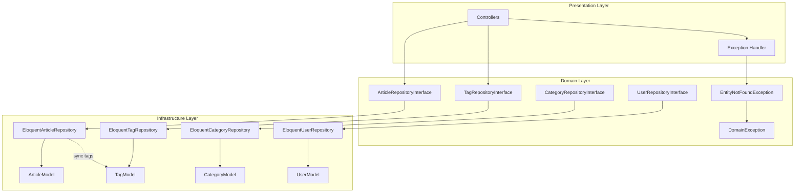

# Design: Repository Pattern Refactoring

**Дата:** 2026-03-19
**Этап:** Design (2/7)
**Основано на:** research-repository-issues.md

---

## Обзор

Рефакторинг Repository Pattern для исправления трёх проблем:
1. Неоднозначность null vs exception при поиске сущности
2. Нарушение DDD: syncForArticle в TagRepository
3. Неправильное использование Eloquent scopes

---

## Архитектурный стиль

**Hexagonal Architecture (DDD)**
- Domain layer определяет интерфейсы репозиториев
- Infrastructure layer реализует через Eloquent
- Exception является частью Domain контракта

---

## Диаграмма компонентов



---

## Компоненты

### EntityNotFoundException

- **Namespace:** `App\Domain\Shared\Exceptions`
- **Ответственность:** Представляет ошибку "сущность не найдена" при обязательном поиске
- **Расширяет:** `DomainException`
- **Зависимости:** Uuid (для типизации identifier)

### ArticleRepositoryInterface (обновлённый)

- **Ответственность:** Контракт для персистентности Article Aggregate
- **Новые методы:**
  - `getById(Uuid $id): Article` - обязательный поиск
  - `getBySlug(string $slug): Article` - обязательный поиск
  - `syncTags(Uuid $articleId, array $tagIds): void` - синхронизация тегов
- **Удалённые методы:** нет (findById остаётся для опционального поиска)

### TagRepositoryInterface (обновлённый)

- **Ответственность:** Контракт для персистентности Tag Aggregate
- **Новые методы:**
  - `getById(Uuid $id): Tag` - обязательный поиск
- **Удалённые методы:**
  - `syncForArticle(Uuid $articleId, array $tagIds): void` - нарушает DDD

### CategoryRepositoryInterface (обновлённый)

- **Ответственность:** Контракт для персистентности Category Aggregate
- **Новые методы:**
  - `getById(Uuid $id): Category` - обязательный поиск
  - `getBySlug(string $slug): Category` - обязательный поиск

### UserRepositoryInterface (обновлённый)

- **Ответственность:** Контракт для персистентности User Aggregate
- **Новые методы:**
  - `getById(Uuid $id): User` - обязательный поиск
  - `getByEmailOrFail(string $email): User` - обязательный поиск

---

## Выбранные паттерны

| Паттерн | Обоснование | Применение |
|---------|-------------|------------|
| **Repository** | Инкапсуляция логики доступа к данным | Все репозитории |
| **Special Case (Exception)** | Явная обработка отсутствия сущности | EntityNotFoundException |
| **Aggregate Boundary** | Чёткое разделение ответственности | Article владеет тегами, Tag не знает об Article |
| **Explicit Query** | Прозрачность запросов в репозитории | Отказ от Eloquent scopes |

---

## Интерфейсы

### EntityNotFoundException

```php
<?php

declare(strict_types=1);

namespace App\Domain\Shared\Exceptions;

/**
 * Exception thrown when an entity is not found during a mandatory lookup.
 *
 * Use this exception when the business logic expects an entity to exist.
 * For optional lookups, use findById() methods that return null.
 */
final class EntityNotFoundException extends DomainException
{
    /**
     * @param string $entityType The type of entity (Article, Tag, User, etc.)
     * @param string $identifier The identifier used for lookup
     * @param string $identifierType The type of identifier (id, slug, email)
     */
    private function __construct(
        private readonly string $entityType,
        private readonly string $identifier,
        private readonly string $identifierType = 'id'
    ) {
        parent::__construct(
            sprintf('%s not found with %s: %s', $entityType, $identifierType, $identifier)
        );
    }

    /**
     * Create exception for entity lookup by ID.
     */
    public static function forEntity(string $entityType, Uuid $id): self
    {
        return new self($entityType, $id->getValue(), 'id');
    }

    /**
     * Create exception for entity lookup by slug.
     */
    public static function bySlug(string $entityType, string $slug): self
    {
        return new self($entityType, $slug, 'slug');
    }

    /**
     * Create exception for entity lookup by email.
     */
    public static function byEmail(string $entityType, string $email): self
    {
        return new self($entityType, $email, 'email');
    }

    /**
     * Get the entity type that was not found.
     */
    public function getEntityType(): string
    {
        return $this->entityType;
    }

    /**
     * Get the identifier used for lookup.
     */
    public function getIdentifier(): string
    {
        return $this->identifier;
    }

    /**
     * Get the identifier type (id, slug, email).
     */
    public function getIdentifierType(): string
    {
        return $this->identifierType;
    }

    /**
     * {@inheritdoc}
     */
    public function getContext(): array
    {
        return [
            'entity_type' => $this->entityType,
            'identifier' => $this->identifier,
            'identifier_type' => $this->identifierType,
        ];
    }

    /**
     * {@inheritdoc}
     */
    public function getErrorType(): string
    {
        return 'entity_not_found';
    }
}
```

### ArticleRepositoryInterface (изменения)

```php
interface ArticleRepositoryInterface
{
    // ... существующие методы ...

    /**
     * Get article by ID (throws if not found).
     *
     * Use this method when the article MUST exist.
     * For optional lookups, use findById().
     *
     * @throws EntityNotFoundException If article not found
     */
    public function getById(Uuid $id): Article;

    /**
     * Get article by slug (throws if not found).
     *
     * Use this method when the article MUST exist.
     * For optional lookups, use findBySlug().
     *
     * @throws EntityNotFoundException If article not found
     */
    public function getBySlug(string $slug): Article;

    /**
     * Sync tags for an article.
     *
     * Article owns the relationship with tags.
     * This method manages the article_tag pivot table.
     *
     * @param Uuid[] $tagIds Array of tag UUIDs to sync
     */
    public function syncTags(Uuid $articleId, array $tagIds): void;
}
```

### TagRepositoryInterface (изменения)

```php
interface TagRepositoryInterface
{
    // ... существующие методы ...

    /**
     * Get tag by ID (throws if not found).
     *
     * Use this method when the tag MUST exist.
     * For optional lookups, use findById().
     *
     * @throws EntityNotFoundException If tag not found
     */
    public function getById(Uuid $id): Tag;

    // УДАЛИТЬ:
    // public function syncForArticle(Uuid $articleId, array $tagIds): void;
}
```

### CategoryRepositoryInterface (изменения)

```php
interface CategoryRepositoryInterface
{
    // ... существующие методы ...

    /**
     * Get category by ID (throws if not found).
     *
     * Use this method when the category MUST exist.
     * For optional lookups, use findById().
     *
     * @throws EntityNotFoundException If category not found
     */
    public function getById(Uuid $id): Category;

    /**
     * Get category by slug (throws if not found).
     *
     * Use this method when the category MUST exist.
     * For optional lookups, use findBySlug().
     *
     * @throws EntityNotFoundException If category not found
     */
    public function getBySlug(string $slug): Category;
}
```

### UserRepositoryInterface (изменения)

```php
interface UserRepositoryInterface
{
    // ... существующие методы ...

    /**
     * Get user by ID (throws if not found).
     *
     * Use this method when the user MUST exist.
     * For optional lookups, use findById().
     *
     * @throws EntityNotFoundException If user not found
     */
    public function getById(Uuid $id): User;

    /**
     * Get user by email (throws if not found).
     *
     * Use this method when the user MUST exist.
     * For optional lookups, use findByEmail().
     *
     * @throws EntityNotFoundException If user not found
     */
    public function getByEmailOrFail(string $email): User;
}
```

---

## Repository Implementation Patterns

### Паттерн 1: Разделение find() и get()

```php
final readonly class EloquentTagRepository implements TagRepositoryInterface
{
    /**
     * Find tag by ID - optional lookup.
     */
    public function findById(Uuid $id): ?Tag
    {
        $model = TagModel::query()
            ->where('uuid', $id->getValue())
            ->first();

        return $model !== null
            ? $this->mapper->toDomain($model)
            : null;
    }

    /**
     * Get tag by ID - mandatory lookup.
     *
     * @throws EntityNotFoundException
     */
    public function getById(Uuid $id): Tag
    {
        $model = $this->findModelById($id);

        if ($model === null) {
            throw EntityNotFoundException::forEntity('Tag', $id);
        }

        return $this->mapper->toDomain($model);
    }

    /**
     * Private helper to avoid code duplication.
     */
    private function findModelById(Uuid $id): ?TagModel
    {
        return TagModel::query()
            ->where('uuid', $id->getValue())
            ->first();
    }
}
```

### Паттерн 2: Явные запросы без scopes

```php
final readonly class EloquentTagRepository implements TagRepositoryInterface
{
    /**
     * Get all tags ordered by name.
     *
     * @return array<Tag>
     */
    public function findAllOrderedByName(): array
    {
        // ПРАВИЛЬНО: Явный запрос в репозитории
        $models = TagModel::query()
            ->orderBy('name', 'asc')
            ->get()
            ->all();

        return $this->mapper->toDomainCollection($models);
    }
}
```

### Паттерн 3: Sync Tags в ArticleRepository

```php
final readonly class EloquentArticleRepository implements ArticleRepositoryInterface
{
    /**
     * Sync tags for an article.
     *
     * @param Uuid[] $tagIds
     */
    public function syncTags(Uuid $articleId, array $tagIds): void
    {
        // 1. Find article model by UUID
        $articleModel = ArticleModel::query()
            ->where('uuid', $articleId->getValue())
            ->first();

        if ($articleModel === null) {
            throw EntityNotFoundException::forEntity('Article', $articleId);
        }

        // 2. Convert tag UUIDs to internal IDs
        $tagUuidValues = array_map(
            fn(Uuid $id) => $id->getValue(),
            $tagIds
        );

        $tagModelIds = TagModel::query()
            ->whereIn('uuid', $tagUuidValues)
            ->pluck('id')
            ->all();

        // 3. Sync via Eloquent relationship
        $articleModel->tags()->sync($tagModelIds);
    }
}
```

---

## Exception Handling Strategy

### Laravel Exception Handler

```php
// app/Exceptions/Handler.php

use App\Domain\Shared\Exceptions\EntityNotFoundException;
use Illuminate\Http\JsonResponse;
use Symfony\Component\HttpKernel\Exception\NotFoundHttpException;
use Throwable;

class Handler extends ExceptionHandler
{
    public function render($request, Throwable $e)
    {
        // Transform EntityNotFoundException to HTTP 404
        if ($e instanceof EntityNotFoundException) {
            return $this->renderEntityNotFound($request, $e);
        }

        return parent::render($request, $e);
    }

    private function renderEntityNotFound($request, EntityNotFoundException $e): JsonResponse
    {
        return response()->json([
            'error' => $e->getErrorType(),
            'message' => $e->getMessage(),
            'context' => $e->getContext(),
        ], 404);
    }
}
```

### Usage в Application Layer

```php
final readonly class ArticleService
{
    /**
     * Get article for editing.
     *
     * @throws EntityNotFoundException If article not found
     */
    public function getArticleForEdit(Uuid $id): ArticleDTO
    {
        // getById() выбросит EntityNotFoundException если не найден
        $article = $this->articleRepository->getById($id);

        return ArticleDTO::fromEntity($article);
    }

    /**
     * Find article for preview (optional).
     */
    public function findArticleForPreview(Uuid $id): ?ArticleDTO
    {
        // findById() вернёт null если не найден
        $article = $this->articleRepository->findById($id);

        return $article !== null
            ? ArticleDTO::fromEntity($article)
            : null;
    }

    /**
     * Update article tags.
     *
     * @throws EntityNotFoundException If article or tags not found
     */
    public function updateArticleTags(Uuid $articleId, array $tagIds): void
    {
        // Валидация существования тегов
        $tags = $this->tagRepository->findByIds($tagIds);
        if (count($tags) !== count($tagIds)) {
            throw new InvalidArgumentException('Some tags not found');
        }

        // Синхронизация через ArticleRepository
        $this->articleRepository->syncTags($articleId, $tagIds);
    }
}
```

---

## Альтернативы

| Вариант | Почему не выбран |
|---------|------------------|
| **EntityNotFoundException в Infrastructure** | Нарушает DDD: Exception - часть контракта репозитория в Domain |
| **Interface для EntityNotFoundException** | Избыточное усложнение: Exception не подменяется |
| **Domain Service для sync tags** | Для простого sync избыточно; ArticleRepository владеет отношением |
| **Result/Either тип вместо Exception** | PHP не имеет нативной поддержки; усложняет код |
| **Optional/Maybe монада** | Не идиоматично для PHP; null уже используется |

---

## Риски

| Риск | Вероятность | Влияние | Митигация |
|------|-------------|---------|-----------|
| Breaking change для существующего кода | Высокая | Среднее | Пошаговый рефакторинг с deprecated warnings |
| Дублирование кода findById/getById | Средняя | Низкое | Private helper метод в репозитории |
| Забыть удалить syncForArticle из impl | Низкая | Высокое | PHPStan check на неиспользуемые методы |
| EntityNotFoundException не перехвачен | Средняя | Среднее | Глобальный handler в Laravel |
| Путаница между find/get | Средняя | Низкое | Чёткие PHPDoc и code review |

---

## Для Plan

### Порядок реализации:

1. **Создать EntityNotFoundException** в Domain\Shared\Exceptions
2. **Обновить интерфейсы** (добавить getById методы)
3. **Обновить Eloquent репозитории** (реализовать getById)
4. **Добавить syncTags в ArticleRepository**
5. **Удалить syncForArticle из TagRepository**
6. **Настроить Exception Handler**
7. **Обновить Application Services** (использовать getById где нужно)
8. **Удалить scopes из Models**

### Файлы для создания/изменения:

**Создать:**
- `laravel/app/Domain/Shared/Exceptions/EntityNotFoundException.php`

**Изменить:**
- `laravel/app/Domain/Article/Repositories/ArticleRepositoryInterface.php`
- `laravel/app/Domain/Article/Repositories/TagRepositoryInterface.php`
- `laravel/app/Domain/Article/Repositories/CategoryRepositoryInterface.php`
- `laravel/app/Domain/User/Repositories/UserRepositoryInterface.php`
- `laravel/app/Exceptions/Handler.php`

**Удалить методы из:**
- `laravel/app/Infrastructure/Persistence/Eloquent/Repositories/EloquentTagRepository.php` (syncForArticle)