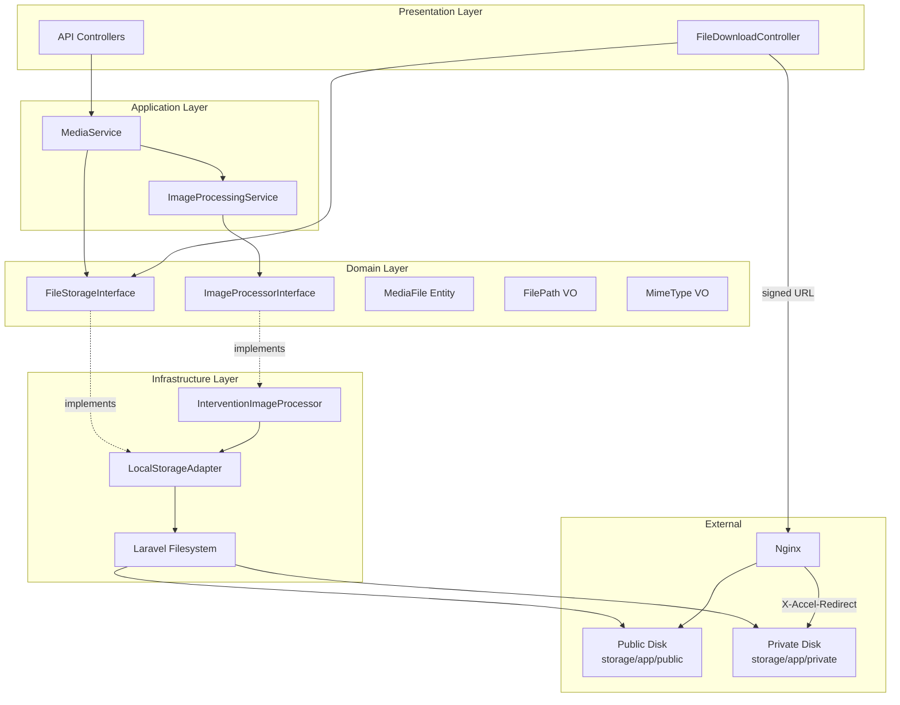
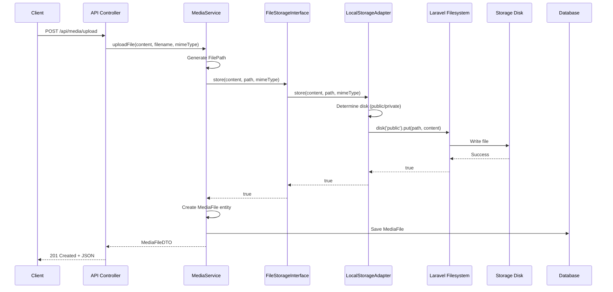
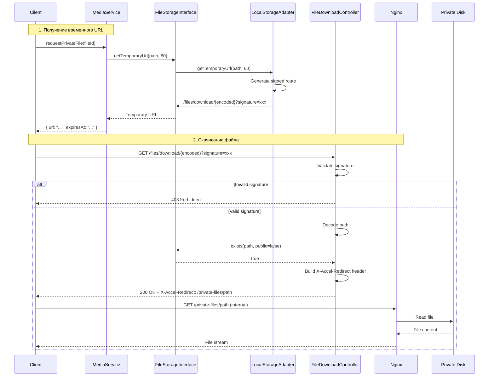

# Design: Local Storage для файлов

**Дата:** 2026-03-19
**Этап:** Design (2/7)
**Основано на:** research-storage.md

---

## Обзор

Дизайн архитектуры для перехода от S3 к локальному хранению файлов с поддержкой публичных и приватных файлов, обработки изображений и масштабируемости.

**Ключевые решения:**
- LocalStorageAdapter реализует существующий FileStorageInterface
- Два диска Laravel: `public` и `private`
- Signed URLs для приватных файлов
- X-Accel-Redirect для эффективной отдачи
- Готовность к миграции на MinIO без изменения Domain/Application

---

## Архитектурный стиль

**Hexagonal Architecture (Ports & Adapters)** с DDD слоёв:

```
Domain (ядро) -> Application (use cases) -> Infrastructure (адаптеры)
```

**Обоснование:**
- FileStorageInterface уже определён в Domain - это Port
- LocalStorageAdapter - это Adapter для Infrastructure
- Позволяет подменять хранилище без изменения бизнес-логики

---

## Диаграмма компонентов



---

## Диаграмма последовательности: Загрузка файла



---

## Диаграмма последовательности: Скачивание приватного файла



---

## Компоненты

### 1. LocalStorageAdapter

**Расположение:** `Infrastructure/Storage/LocalStorageAdapter.php`

**Ответственность:**
- Реализация FileStorageInterface для локальной файловой системы
- Маршрутизация между public и private дисками
- Генерация signed URLs для приватных файлов

**Интерфейс:**

```php
<?php

declare(strict_types=1);

namespace App\Infrastructure\Storage;

use App\Domain\Media\Services\FileStorageInterface;
use App\Domain\Media\ValueObjects\FilePath;
use App\Domain\Media\ValueObjects\MimeType;
use Illuminate\Support\Facades\Storage;
use Illuminate\Support\Facades\URL;

final class LocalStorageAdapter implements FileStorageInterface
{
    private const PUBLIC_DISK = 'public';
    private const PRIVATE_DISK = 'private';
    private const PUBLIC_PATH_PREFIX = 'public/';
    private const PRIVATE_PATH_PREFIX = 'private/';

    public function store(string $content, FilePath $path, MimeType $mimeType): bool
    {
        $disk = $this->resolveDisk($path);
        $relativePath = $this->stripPrefix($path->getValue());

        return Storage::disk($disk)->put($relativePath, $content);
    }

    public function storeFromTemp(string $tempPath, FilePath $targetPath): bool
    {
        $disk = $this->resolveDisk($targetPath);
        $relativePath = $this->stripPrefix($targetPath->getValue());

        $stream = fopen($tempPath, 'rb');
        if ($stream === false) {
            return false;
        }

        $result = Storage::disk($disk)->put($relativePath, $stream);
        fclose($stream);

        return $result;
    }

    public function get(FilePath $path): string
    {
        $disk = $this->resolveDisk($path);
        $relativePath = $this->stripPrefix($path->getValue());

        $content = Storage::disk($disk)->get($relativePath);

        if ($content === null) {
            throw new \RuntimeException("File not found: {$path->getValue()}");
        }

        return $content;
    }

    public function exists(FilePath $path): bool
    {
        $disk = $this->resolveDisk($path);
        $relativePath = $this->stripPrefix($path->getValue());

        return Storage::disk($disk)->exists($relativePath);
    }

    public function delete(FilePath $path): bool
    {
        $disk = $this->resolveDisk($path);
        $relativePath = $this->stripPrefix($path->getValue());

        return Storage::disk($disk)->delete($relativePath);
    }

    public function move(FilePath $from, FilePath $to): bool
    {
        $fromDisk = $this->resolveDisk($from);
        $toDisk = $this->resolveDisk($to);

        if ($fromDisk !== $toDisk) {
            // Cross-disk move: copy + delete
            $content = $this->get($from);
            $stored = Storage::disk($toDisk)->put($this->stripPrefix($to->getValue()), $content);

            if (!$stored) {
                return false;
            }

            return $this->delete($from);
        }

        return Storage::disk($fromDisk)->move(
            $this->stripPrefix($from->getValue()),
            $this->stripPrefix($to->getValue())
        );
    }

    public function copy(FilePath $from, FilePath $to): bool
    {
        $fromDisk = $this->resolveDisk($from);
        $toDisk = $this->resolveDisk($to);

        if ($fromDisk !== $toDisk) {
            $content = $this->get($from);
            return Storage::disk($toDisk)->put($this->stripPrefix($to->getValue()), $content);
        }

        return Storage::disk($fromDisk)->copy(
            $this->stripPrefix($from->getValue()),
            $this->stripPrefix($to->getValue())
        );
    }

    public function size(FilePath $path): int
    {
        $disk = $this->resolveDisk($path);
        $relativePath = $this->stripPrefix($path->getValue());

        return Storage::disk($disk)->size($relativePath);
    }

    public function lastModified(FilePath $path): \DateTimeInterface
    {
        $disk = $this->resolveDisk($path);
        $relativePath = $this->stripPrefix($path->getValue());

        $timestamp = Storage::disk($disk)->lastModified($relativePath);

        return (new \DateTimeImmutable())->setTimestamp($timestamp);
    }

    public function getUrl(FilePath $path): string
    {
        // Only works for public files
        if (!$this->isPublic($path)) {
            throw new \RuntimeException('Cannot get public URL for private file. Use getTemporaryUrl() instead.');
        }

        $relativePath = $this->stripPrefix($path->getValue());

        return Storage::disk(self::PUBLIC_DISK)->url($relativePath);
    }

    public function getTemporaryUrl(FilePath $path, int $expirationMinutes = 60): string
    {
        // For public files, return permanent URL
        if ($this->isPublic($path)) {
            return $this->getUrl($path);
        }

        $relativePath = $this->stripPrefix($path->getValue());
        $encodedPath = base64_encode($relativePath);

        return URL::temporarySignedRoute(
            'files.download',
            now()->addMinutes($expirationMinutes),
            ['path' => $encodedPath]
        );
    }

    public function isPublic(FilePath $path): bool
    {
        return str_starts_with($path->getValue(), self::PUBLIC_PATH_PREFIX);
    }

    public function setVisibility(FilePath $from, FilePath $to): bool
    {
        // Visibility change requires move between disks
        return $this->move($from, $to);
    }

    public function getMimeType(FilePath $path): MimeType
    {
        $disk = $this->resolveDisk($path);
        $relativePath = $this->stripPrefix($path->getValue());

        $mimeType = Storage::disk($disk)->mimeType($relativePath);

        return MimeType::fromString($mimeType);
    }

    public function generateUniquePath(string $originalName, MimeType $mimeType): FilePath
    {
        return FilePath::generateForUpload(
            directory: 'public/uploads',
            filename: $originalName
        );
    }

    public function getTotalUsage(): int
    {
        $publicSize = $this->getDirectorySize(storage_path('app/public'));
        $privateSize = $this->getDirectorySize(storage_path('app/private'));

        return $publicSize + $privateSize;
    }

    public function getAvailableSpace(): int
    {
        $freeSpace = disk_free_space(storage_path('app'));

        return $freeSpace !== false ? (int) $freeSpace : -1;
    }

    private function resolveDisk(FilePath $path): string
    {
        return $this->isPublic($path) ? self::PUBLIC_DISK : self::PRIVATE_DISK;
    }

    private function stripPrefix(string $path): string
    {
        if (str_starts_with($path, self::PUBLIC_PATH_PREFIX)) {
            return substr($path, strlen(self::PUBLIC_PATH_PREFIX));
        }

        if (str_starts_with($path, self::PRIVATE_PATH_PREFIX)) {
            return substr($path, strlen(self::PRIVATE_PATH_PREFIX));
        }

        // Default to public for backwards compatibility
        return $path;
    }

    private function getDirectorySize(string $directory): int
    {
        if (!is_dir($directory)) {
            return 0;
        }

        $size = 0;
        $iterator = new \RecursiveIteratorIterator(
            new \RecursiveDirectoryIterator($directory, \FilesystemIterator::SKIP_DOTS)
        );

        foreach ($iterator as $file) {
            if ($file->isFile()) {
                $size += $file->getSize();
            }
        }

        return $size;
    }
}
```

**Зависимости:**
- Laravel Filesystem (Storage facade)
- Laravel URL (для signed routes)
- Domain ValueObjects: FilePath, MimeType

---

### 2. ImageProcessorInterface (Domain)

**Расположение:** `Domain/Media/Services/ImageProcessorInterface.php`

**Ответственность:**
- Контракт для обработки изображений
- Независимость от конкретной библиотеки

```php
<?php

declare(strict_types=1);

namespace App\Domain\Media\Services;

use App\Domain\Media\ValueObjects\FilePath;
use App\Domain\Media\ValueObjects\ImageDimensions;

interface ImageProcessorInterface
{
    /**
     * Resize image to fit within max dimensions (maintains aspect ratio).
     */
    public function resize(
        FilePath $sourcePath,
        FilePath $targetPath,
        int $maxWidth,
        int $maxHeight
    ): bool;

    /**
     * Resize image to exact dimensions (may distort).
     */
    public function resizeExact(
        FilePath $sourcePath,
        FilePath $targetPath,
        int $width,
        int $height
    ): bool;

    /**
     * Crop image to specified dimensions from center.
     */
    public function crop(
        FilePath $sourcePath,
        FilePath $targetPath,
        int $width,
        int $height
    ): bool;

    /**
     * Convert image to WebP format.
     */
    public function convertToWebP(
        FilePath $sourcePath,
        FilePath $targetPath,
        int $quality = 85
    ): bool;

    /**
     * Convert image to AVIF format.
     */
    public function convertToAVIF(
        FilePath $sourcePath,
        FilePath $targetPath,
        int $quality = 65
    ): bool;

    /**
     * Get image dimensions.
     */
    public function getDimensions(FilePath $path): ?ImageDimensions;

    /**
     * Optimize image (reduce file size while maintaining quality).
     */
    public function optimize(FilePath $path, int $quality = 85): bool;

    /**
     * Check if file is a processable image.
     */
    public function isProcessableImage(FilePath $path): bool;
}
```

---

### 3. InterventionImageProcessor (Infrastructure)

**Расположение:** `Infrastructure/Storage/InterventionImageProcessor.php`

**Ответственность:**
- Реализация ImageProcessorInterface с Intervention Image v3
- Поддержка GD и Imagick драйверов

```php
<?php

declare(strict_types=1);

namespace App\Infrastructure\Storage;

use App\Domain\Media\Services\ImageProcessorInterface;
use App\Domain\Media\ValueObjects\FilePath;
use App\Domain\Media\ValueObjects\ImageDimensions;
use Intervention\Image\ImageManager;
use Intervention\Image\Interfaces\ImageInterface;

final class InterventionImageProcessor implements ImageProcessorInterface
{
    private readonly ImageManager $manager;

    public function __construct(?string $driver = null)
    {
        $driver = $driver ?? (extension_loaded('imagick') ? 'imagick' : 'gd');
        $this->manager = ImageManager::withDriver($driver);
    }

    public function resize(
        FilePath $sourcePath,
        FilePath $targetPath,
        int $maxWidth,
        int $maxHeight
    ): bool {
        try {
            $image = $this->manager->read($sourcePath->getValue());
            $image->scaleDown(width: $maxWidth, height: $maxHeight);

            return $image->save($targetPath->getValue()) !== null;
        } catch (\Exception) {
            return false;
        }
    }

    public function resizeExact(
        FilePath $sourcePath,
        FilePath $targetPath,
        int $width,
        int $height
    ): bool {
        try {
            $image = $this->manager->read($sourcePath->getValue());
            $image->resize(width: $width, height: $height);

            return $image->save($targetPath->getValue()) !== null;
        } catch (\Exception) {
            return false;
        }
    }

    public function crop(
        FilePath $sourcePath,
        FilePath $targetPath,
        int $width,
        int $height
    ): bool {
        try {
            $image = $this->manager->read($sourcePath->getValue());
            $image->cover(width: $width, height: $height);

            return $image->save($targetPath->getValue()) !== null;
        } catch (\Exception) {
            return false;
        }
    }

    public function convertToWebP(
        FilePath $sourcePath,
        FilePath $targetPath,
        int $quality = 85
    ): bool {
        try {
            $image = $this->manager->read($sourcePath->getValue());

            return $image->toWebp(quality: $quality)->save($targetPath->getValue()) !== null;
        } catch (\Exception) {
            return false;
        }
    }

    public function convertToAVIF(
        FilePath $sourcePath,
        FilePath $targetPath,
        int $quality = 65
    ): bool {
        try {
            $image = $this->manager->read($sourcePath->getValue());

            return $image->toAvif(quality: $quality)->save($targetPath->getValue()) !== null;
        } catch (\Exception) {
            return false;
        }
    }

    public function getDimensions(FilePath $path): ?ImageDimensions
    {
        try {
            $image = $this->manager->read($path->getValue());

            return ImageDimensions::fromIntegers(
                $image->width(),
                $image->height()
            );
        } catch (\Exception) {
            return null;
        }
    }

    public function optimize(FilePath $path, int $quality = 85): bool
    {
        try {
            $image = $this->manager->read($path->getValue());

            return $image->save($path->getValue(), quality: $quality) !== null;
        } catch (\Exception) {
            return false;
        }
    }

    public function isProcessableImage(FilePath $path): bool
    {
        $processableExtensions = ['jpg', 'jpeg', 'png', 'gif', 'webp', 'avif'];
        $extension = strtolower($path->getExtension());

        return in_array($extension, $processableExtensions, true);
    }
}
```

---

### 4. ImageProcessingService (Application)

**Расположение:** `Application/Media/Services/ImageProcessingService.php`

**Ответственность:**
- Координация обработки изображений
- Создание превью разных размеров
- Конвертация в современные форматы

```php
<?php

declare(strict_types=1);

namespace App\Application\Media\Services;

use App\Domain\Media\Services\FileStorageInterface;
use App\Domain\Media\Services\ImageProcessorInterface;
use App\Domain\Media\ValueObjects\FilePath;
use App\Domain\Media\ValueObjects\ImageDimensions;

final readonly class ImageProcessingService
{
    private const THUMBNAIL_SIZES = [
        'thumb' => ['width' => 150, 'height' => 150],
        'small' => ['width' => 320, 'height' => 240],
        'medium' => ['width' => 640, 'height' => 480],
        'large' => ['width' => 1280, 'height' => 960],
    ];

    public function __construct(
        private FileStorageInterface $storage,
        private ImageProcessorInterface $imageProcessor
    ) {}

    /**
     * Process uploaded image: create thumbnails and WebP version.
     *
     * @return array{original: FilePath, thumbnails: array<string, FilePath>, webp: ?FilePath}
     */
    public function processImage(FilePath $originalPath): array
    {
        $result = [
            'original' => $originalPath,
            'thumbnails' => [],
            'webp' => null,
        ];

        if (!$this->imageProcessor->isProcessableImage($originalPath)) {
            return $result;
        }

        // Create thumbnails
        foreach (self::THUMBNAIL_SIZES as $sizeName => $dimensions) {
            $thumbnailPath = $this->generateThumbnailPath($originalPath, $sizeName);

            if ($this->imageProcessor->resize(
                $originalPath,
                $thumbnailPath,
                $dimensions['width'],
                $dimensions['height']
            )) {
                $result['thumbnails'][$sizeName] = $thumbnailPath;
            }
        }

        // Create WebP version
        $webpPath = $this->generateWebPPath($originalPath);
        if ($this->imageProcessor->convertToWebP($originalPath, $webpPath, quality: 85)) {
            $result['webp'] = $webpPath;
        }

        // Optimize original
        $this->imageProcessor->optimize($originalPath, quality: 90);

        return $result;
    }

    public function getDimensions(FilePath $path): ?ImageDimensions
    {
        return $this->imageProcessor->getDimensions($path);
    }

    private function generateThumbnailPath(FilePath $original, string $sizeName): FilePath
    {
        $directory = $original->getDirectory();
        $name = $original->getNameWithoutExtension();
        $extension = $original->getExtension();

        return FilePath::fromParts($directory, "{$name}_{$sizeName}.{$extension}");
    }

    private function generateWebPPath(FilePath $original): FilePath
    {
        $directory = $original->getDirectory();
        $name = $original->getNameWithoutExtension();

        return FilePath::fromParts($directory, "{$name}.webp");
    }
}
```

---

### 5. FileDownloadController (Infrastructure)

**Расположение:** `Infrastructure/Http/Controllers/FileDownloadController.php`

**Ответственность:**
- Обработка запросов на скачивание приватных файлов
- Проверка signed URL
- Отдача через X-Accel-Redirect

```php
<?php

declare(strict_types=1);

namespace App\Infrastructure\Http\Controllers;

use App\Domain\Media\Services\FileStorageInterface;
use App\Domain\Media\ValueObjects\FilePath;
use Illuminate\Http\Request;
use Illuminate\Http\Response;
use Symfony\Component\HttpFoundation\StreamedResponse;

final class FileDownloadController
{
    public function __construct(
        private readonly FileStorageInterface $storage
    ) {}

    /**
     * Download a private file via signed URL.
     */
    public function download(Request $request, string $encodedPath): Response|StreamedResponse
    {
        // Validate signature
        if (!$request->hasValidSignature()) {
            abort(403, 'Invalid or expired download link');
        }

        // Decode path
        $decodedPath = base64_decode($encodedPath, strict: true);
        if ($decodedPath === false) {
            abort(400, 'Invalid file path encoding');
        }

        // Create FilePath value object (validates path)
        try {
            $path = FilePath::fromString('private/' . $decodedPath);
        } catch (\InvalidArgumentException $e) {
            abort(400, 'Invalid file path');
        }

        // Check file exists
        if (!$this->storage->exists($path)) {
            abort(404, 'File not found');
        }

        // Get MIME type
        $mimeType = $this->storage->getMimeType($path);
        $filename = $path->getFilename();

        // Use X-Accel-Redirect for efficient file serving
        return response()->streamDownload(
            fn() => null, // Empty callback - Nginx handles the file
            $filename,
            [
                'Content-Type' => $mimeType->getValue(),
                'X-Accel-Redirect' => '/private-files/' . $decodedPath,
                'Cache-Control' => 'private, max-age=3600',
            ]
        );
    }
}
```

---

### 6. StorageServiceProvider

**Расположение:** `Infrastructure/Providers/StorageServiceProvider.php`

**Ответственность:**
- DI bindings для storage сервисов

```php
<?php

declare(strict_types=1);

namespace App\Infrastructure\Providers;

use App\Domain\Media\Services\FileStorageInterface;
use App\Domain\Media\Services\ImageProcessorInterface;
use App\Infrastructure\Storage\InterventionImageProcessor;
use App\Infrastructure\Storage\LocalStorageAdapter;
use Illuminate\Support\ServiceProvider;

final class StorageServiceProvider extends ServiceProvider
{
    public function register(): void
    {
        $this->app->singleton(FileStorageInterface::class, LocalStorageAdapter::class);

        $this->app->singleton(ImageProcessorInterface::class, function () {
            $driver = config('image.driver', 'gd');
            return new InterventionImageProcessor($driver);
        });
    }

    public function boot(): void
    {
        // Ensure storage directories exist
        $this->ensureStorageDirectories();
    }

    private function ensureStorageDirectories(): void
    {
        $directories = [
            storage_path('app/public/uploads'),
            storage_path('app/private/uploads'),
        ];

        foreach ($directories as $directory) {
            if (!is_dir($directory)) {
                mkdir($directory, 0755, true);
            }
        }
    }
}
```

---

## Выбранные паттерны

| Паттерн | Обоснование | Применение |
|---------|-------------|------------|
| **Adapter** | Абстракция хранилища от бизнес-логики | LocalStorageAdapter реализует FileStorageInterface |
| **Strategy** | Выбор диска на основе пути | resolveDisk() определяет public/private |
| **Factory** | Создание Value Objects | FilePath::generateForUpload(), MimeType::fromString() |
| **Template Method** | Обработка изображений | ImageProcessingService определяет алгоритм обработки |
| **Port/Adapter (Hexagonal)** | Независимость от инфраструктуры | Интерфейсы в Domain, реализации в Infrastructure |

---

## Конфигурации

### Laravel Filesystem (config/filesystems.php)

```php
<?php

declare(strict_types=1);

return [
    'default' => env('FILESYSTEM_DISK', 'local'),

    'disks' => [
        'local' => [
            'driver' => 'local',
            'root' => storage_path('app/private'),
            'visibility' => 'private',
            'throw' => false,
        ],

        'public' => [
            'driver' => 'local',
            'root' => storage_path('app/public'),
            'url' => env('APP_URL') . '/storage',
            'visibility' => 'public',
            'throw' => false,
        ],

        'private' => [
            'driver' => 'local',
            'root' => storage_path('app/private'),
            'visibility' => 'private',
            'throw' => false,
        ],
    ],

    'links' => [
        public_path('storage') => storage_path('app/public'),
    ],
];
```

### Image Processing (config/image.php)

```php
<?php

declare(strict_types=1);

return [
    /*
    | Image processing driver: 'gd' or 'imagick'
    */
    'driver' => env('IMAGE_DRIVER', 'gd'),

    /*
    | Default quality for image optimization
    */
    'quality' => [
        'webp' => 85,
        'avif' => 65,
        'jpeg' => 90,
        'png' => 90,
    ],

    /*
    | Thumbnail sizes
    */
    'thumbnails' => [
        'thumb' => ['width' => 150, 'height' => 150],
        'small' => ['width' => 320, 'height' => 240],
        'medium' => ['width' => 640, 'height' => 480],
        'large' => ['width' => 1280, 'height' => 960],
    ],
];
```

### Nginx (docker/nginx/dev.conf - additions)

```nginx
# ============================================
# Public Storage Files
# ============================================
location /storage {
    alias /var/www/html/storage/app/public;
    expires 30d;
    add_header Cache-Control "public, immutable";
    access_log off;

    # Allowed file types
    location ~* \.(jpg|jpeg|png|gif|webp|svg|ico|avif|pdf)$ {
        expires 30d;
        add_header Cache-Control "public, immutable";
    }

    # Deny PHP execution in storage
    location ~* \.php$ {
        deny all;
    }
}

# ============================================
# Private Files (X-Accel-Redirect)
# ============================================
location /private-files/ {
    internal;
    alias /var/www/html/storage/app/private/;
    expires 1h;
    add_header Cache-Control "private";

    # Deny direct access
    location ~* \.php$ {
        deny all;
    }
}
```

### Routes (routes/web.php - additions)

```php
<?php

declare(strict_types=1);

use App\Infrastructure\Http\Controllers\FileDownloadController;
use Illuminate\Support\Facades\Route;

// Private file download (signed URL required)
Route::get('/files/download/{path}', [FileDownloadController::class, 'download'])
    ->name('files.download')
    ->middleware(['signed']);
```

### Docker Compose (docker-compose.prod.yml)

```yaml
services:
  app:
    volumes:
      # ... existing volumes
      - storage_data:/var/www/html/storage/app

volumes:
  # ... existing volumes
  storage_data:
    name: blog_storage_data
    driver: local
```

---

## План миграции данных

### Этап 1: Подготовка (без downtime)

1. Добавить `intervention/image` в composer.json
2. Создать Infrastructure/Storage компоненты
3. Добавить ServiceProvider
4. Обновить конфигурации (filesystems.php, image.php)
5. Обновить Nginx конфигурацию
6. Написать тесты

### Этап 2: Развертывание

1. Запустить `php artisan storage:link`
2. Очистить кэш: `php artisan config:clear`
3. Перезагрузить Nginx
4. Проверить health check

### Этап 3: Тестирование

1. Загрузить тестовый файл (public)
2. Проверить доступ через /storage/
3. Загрузить тестовый файл (private)
4. Проверить signed URL
5. Проверить обработку изображений

### Этап 4: Миграция существующих файлов (если есть)

```bash
# Скрипт миграции
rsync -av /old/storage/ /var/www/html/storage/app/public/
```

---

## Риски и митигация

| Риск | Вероятность | Влияние | Митигация |
|------|-------------|---------|-----------|
| **Потеря файлов при redeploy** | High | Critical | Docker volume для storage/app в production; Backup скрипты |
| **Несанкционированный доступ к приватным файлам** | High | Critical | Signed routes с expiration; FilePath валидация; Nginx internal location |
| **Переполнение диска** | Medium | High | Monitoring getTotalUsage(); Cleanup job для старых файлов; Quota на уровне ОС |
| **Медленная отдача больших файлов** | Medium | Medium | X-Accel-Redirect (Nginx отдаёт напрямую); Не нагружает PHP-FPM |
| **Нет CDN для публичных файлов** | Low | Low | Cloudflare перед Nginx; Nginx caching headers настроены |
| **Directory traversal атака** | Low | Critical | FilePath VO валидация (запрещает '..'); Nginx alias |
| **Библиотека обработки изображений недоступна** | Low | Medium | Fallback на GD если Imagick недоступен; Graceful degradation |

---

## Альтернативы

| Вариант | Почему не выбран |
|---------|------------------|
| **MinIO** | Overkill для одного блока; Дополнительный контейнер; Сложнее настройка |
| **S3** | Платно; Недоступен в текущем окружении |
| **Единый диск без разделения** | Нет гибкости для приватных файлов; Сложнее security |
| **Хранение мета-данных visibility в БД** | Усложняет архитектуру; Дополнительный запрос к БД |
| **Direct file streaming через PHP** | Нагружает PHP-FPM; Медленнее Nginx |

---

## Для Plan

При создании плана разработки учесть:

1. **Порядок реализации:**
   - Сначала LocalStorageAdapter (критично для работы)
   - Затем ServiceProvider (DI bindings)
   - Потом Nginx конфигурация (отдача файлов)
   - Далее FileDownloadController (приватные файлы)
   - После ImageProcessor (оптимизация)

2. **Тестирование:**
   - Unit тесты для LocalStorageAdapter
   - Integration тесты для загрузки/скачивания
   - Feature тесты для signed URLs

3. **Зависимости:**
   - composer require intervention/image:^3.0
   - Убедиться что GD или Imagick установлены в Docker образе

4. **Мониторинг:**
   - Добавить alert на disk usage > 80%
   - Логировать неудачные попытки доступа к приватным файлам

5. **Документация:**
   - API документация для endpoints загрузки
   - Инструкция по backup/restore

---

## Связанные файлы

- Research: `.claude/pipeline/research-storage.md`
- Существующий интерфейс: `laravel/app/Domain/Media/Services/FileStorageInterface.php`
- Существующий сервис: `laravel/app/Application/Media/Services/MediaService.php`
- Value Objects: `laravel/app/Domain/Media/ValueObjects/`