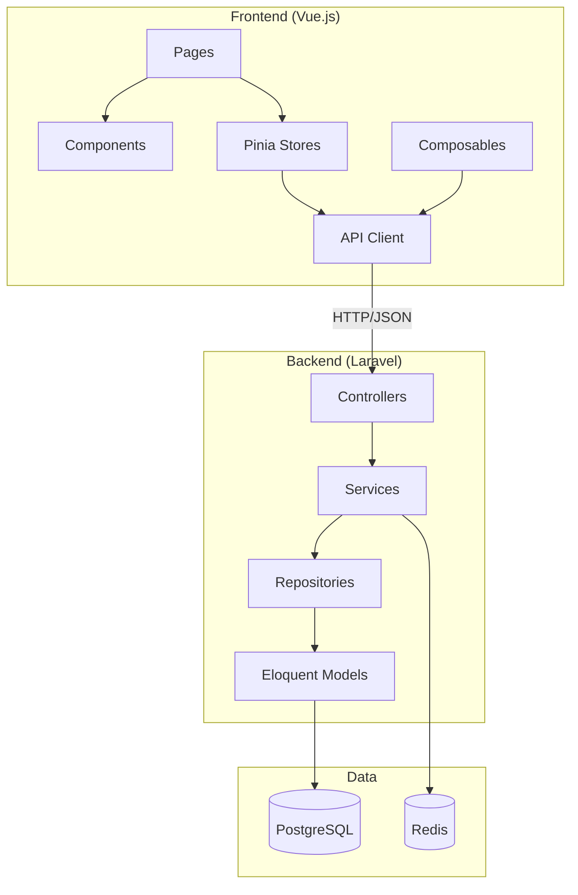
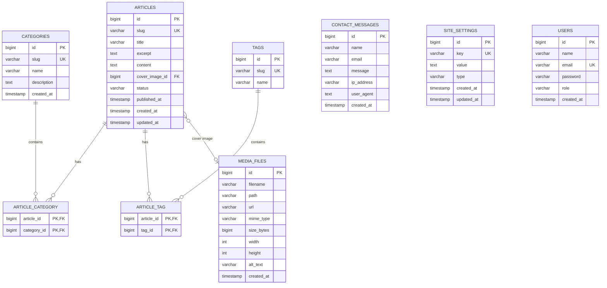

# Design: Блог с DDD архитектурой и Bento Grid дизайном

**Дата:** 2026-03-17
**Этап:** Design (2/7)
**Основано на:** 01-research.md

---

## Обзор

Блог на стеке Laravel + Vue.js с DDD архитектурой, SSG для SEO и Bento Grid дизайном.

**Ключевые решения:**
- Layered Architecture с DDD ограниченными контекстами
- SSG (vite-ssg) для SEO оптимизации
- Repository pattern для абстракции Eloquent
- ISR webhook для мгновенной публикации статей

---

## Архитектурный стиль

**Layered Architecture** с элементами **Hexagonal (Ports & Adapters)**

```
┌─────────────────────────────────────────────────────────┐
│                    Presentation Layer                    │
│  Vue.js SPA + vite-ssg (SSG) + @unhead/vue (SEO)        │
├─────────────────────────────────────────────────────────┤
│                   Application Layer                      │
│  Services, DTOs, Commands/Queries, Controllers          │
├─────────────────────────────────────────────────────────┤
│                     Domain Layer                         │
│  Entities, Value Objects, Repository Interfaces,        │
│  Domain Events                                          │
├─────────────────────────────────────────────────────────┤
│                  Infrastructure Layer                    │
│  Eloquent Models, Repositories, Cache, Queue, Storage   │
└─────────────────────────────────────────────────────────┘
```

### Диаграмма слоёв

**FigJam:** [Blog Architecture - DDD Layers](https://www.figma.com/online-whiteboard/create-diagram/a93da00f-f4b1-4ead-9fb8-5183ba09bcc4)

---

## Диаграмма компонентов



### Frontend компоненты

**FigJam:** [Blog Frontend Components](https://www.figma.com/online-whiteboard/create-diagram/5add202c-d2bb-464a-b231-55fe9665b810)

---

## Домены DDD

### Article Domain (ядро)

```
Domain/Article/
├── Entities/
│   ├── Article.php
│   ├── Category.php
│   └── Tag.php
├── ValueObjects/
│   ├── ArticleStatus.php
│   ├── Slug.php
│   └── ArticleContent.php
├── Repositories/
│   ├── ArticleRepositoryInterface.php
│   ├── CategoryRepositoryInterface.php
│   └── TagRepositoryInterface.php
├── Events/
│   ├── ArticlePublished.php
│   └── ArticleArchived.php
└── Exceptions/
    └── ArticleNotFoundException.php
```

### Contact Domain

```
Domain/Contact/
├── Entities/
│   └── ContactMessage.php
├── ValueObjects/
│   ├── Email.php
│   └── IPAddress.php
├── Repositories/
│   └── ContactRepositoryInterface.php
└── Events/
    └── ContactMessageReceived.php
```

### User Domain

```
Domain/User/
├── Entities/
│   └── User.php
├── ValueObjects/
│   ├── UserRole.php
│   └── Password.php
├── Repositories/
│   └── UserRepositoryInterface.php
└── Services/
    └── AuthenticationService.php
```

### Media Domain

```
Domain/Media/
├── Entities/
│   └── MediaFile.php
├── ValueObjects/
│   ├── FilePath.php
│   ├── MimeType.php
│   └── ImageDimensions.php
├── Repositories/
│   └── MediaRepositoryInterface.php
└── Services/
    └── FileStorageInterface.php
```

### Settings Domain

```
Domain/Settings/
├── Entities/
│   └── SiteSetting.php
├── ValueObjects/
│   ├── SettingKey.php
│   └── SettingValue.php
└── Repositories/
    └── SettingsRepositoryInterface.php
```

### Shared Kernel

```
Domain/Shared/
├── Entity.php
├── ValueObject.php
├── Uuid.php
├── Timestamps.php
├── DomainEvent.php
├── PaginatedResult.php
└── Exceptions/
    ├── DomainException.php
    └── ValidationException.php
```

---

## Выбранные паттерны

| Паттерн | Обоснование | Применение |
|---------|-------------|------------|
| **Repository** | Абстракция над БД, тестирование без Eloquent | ArticleRepository, UserRepository |
| **Service Layer** | Инкапсуляция бизнес-логики, orchestration | ArticleService, ContactService |
| **DTO** | Типизированные данные между слоями | ArticleDTO, CreateArticleRequest |
| **Command/Query** | Разделение операций записи и чтения | CreateArticleCommand, GetArticleQuery |
| **Factory** | Создание сложных объектов | ArticleFactory, MediaFactory |
| **Adapter** | Интеграция с внешними сервисами | StorageAdapter (local/S3) |
| **Facade** | Упрощение сложных операций | ArticleFacade (для контроллеров) |

---

## Интерфейсы

### Shared Kernel - PaginatedResult

```php
<?php

declare(strict_types=1);

namespace App\Domain\Shared;

/**
 * @template T
 */
final readonly class PaginatedResult
{
    /**
     * @param array<T> $items
     * @param int $total
     * @param int $page
     * @param int $perPage
     * @param int $lastPage
     */
    public function __construct(
        public array $items,
        public int $total,
        public int $page,
        public int $perPage,
        public int $lastPage,
    ) {}

    public function hasMore(): bool
    {
        return $this->page < $this->lastPage;
    }

    public function isEmpty(): bool
    {
        return count($this->items) === 0;
    }
}
```

### Repository Interfaces

```php
<?php

declare(strict_types=1);

namespace App\Domain\Article\Repositories;

use App\Domain\Article\Entities\Article;
use App\Domain\Shared\Uuid;
use App\Domain\Shared\PaginatedResult;

interface ArticleRepositoryInterface
{
    public function findById(Uuid $id): ?Article;

    public function findBySlug(string $slug): ?Article;

    /**
     * @return PaginatedResult<Article>
     */
    public function findPublished(int $page = 1, int $perPage = 12): PaginatedResult;

    /**
     * @return PaginatedResult<Article>
     */
    public function findByCategory(string $categorySlug, int $page = 1, int $perPage = 12): PaginatedResult;

    /**
     * @return PaginatedResult<Article>
     */
    public function findByTag(string $tagSlug, int $page = 1, int $perPage = 12): PaginatedResult;

    public function save(Article $article): void;

    public function delete(Uuid $id): void;
}
```

```php
<?php

declare(strict_types=1);

namespace App\Domain\Contact\Repositories;

use App\Domain\Contact\Entities\ContactMessage;
use App\Domain\Shared\Uuid;
use App\Domain\Shared\PaginatedResult;

interface ContactRepositoryInterface
{
    public function findById(Uuid $id): ?ContactMessage;

    /**
     * @return PaginatedResult<ContactMessage>
     */
    public function findAll(int $page = 1, int $perPage = 20): PaginatedResult;

    public function save(ContactMessage $message): void;

    public function delete(Uuid $id): void;
}
```

```php
<?php

declare(strict_types=1);

namespace App\Domain\User\Repositories;

use App\Domain\User\Entities\User;
use App\Domain\Shared\Uuid;

interface UserRepositoryInterface
{
    public function findById(Uuid $id): ?User;

    public function findByEmail(string $email): ?User;

    public function save(User $user): void;

    public function delete(Uuid $id): void;
}
```

```php
<?php

declare(strict_types=1);

namespace App\Domain\Media\Repositories;

use App\Domain\Media\Entities\MediaFile;
use App\Domain\Shared\Uuid;
use App\Domain\Shared\PaginatedResult;

interface MediaRepositoryInterface
{
    public function findById(Uuid $id): ?MediaFile;

    /**
     * @return PaginatedResult<MediaFile>
     */
    public function findAll(int $page = 1, int $perPage = 30): PaginatedResult;

    public function save(MediaFile $mediaFile): void;

    public function delete(Uuid $id): void;
}
```

### Storage Interface

```php
<?php

declare(strict_types=1);

namespace App\Domain\Media\Services;

use App\Domain\Media\Entities\MediaFile;
use App\Domain\Media\ValueObjects\FilePath;

interface FileStorageInterface
{
    public function store(string $content, FilePath $path, string $mimeType): MediaFile;

    public function retrieve(FilePath $path): ?string;

    public function delete(FilePath $path): void;

    public function exists(FilePath $path): bool;

    public function getUrl(FilePath $path): string;
}
```

### Settings Interface

```php
<?php

declare(strict_types=1);

namespace App\Domain\Settings\Repositories;

use App\Domain\Settings\Entities\SiteSetting;
use App\Domain\Settings\ValueObjects\SettingKey;

interface SettingsRepositoryInterface
{
    public function findByKey(SettingKey $key): ?SiteSetting;

    /**
     * @return array<SiteSetting>
     */
    public function findAll(): array;

    public function save(SiteSetting $setting): void;

    public function delete(SettingKey $key): void;
}
```

---

## ER-диаграмма Базы Данных



---

## Структура папок

### Backend (Laravel)

```
laravel/
├── app/
│   ├── Domain/
│   │   ├── Shared/
│   │   │   ├── Entity.php
│   │   │   ├── ValueObject.php
│   │   │   ├── Uuid.php
│   │   │   ├── Timestamps.php
│   │   │   ├── DomainEvent.php
│   │   │   ├── PaginatedResult.php
│   │   │   └── Exceptions/
│   │   │       ├── DomainException.php
│   │   │       └── ValidationException.php
│   │   ├── Article/
│   │   │   ├── Entities/
│   │   │   │   ├── Article.php
│   │   │   │   ├── Category.php
│   │   │   │   └── Tag.php
│   │   │   ├── ValueObjects/
│   │   │   │   ├── ArticleStatus.php
│   │   │   │   ├── Slug.php
│   │   │   │   └── ArticleContent.php
│   │   │   ├── Repositories/
│   │   │   │   ├── ArticleRepositoryInterface.php
│   │   │   │   ├── CategoryRepositoryInterface.php
│   │   │   │   └── TagRepositoryInterface.php
│   │   │   ├── Events/
│   │   │   │   ├── ArticlePublished.php
│   │   │   │   └── ArticleArchived.php
│   │   │   └── Exceptions/
│   │   │       └── ArticleNotFoundException.php
│   │   ├── Contact/
│   │   │   ├── Entities/
│   │   │   │   └── ContactMessage.php
│   │   │   ├── ValueObjects/
│   │   │   │   ├── Email.php
│   │   │   │   └── IPAddress.php
│   │   │   ├── Repositories/
│   │   │   │   └── ContactRepositoryInterface.php
│   │   │   └── Events/
│   │   │       └── ContactMessageReceived.php
│   │   ├── User/
│   │   │   ├── Entities/
│   │   │   │   └── User.php
│   │   │   ├── ValueObjects/
│   │   │   │   ├── UserRole.php
│   │   │   │   └── Password.php
│   │   │   └── Repositories/
│   │   │       └── UserRepositoryInterface.php
│   │   ├── Media/
│   │   │   ├── Entities/
│   │   │   │   └── MediaFile.php
│   │   │   ├── ValueObjects/
│   │   │   │   ├── FilePath.php
│   │   │   │   ├── MimeType.php
│   │   │   │   └── ImageDimensions.php
│   │   │   ├── Repositories/
│   │   │   │   └── MediaRepositoryInterface.php
│   │   │   └── Services/
│   │   │       └── FileStorageInterface.php
│   │   └── Settings/
│   │       ├── Entities/
│   │       │   └── SiteSetting.php
│   │       ├── ValueObjects/
│   │       │   ├── SettingKey.php
│   │       │   └── SettingValue.php
│   │       └── Repositories/
│   │           └── SettingsRepositoryInterface.php
│   ├── Application/
│   │   ├── Article/
│   │   │   ├── DTOs/
│   │   │   │   ├── ArticleDTO.php
│   │   │   │   └── ArticleListDTO.php
│   │   │   ├── Commands/
│   │   │   │   ├── CreateArticleCommand.php
│   │   │   │   ├── PublishArticleCommand.php
│   │   │   │   └── ArchiveArticleCommand.php
│   │   │   ├── Queries/
│   │   │   │   ├── GetArticleBySlugQuery.php
│   │   │   │   └── GetPublishedArticlesQuery.php
│   │   │   └── Services/
│   │   │       └── ArticleService.php
│   │   ├── Contact/
│   │   │   ├── DTOs/
│   │   │   │   └── ContactMessageDTO.php
│   │   │   ├── Commands/
│   │   │   │   └── SendMessageCommand.php
│   │   │   └── Services/
│   │   │       └── ContactService.php
│   │   ├── User/
│   │   │   ├── DTOs/
│   │   │   │   ├── UserDTO.php
│   │   │   │   └── AuthRequest.php
│   │   │   └── Services/
│   │   │       └── AuthenticationService.php
│   │   ├── Media/
│   │   │   ├── DTOs/
│   │   │   │   └── MediaFileDTO.php
│   │   │   └── Services/
│   │   │       └── MediaService.php
│   │   └── Settings/
│   │       ├── DTOs/
│   │       │   └── SettingsDTO.php
│   │       └── Services/
│   │           └── SettingsService.php
│   ├── Infrastructure/
│   │   ├── Persistence/
│   │   │   ├── Eloquent/
│   │   │   │   ├── Models/
│   │   │   │   │   ├── ArticleModel.php
│   │   │   │   │   ├── CategoryModel.php
│   │   │   │   │   ├── TagModel.php
│   │   │   │   │   ├── MediaFileModel.php
│   │   │   │   │   ├── ContactMessageModel.php
│   │   │   │   │   ├── SiteSettingModel.php
│   │   │   │   │   └── UserModel.php
│   │   │   │   └── Repositories/
│   │   │   │       ├── EloquentArticleRepository.php
│   │   │   │       ├── EloquentCategoryRepository.php
│   │   │   │       ├── EloquentTagRepository.php
│   │   │   │       ├── EloquentContactRepository.php
│   │   │   │       ├── EloquentUserRepository.php
│   │   │   │       ├── EloquentMediaRepository.php
│   │   │   │       └── EloquentSettingsRepository.php
│   │   │   └── Cache/
│   │   │       └── CachedArticleRepository.php
│   │   ├── Http/
│   │   │   ├── Controllers/
│   │   │   │   ├── Api/
│   │   │   │   │   ├── ArticleController.php
│   │   │   │   │   ├── CategoryController.php
│   │   │   │   │   ├── TagController.php
│   │   │   │   │   ├── ContactController.php
│   │   │   │   │   ├── SettingsController.php
│   │   │   │   │   └── HealthController.php
│   │   │   │   └── Admin/
│   │   │   │       ├── AdminArticleController.php
│   │   │   │       ├── AdminCategoryController.php
│   │   │   │       ├── AdminTagController.php
│   │   │   │       ├── AdminMediaController.php
│   │   │   │       ├── AdminMessageController.php
│   │   │   │       ├── AdminSettingsController.php
│   │   │   │       ├── AdminUserController.php
│   │   │   │       └── AuthController.php
│   │   │   ├── Requests/
│   │   │   │   ├── CreateArticleRequest.php
│   │   │   │   ├── UpdateArticleRequest.php
│   │   │   │   ├── ContactRequest.php
│   │   │   │   └── LoginRequest.php
│   │   │   └── Resources/
│   │   │       ├── ArticleResource.php
│   │   │       ├── ArticleListResource.php
│   │   │       ├── CategoryResource.php
│   │   │       ├── TagResource.php
│   │   │       ├── MediaResource.php
│   │   │       └── SettingsResource.php
│   │   ├── Storage/
│   │   │   ├── LocalStorageAdapter.php
│   │   │   └── S3StorageAdapter.php
│   │   └── Queue/
│   │       └── ProcessImageJob.php
│   └── Providers/
│       ├── AppServiceProvider.php
│       ├── RepositoryServiceProvider.php
│       └── DomainEventServiceProvider.php
├── database/
│   ├── migrations/
│   │   ├── 2024_01_01_000001_create_users_table.php
│   │   ├── 2024_01_01_000002_create_categories_table.php
│   │   ├── 2024_01_01_000003_create_tags_table.php
│   │   ├── 2024_01_01_000004_create_media_files_table.php
│   │   ├── 2024_01_01_000005_create_articles_table.php
│   │   ├── 2024_01_01_000006_create_article_category_table.php
│   │   ├── 2024_01_01_000007_create_article_tag_table.php
│   │   ├── 2024_01_01_000008_create_contact_messages_table.php
│   │   └── 2024_01_01_000009_create_site_settings_table.php
│   └── seeders/
│       ├── DatabaseSeeder.php
│       ├── UserSeeder.php
│       ├── CategorySeeder.php
│       └── SettingsSeeder.php
├── routes/
│   ├── api.php
│   └── web.php
├── config/
│   ├── app.php
│   ├── database.php
│   ├── sanctum.php
│   └── filesystems.php
├── composer.json
└── artisan
```

### Frontend (Vue.js)

```
frontend/
├── src/
│   ├── components/
│   │   ├── base/
│   │   │   ├── BaseButton.vue
│   │   │   ├── BaseInput.vue
│   │   │   ├── BaseCard.vue
│   │   │   ├── BaseTag.vue
│   │   │   ├── BaseModal.vue
│   │   │   └── BaseLoader.vue
│   │   ├── bento/
│   │   │   ├── BentoGrid.vue
│   │   │   ├── BentoCard.vue
│   │   │   └── BentoGridItem.vue
│   │   ├── layout/
│   │   │   ├── AppHeader.vue
│   │   │   ├── AppFooter.vue
│   │   │   └── AppLayout.vue
│   │   ├── home/
│   │   │   ├── HeroSection.vue
│   │   │   ├── AboutMeCard.vue
│   │   │   ├── ContactForm.vue
│   │   │   └── LatestArticles.vue
│   │   ├── article/
│   │   │   ├── ArticleCard.vue
│   │   │   ├── ArticleList.vue
│   │   │   ├── ArticleDetail.vue
│   │   │   └── ArticleContent.vue
│   │   ├── category/
│   │   │   ├── CategoryCard.vue
│   │   │   └── CategoryList.vue
│   │   ├── tag/
│   │   │   ├── TagBadge.vue
│   │   │   └── TagCloud.vue
│   │   └── admin/
│   │       ├── AdminLayout.vue
│   │       ├── AdminSidebar.vue
│   │       ├── ArticleEditor.vue
│   │       ├── MediaGallery.vue
│   │       ├── MediaUploader.vue
│   │       ├── MessageList.vue
│   │       ├── SettingsEditor.vue
│   │       └── DataTable.vue
│   ├── pages/
│   │   ├── HomePage.vue
│   │   ├── ArticlesPage.vue
│   │   ├── ArticleDetailPage.vue
│   │   ├── CategoriesPage.vue
│   │   ├── CategoryDetailPage.vue
│   │   ├── TagsPage.vue
│   │   ├── TagDetailPage.vue
│   │   └── admin/
│   │       ├── AdminDashboard.vue
│   │       ├── AdminArticles.vue
│   │       ├── AdminCategories.vue
│   │       ├── AdminTags.vue
│   │       ├── AdminMedia.vue
│   │       ├── AdminMessages.vue
│   │       ├── AdminSettings.vue
│   │       └── AdminUsers.vue
│   ├── composables/
│   │   ├── useArticle.ts
│   │   ├── useArticles.ts
│   │   ├── useCategories.ts
│   │   ├── useTags.ts
│   │   ├── useSeo.ts
│   │   ├── useContact.ts
│   │   └── useAuth.ts
│   ├── stores/
│   │   ├── articleStore.ts
│   │   ├── authStore.ts
│   │   ├── uiStore.ts
│   │   └── mediaStore.ts
│   ├── services/
│   │   ├── apiClient.ts
│   │   ├── articleService.ts
│   │   ├── categoryService.ts
│   │   ├── tagService.ts
│   │   ├── contactService.ts
│   │   ├── authService.ts
│   │   └── mediaService.ts
│   ├── types/
│   │   ├── article.ts
│   │   ├── category.ts
│   │   ├── tag.ts
│   │   ├── user.ts
│   │   ├── media.ts
│   │   └── api.ts
│   ├── utils/
│   │   ├── formatDate.ts
│   │   ├── slugify.ts
│   │   └── validators.ts
│   ├── router/
│   │   └── index.ts
│   ├── styles/
│   │   ├── variables.css
│   │   ├── typography.css
│   │   ├── bento.css
│   │   └── main.css
│   ├── App.vue
│   └── main.ts
├── public/
│   ├── favicon.ico
│   └── robots.txt
├── index.html
├── vite.config.ts
├── tsconfig.json
└── package.json
```

---

## SEO архитектура

### SSG Flow

```
┌─────────────┐         ┌─────────────┐         ┌─────────────┐
│  Laravel    │  API    │   Vue.js    │  SSG    │   Static    │
│  Backend    │────────►│   Frontend  │────────►│   HTML      │
│  (REST API) │         │   (SPA)     │         │   (CDN)     │
└─────────────┘         └─────────────┘         └─────────────┘
        ▲                       │                       │
        │                       ▼                       ▼
        │               ┌─────────────┐         ┌─────────────┐
        │               │  @unhead/   │         │  sitemap.   │
        └───────────────│  vue (SEO)  │         │  xml        │
           ISR webhook  └─────────────┘         └─────────────┘
```

### ISR (Incremental Static Regeneration)

```php
// Laravel Webhook для ISR (Infrastructure Layer)
Route::post('/webhook/rebuild', function (Request $request) {
    $article = Article::findOrFail($request->input('article_id'));

    // Trigger rebuild для конкретной страницы
    Http::post(config('services.ssg.webhook_url'), [
        'paths' => [
            "/articles/{$article->slug}",
            '/', // Homepage
            '/sitemap.xml'
        ],
        'force' => true
    ]);

    return response()->json(['status' => 'triggered']);
});
```

---

## Альтернативы

| Вариант | Почему не выбран |
|---------|------------------|
| **Чистый SPA без SSG** | SEO провал, поисковики не увидят контент |
| **Nuxt.js SSR** | Избыточная сложность, нужен Node.js сервер |
| **Laravel Blade** | Не соответствует требованию Vue.js SPA |
| **Monolith без API** | Нарушает требование разделения frontend/backend |
| **GraphQL API** | REST достаточно для блога |
| **MongoDB** | PostgreSQL лучше для структурированных данных |
| **Full Hexagonal** | Слишком много абстракций для простого блога |
| **Event Sourcing** | Избыточно для блога |
| **CQRS полная** | Достаточно упрощённого Command/Query |

---

## Риски

| Риск | Вероятность | Влияние | Митигация |
|------|-------------|---------|-----------|
| DDD vs Laravel (Eloquent) | Высокая | Высокое | Repository pattern, Domain Models отдельно от Eloquent Models |
| SSG задержка публикации | Средняя | Среднее | ISR webhook + fallback на API |
| Bento Grid responsive | Средняя | Среднее | CSS Grid auto-fit, mobile-first breakpoints |
| Медиа-файлы (размер, хранение) | Средняя | Среднее | spatie/laravel-medialibrary, S3, image optimization |
| SEO индексация SPA | Высокая | Высокое | SSG + Schema.org + sitemap.xml |
| Performance Bento Grid | Средняя | Среднее | Lazy loading, код-сплиттинг, кэширование |
| Безопасность админ-панели | Высокая | Высокое | Laravel Sanctum, rate limiting, CSRF |

---

## Для Plan

### Приоритет реализации:

1. **Фаза 1: Infrastructure**
   - Docker Compose (nginx, php, postgres, redis, node)
   - Laravel setup + PostgreSQL migrations
   - Vue.js setup + Vite

2. **Фаза 2: Domain Layer**
   - Shared Kernel (Entity, ValueObject, Uuid, PaginatedResult)
   - Article Domain (Entities, ValueObjects, Repository Interfaces)
   - Contact Domain
   - User Domain
   - Media Domain
   - Settings Domain

3. **Фаза 3: Application Layer**
   - DTOs (без зависимостей от фреймворка)
   - Services (ArticleService, ContactService, AuthService)
   - Commands/Queries

4. **Фаза 4: Infrastructure Layer**
   - Eloquent Models
   - Repository Implementations (преобразование Domain ↔ Eloquent)
   - Cache layer
   - Storage Adapters

5. **Фаза 5: HTTP Layer**
   - Controllers (Public API)
   - Requests (Validation)
   - Resources (Response formatting)

6. **Фаза 6: Frontend Base**
   - Base Components (BaseButton, BaseCard, BaseInput)
   - Bento Grid Layout
   - Router setup
   - API Client

7. **Фаза 7: Frontend Pages**
   - Home Page (Hero, About, Contact, Latest Articles)
   - Articles List + Detail
   - Categories + Tags

8. **Фаза 8: Admin Panel**
   - Authentication UI
   - Article Editor (WYSIWYG)
   - Media Management
   - Settings Editor

9. **Фаза 9: SEO & SSG**
   - vite-ssg setup
   - @unhead/vue integration
   - Schema.org markup
   - sitemap.xml generation
   - ISR webhook

### Технические решения для Plan:

- **WYSIWYG редактор:** TipTap (современный, расширяемый)
- **Аутентификация:** Laravel Sanctum (cookie-based для SPA)
- **Кэширование:** Redis с тегами для инвалидации
- **Медиа хранилище:** Local (dev) → S3 (prod)
- **Очереди:** Redis Queue для email и обработки изображений

---

**Статус:** ✅ ЗАВЕРШЁН

**Диаграммы:**
- [Blog Architecture - DDD Layers](https://www.figma.com/online-whiteboard/create-diagram/a93da00f-f4b1-4ead-9fb8-5183ba09bcc4)
- [Blog Frontend Components](https://www.figma.com/online-whiteboard/create-diagram/5add202c-d2bb-464a-b231-55fe9665b810)