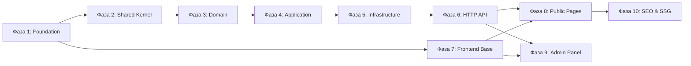

# Plan: Блог с DDD архитектурой и Bento Grid дизайном

**Дата:** 2026-03-19 (обновлено)
**Pipeline этап:** Plan (4/7)
**Research:** 01-research.md, research-storage.md, research-model-map.md, research-repository-issues.md
**Design:** 02-design.md, 02-design-storage.md, design-mappers.md, 02-design-repositories.md
**DevOps:** 03-devops-setup.md (уже реализован)
**Implement:** 05-implement-storage.md (Local Storage), 05-implement-mappers.md (Data Mappers)

---

## Обзор

Реализация блога на стеке Laravel (PHP 8.3) + Vue.js 3 с DDD архитектурой, SSG для SEO и Bento Grid дизайном.

**Ключевые особенности:**
- DevOps инфраструктура уже готова (Docker Compose, Nginx, PostgreSQL, Redis)
- 10 фаз реализации с чёткими критериями готовности
- Параллельные потоки: Backend (DDD слои), Frontend Base, Frontend Pages
- MVP подход: сначала публичная часть, потом Admin Panel и SEO

---

## Ключевые находки Research

- **Стек:** Laravel (PHP 8.3) + Vue.js 3 + PostgreSQL 17 + Redis 7
- **SEO Strategy:** SSG (vite-ssg) + ISR + Schema.org + @unhead/vue
- **Аутентификация:** Laravel Sanctum (cookie-based для SPA)
- **WYSIWYG редактор:** TipTap (современный, расширяемый)
- **Bento Grid:** CSS Grid с 12 колонками, responsive breakpoints
- **Кэширование:** Redis с тегами для инвалидации

**Главные риски Research:**
1. SEO для SPA (High) - митигация: SSG + ISR
2. DDD vs Laravel conventions (High) - митигация: Repository pattern
3. Bento Grid responsive (Medium) - митигация: CSS Grid auto-fit, mobile-first

---

## Ключевые решения Design

- **Архитектура:** Layered Architecture с DDD ограниченными контекстами
- **Паттерны:** Repository, Service Layer, DTO, Command/Query, Factory, Adapter
- **Домены:** Article (ядро), Contact, User, Media, Settings
- **Shared Kernel:** Entity, ValueObject, Uuid, Timestamps, PaginatedResult
- **Разделение:** Domain Models отдельно от Eloquent Models

**Структура Backend:**
```
app/
├── Domain/          # Доменные сущности, VO, интерфейсы репозиториев
├── Application/     # DTOs, Services, Commands/Queries
├── Infrastructure/  # Eloquent Models, Repository implementations, Storage
└── Http/            # Controllers, Requests, Resources
```

**Структура Frontend:**
```
src/
├── components/      # base/, bento/, layout/, article/, home/, admin/
├── composables/     # useArticle, useSeo, useAuth, etc.
├── stores/          # Pinia stores
├── services/        # API clients
├── types/           # TypeScript types
├── router/          # Vue Router config
└── styles/          # CSS variables, Bento Grid styles
```

---

## Фазы реализации

### Фаза 1: Foundation Setup

**Задачи:**
- Создать Laravel проект в директории `laravel/`
- Создать Vue.js проект в директории `frontend/`
- Настроить composer.json и package.json
- Создать базовые миграции БД (users, articles, categories, tags, media_files, contact_messages, site_settings)
- Настроить .env файлы для Laravel
- Установить Sanctum для аутентификации

**Файлы:**
- `laravel/composer.json`
- `laravel/.env`
- `laravel/config/sanctum.php`
- `laravel/database/migrations/*` (7 миграций)
- `frontend/package.json`
- `frontend/vite.config.ts`
- `frontend/tsconfig.json`
- `frontend/src/main.ts`
- `frontend/src/App.vue`

**Критерий готовности:**
- [ ] Laravel проект создан в laravel/
- [ ] Vue.js проект создан в frontend/
- [ ] Docker контейнеры запускаются (`make dev` работает)
- [ ] БД миграции выполнены (7 таблиц созданы)
- [ ] Homepage отображается (Laravel welcome или Vue dev server)
- [ ] API health endpoint возвращает 200

**Риски:**
| Риск | Митигация |
|------|-----------|
| Конфликт версий пакетов | Зафиксировать версии в composer.json/package.json |
| Проблемы с подключением к БД | DevOps уже настроен с health checks |

---

### Фаза 2: Shared Kernel (Domain Layer)

**Задачи:**
- Создать базовые классы для Domain Layer
- Реализовать Entity, ValueObject, Uuid, Timestamps
- Реализовать PaginatedResult для типизированной пагинации
- Создать DomainException и ValidationException

**Файлы:**
- `laravel/app/Domain/Shared/Entity.php`
- `laravel/app/Domain/Shared/ValueObject.php`
- `laravel/app/Domain/Shared/Uuid.php`
- `laravel/app/Domain/Shared/Timestamps.php`
- `laravel/app/Domain/Shared/PaginatedResult.php`
- `laravel/app/Domain/Shared/DomainEvent.php`
- `laravel/app/Domain/Shared/Exceptions/DomainException.php`
- `laravel/app/Domain/Shared/Exceptions/ValidationException.php`

**Критерий готовности:**
- [ ] Все базовые классы созданы
- [ ] Unit тесты для Uuid и PaginatedResult проходят

**Риски:**
| Риск | Митигация |
|------|-----------|
| Сложность Value Objects | Начать с простых (Uuid, Email), усложнять по необходимости |

---

### Фаза 3: Domain Layer

**Задачи:**
- Создать Entities для всех доменов (Article, Category, Tag, User, MediaFile, ContactMessage, SiteSetting)
- Создать ValueObjects (Slug, Email, ArticleStatus, UserRole, MimeType, FilePath, etc.)
- Определить Repository Interfaces для всех доменов
- Создать Domain Events (ArticlePublished, ContactMessageReceived)

**Файлы:**
- `laravel/app/Domain/Article/Entities/Article.php`
- `laravel/app/Domain/Article/Entities/Category.php`
- `laravel/app/Domain/Article/Entities/Tag.php`
- `laravel/app/Domain/Article/ValueObjects/ArticleStatus.php`
- `laravel/app/Domain/Article/ValueObjects/Slug.php`
- `laravel/app/Domain/Article/ValueObjects/ArticleContent.php`
- `laravel/app/Domain/Article/Repositories/ArticleRepositoryInterface.php`
- `laravel/app/Domain/Article/Repositories/CategoryRepositoryInterface.php`
- `laravel/app/Domain/Article/Repositories/TagRepositoryInterface.php`
- `laravel/app/Domain/Article/Events/ArticlePublished.php`
- `laravel/app/Domain/Article/Events/ArticleArchived.php`
- `laravel/app/Domain/Contact/Entities/ContactMessage.php`
- `laravel/app/Domain/Contact/ValueObjects/Email.php`
- `laravel/app/Domain/Contact/ValueObjects/IPAddress.php`
- `laravel/app/Domain/Contact/Repositories/ContactRepositoryInterface.php`
- `laravel/app/Domain/User/Entities/User.php`
- `laravel/app/Domain/User/ValueObjects/UserRole.php`
- `laravel/app/Domain/User/ValueObjects/Password.php`
- `laravel/app/Domain/User/Repositories/UserRepositoryInterface.php`
- `laravel/app/Domain/Media/Entities/MediaFile.php`
- `laravel/app/Domain/Media/ValueObjects/FilePath.php`
- `laravel/app/Domain/Media/ValueObjects/MimeType.php`
- `laravel/app/Domain/Media/ValueObjects/ImageDimensions.php`
- `laravel/app/Domain/Media/Repositories/MediaRepositoryInterface.php`
- `laravel/app/Domain/Media/Services/FileStorageInterface.php`
- `laravel/app/Domain/Settings/Entities/SiteSetting.php`
- `laravel/app/Domain/Settings/ValueObjects/SettingKey.php`
- `laravel/app/Domain/Settings/ValueObjects/SettingValue.php`
- `laravel/app/Domain/Settings/Repositories/SettingsRepositoryInterface.php`

**Критерий готовности:**
- [ ] Все Entities созданы
- [ ] Все ValueObjects созданы
- [ ] Все Repository Interfaces определены
- [ ] Domain Events созданы
- [ ] Unit тесты для Domain Entities проходят

**Риски:**
| Риск | Митигация |
|------|-----------|
| DDD vs Laravel conventions конфликт | Четкое разделение Domain Models от Eloquent Models |

---

### Фаза 4: Application Layer

**Задачи:**
- Создать DTOs для всех доменов
- Реализовать Services (ArticleService, ContactService, AuthenticationService, MediaService, SettingsService)
- Создать Commands и Queries для CQRS паттерна

**Файлы:**
- `laravel/app/Application/Article/DTOs/ArticleDTO.php`
- `laravel/app/Application/Article/DTOs/ArticleListDTO.php`
- `laravel/app/Application/Article/Commands/CreateArticleCommand.php`
- `laravel/app/Application/Article/Commands/PublishArticleCommand.php`
- `laravel/app/Application/Article/Commands/ArchiveArticleCommand.php`
- `laravel/app/Application/Article/Queries/GetArticleBySlugQuery.php`
- `laravel/app/Application/Article/Queries/GetPublishedArticlesQuery.php`
- `laravel/app/Application/Article/Services/ArticleService.php`
- `laravel/app/Application/Contact/DTOs/ContactMessageDTO.php`
- `laravel/app/Application/Contact/Commands/SendMessageCommand.php`
- `laravel/app/Application/Contact/Services/ContactService.php`
- `laravel/app/Application/User/DTOs/UserDTO.php`
- `laravel/app/Application/User/DTOs/AuthRequest.php`
- `laravel/app/Application/User/Services/AuthenticationService.php`
- `laravel/app/Application/Media/DTOs/MediaFileDTO.php`
- `laravel/app/Application/Media/Services/MediaService.php`
- `laravel/app/Application/Settings/DTOs/SettingsDTO.php`
- `laravel/app/Application/Settings/Services/SettingsService.php`

**Критерий готовности:**
- [ ] Все DTOs созданы
- [ ] ArticleService реализован (CRUD + publish/archive)
- [ ] ContactService реализован (sendMessage)
- [ ] AuthenticationService реализован (login/logout)
- [ ] Unit тесты для Services проходят

**Риски:**
| Риск | Митигация |
|------|-----------|
| Over-engineering для простого блога | Минимальный набор Services и DTOs |
| DTO duplication | Базовые DTOs, расширять только когда нужно |

---

### Принятые архитектурные решения (ADR)

#### ADR-001: Гибридная типизация в CQRS

**Статус:** Принято (2026-03-19)

**Гибридный подход к типизации в Commands/Queries:**

| Тип данных | Тип в Commands/Queries | Обоснование |
|------------|------------------------|-------------|
| Идентификаторы | `Uuid` (Value Object) | Защита от перепутывания ID |
| Бизнес-значимые данные | Value Objects (`Slug`, `Email`, `IPAddress`) | Инкапсуляция валидации |
| Простые данные | Примитивы (`string`, `int`) | Простота, контекст-dependent валидация |
| DTOs | Примитивы | Сериализация в JSON, API responses |

#### ADR-002: Query Object Pattern для фильтрации

**Статус:** Принято (2026-03-19)

**Query Object Pattern** с `ArticleFilters` Value Object вместо множества специфичных методов репозитория.

**Преимущества:**
- Единый метод `findByFilters()` в репозитории
- Domain-слой владеет структурой фильтров
- Легко добавлять новые фильтры
- Типобезопасность

#### ADR-003: Разделение findById() и getById() в репозиториях

**Статус:** Принято (2026-03-19)

**Проблема:** Неоднозначность возвращаемого значения при поиске сущности - `null` или `Exception`?

**Решение:** Разделять методы по семантике:

| Метод | Возврат | Когда использовать |
|-------|---------|-------------------|
| `findById(Uuid $id)` | `?Entity` | Опциональный поиск, сущность может не существовать |
| `getById(Uuid $id)` | `Entity` | Обязательный поиск, выбрасывает `EntityNotFoundException` |

**Обоснование:**
- Martin Fowler: `find()` vs `get()` семантика
- Vaughn Vernon: Optional vs Mandatory lookup
- Явная обработка ошибок на уровне Domain

**Aggregate Boundary (many-to-many sync):**
- Отношение `article_tag` принадлежит **Article Aggregate**
- `syncTags()` находится в **ArticleRepository**, не в TagRepository
- Tag Aggregate не должен знать об Article

**Детали:** `research-repository-issues.md`, `02-design-repositories.md`

---

### Фаза 5: Infrastructure Layer

> **Детальные планы:**
> - `05-implement-storage.md` (Local Storage)
> - `05-implement-mappers.md` (Data Mappers) ✨ **NEW**

**Задачи:**

*Data Mappers (типобезопасная трансформация Domain <-> Eloquent):*
- Создать Custom Casts (7 штук): UuidCast, SlugCast, EmailCast, IPAddressCast, MimeTypeCast, FilePathCast, SettingKeyCast
- Создать BaseMapper trait с общими методами маппинга
- Создать типизированные Mappers (7 штук): ArticleMapper, CategoryMapper, TagMapper, UserMapper, MediaFileMapper, ContactMessageMapper, SiteSettingMapper
- Обновить Eloquent Models с Custom Casts
- Интегрировать Mappers в Repositories

*Persistence (Eloquent):*
- Создать Eloquent Models для всех таблиц
- Реализовать Repository Implementations (преобразование Domain <-> Eloquent)
- Создать CachedArticleRepository для кэширования

*Storage (Local):*
- Реализовать Local Storage (LocalStorageAdapter, InterventionImageProcessor)
- Создать FileDownloadController для приватных файлов
- Настроить StorageServiceProvider (DI bindings)
- Создать Jobs для обработки изображений

**Файлы:**

*Custom Casts (7):*
- `laravel/app/Infrastructure/Persistence/Casts/UuidCast.php`
- `laravel/app/Infrastructure/Persistence/Casts/SlugCast.php`
- `laravel/app/Infrastructure/Persistence/Casts/EmailCast.php`
- `laravel/app/Infrastructure/Persistence/Casts/IPAddressCast.php`
- `laravel/app/Infrastructure/Persistence/Casts/MimeTypeCast.php`
- `laravel/app/Infrastructure/Persistence/Casts/FilePathCast.php`
- `laravel/app/Infrastructure/Persistence/Casts/SettingKeyCast.php`

*Mappers (8):*
- `laravel/app/Infrastructure/Persistence/Eloquent/Mappers/BaseMapper.php` (trait)
- `laravel/app/Infrastructure/Persistence/Eloquent/Mappers/ArticleMapper.php`
- `laravel/app/Infrastructure/Persistence/Eloquent/Mappers/CategoryMapper.php`
- `laravel/app/Infrastructure/Persistence/Eloquent/Mappers/TagMapper.php`
- `laravel/app/Infrastructure/Persistence/Eloquent/Mappers/UserMapper.php`
- `laravel/app/Infrastructure/Persistence/Eloquent/Mappers/MediaFileMapper.php`
- `laravel/app/Infrastructure/Persistence/Eloquent/Mappers/ContactMessageMapper.php`
- `laravel/app/Infrastructure/Persistence/Eloquent/Mappers/SiteSettingMapper.php`

*Persistence (Eloquent):*
- `laravel/app/Domain/Shared/Exceptions/EntityNotFoundException.php` ✨ **NEW**
- `laravel/app/Infrastructure/Persistence/Eloquent/Models/ArticleModel.php`
- `laravel/app/Infrastructure/Persistence/Eloquent/Models/CategoryModel.php`
- `laravel/app/Infrastructure/Persistence/Eloquent/Models/TagModel.php`
- `laravel/app/Infrastructure/Persistence/Eloquent/Models/MediaFileModel.php`
- `laravel/app/Infrastructure/Persistence/Eloquent/Models/ContactMessageModel.php`
- `laravel/app/Infrastructure/Persistence/Eloquent/Models/SiteSettingModel.php`
- `laravel/app/Infrastructure/Persistence/Eloquent/Models/UserModel.php`
- `laravel/app/Infrastructure/Persistence/Eloquent/Repositories/EloquentArticleRepository.php`
- `laravel/app/Infrastructure/Persistence/Eloquent/Repositories/EloquentCategoryRepository.php`
- `laravel/app/Infrastructure/Persistence/Eloquent/Repositories/EloquentTagRepository.php`
- `laravel/app/Infrastructure/Persistence/Eloquent/Repositories/EloquentContactRepository.php`
- `laravel/app/Infrastructure/Persistence/Eloquent/Repositories/EloquentUserRepository.php`
- `laravel/app/Infrastructure/Persistence/Eloquent/Repositories/EloquentMediaRepository.php`
- `laravel/app/Infrastructure/Persistence/Eloquent/Repositories/EloquentSettingsRepository.php`
- `laravel/app/Infrastructure/Persistence/Cache/CachedArticleRepository.php`
- `laravel/app/Exceptions/Handler.php` (update - EntityNotFoundException handling) ✨ **NEW**

*Storage (Local):*
- `laravel/app/Infrastructure/Storage/LocalStorageAdapter.php`
- `laravel/app/Infrastructure/Storage/InterventionImageProcessor.php`
- `laravel/app/Infrastructure/Http/Controllers/FileDownloadController.php`
- `laravel/app/Infrastructure/Providers/StorageServiceProvider.php`
- `laravel/config/image.php`
- `laravel/app/Infrastructure/Queue/ProcessImageJob.php`

**Зависимости:**
- `intervention/image:^3.0` (composer)
- Docker volume для storage/app
- Nginx X-Accel-Redirect для приватных файлов

**Порядок имплементации (Mappers):**
```
Custom Casts (7) --> BaseMapper Trait --> Mappers (7) --> Интеграция Models & Repositories
```

**Порядок имплементации (Repositories):** ✨ **NEW**
```
1. EntityNotFoundException (Domain)
2. Обновить интерфейсы (добавить getById, getBySlug)
3. EloquentArticleRepository (с syncTags)
4. EloquentCategoryRepository
5. EloquentTagRepository (БЕЗ syncForArticle!)
6. EloquentUserRepository
7. EloquentMediaRepository
8. EloquentContactRepository
9. EloquentSettingsRepository
10. Exception Handler (Laravel)
11. CachedArticleRepository (decorator)
```

**Критерий готовности:**
- [ ] Все Custom Casts созданы и работают
- [ ] BaseMapper trait создан
- [ ] Все 7 Mappers созданы с типизированными сигнатурами
- [ ] Eloquent Models обновлены с $casts
- [ ] **EntityNotFoundException создан в Domain\Shared\Exceptions** ✨ **NEW**
- [ ] **Все репозитории имеют findById() (nullable) и getById() (throws)** ✨ **NEW**
- [ ] **ArticleRepository.syncTags() реализован, syncForArticle удалён из TagRepository** ✨ **NEW**
- [ ] **Exception Handler перехватывает EntityNotFoundException → HTTP 404** ✨ **NEW**
- [ ] Repositories используют Mappers
- [ ] Все Eloquent Models созданы с relationships
- [ ] CachedArticleRepository реализован
- [ ] LocalStorageAdapter работает (public/private диски)
- [ ] InterventionImageProcessor работает (resize, WebP, AVIF)
- [ ] FileDownloadController отдаёт приватные файлы через X-Accel-Redirect
- [ ] StorageServiceProvider зарегистрирован
- [ ] Интеграционные тесты для Repositories проходят
- [ ] Unit тесты для Mappers и LocalStorageAdapter проходят

**Риски:**
| Риск | Митигация |
|------|-----------|
| Сложность маппинга Domain <-> Eloquent | Типизированные Mappers с BaseMapper trait |
| Performance (N+1 queries) | Eager loading, индексы в миграциях |
| Потеря файлов при redeploy | Docker named volume для storage/app |
| GD/Imagick недоступен | Fallback на GD, проверить Dockerfile |
| Несанкционированный доступ к приватным файлам | Signed URLs + Nginx internal location |
| Отсутствие методов reconstitute в Entities | Проверить наличие перед имплементацией |
| **EntityNotFoundException не перехвачен** ✨ **NEW** | Глобальный Exception Handler → HTTP 404 |
| **Путаница между find/get методами** ✨ **NEW** | Чёткие PHPDoc и code review |
| **Scopes не работают через query()** ✨ **NEW** | Явные запросы в репозитории, удалить scopes |

---

### Фаза 6: HTTP Layer (API)

**Задачи:**
- Создать Controllers для Public API (ArticleController, CategoryController, TagController, ContactController, SettingsController, HealthController)
- Создать Controllers для Admin API (AdminArticleController, AdminCategoryController, AdminTagController, AdminMediaController, AdminMessageController, AdminSettingsController, AdminUserController, AuthController)
- Создать Form Requests для валидации
- Создать API Resources для форматирования ответов
- Настроить Routes (api.php)

**Файлы:**
- `laravel/app/Infrastructure/Http/Controllers/Api/HealthController.php`
- `laravel/app/Infrastructure/Http/Controllers/Api/ArticleController.php`
- `laravel/app/Infrastructure/Http/Controllers/Api/CategoryController.php`
- `laravel/app/Infrastructure/Http/Controllers/Api/TagController.php`
- `laravel/app/Infrastructure/Http/Controllers/Api/ContactController.php`
- `laravel/app/Infrastructure/Http/Controllers/Api/SettingsController.php`
- `laravel/app/Infrastructure/Http/Controllers/Admin/AuthController.php`
- `laravel/app/Infrastructure/Http/Controllers/Admin/AdminArticleController.php`
- `laravel/app/Infrastructure/Http/Controllers/Admin/AdminCategoryController.php`
- `laravel/app/Infrastructure/Http/Controllers/Admin/AdminTagController.php`
- `laravel/app/Infrastructure/Http/Controllers/Admin/AdminMediaController.php`
- `laravel/app/Infrastructure/Http/Controllers/Admin/AdminMessageController.php`
- `laravel/app/Infrastructure/Http/Controllers/Admin/AdminSettingsController.php`
- `laravel/app/Infrastructure/Http/Controllers/Admin/AdminUserController.php`
- `laravel/app/Infrastructure/Http/Requests/CreateArticleRequest.php`
- `laravel/app/Infrastructure/Http/Requests/UpdateArticleRequest.php`
- `laravel/app/Infrastructure/Http/Requests/ContactRequest.php`
- `laravel/app/Infrastructure/Http/Requests/LoginRequest.php`
- `laravel/app/Infrastructure/Http/Resources/ArticleResource.php`
- `laravel/app/Infrastructure/Http/Resources/ArticleListResource.php`
- `laravel/app/Infrastructure/Http/Resources/CategoryResource.php`
- `laravel/app/Infrastructure/Http/Resources/TagResource.php`
- `laravel/app/Infrastructure/Http/Resources/MediaResource.php`
- `laravel/app/Infrastructure/Http/Resources/SettingsResource.php`
- `laravel/routes/api.php`

**Критерий готовности:**
- [ ] Все Public API endpoints работают
- [ ] Все Admin API endpoints работают
- [ ] Sanctum аутентификация работает
- [ ] Form Request validation работает
- [ ] API Resources возвращают правильный JSON
- [ ] Postman/Insomnia collection создана
- [ ] Feature тесты для API проходят

**Риски:**
| Риск | Митигация |
|------|-----------|
| Неполная валидация данных | Form Requests для всех endpoints |
| Отсутствие авторизации | Sanctum middleware для admin routes |

---

### Фаза 7: Frontend Base

**Задачи:**
- Создать Base Components (BaseButton, BaseInput, BaseCard, BaseTag, BaseModal, BaseLoader)
- Создать Layout Components (AppHeader, AppFooter, AppLayout)
- Создать Bento Grid Components (BentoGrid, BentoCard, BentoGridItem)
- Настроить Vue Router
- Создать API Client (axios с interceptors)
- Создать TypeScript types
- Настроить CSS variables (Nature Distilled палитра)

**Файлы:**
- `frontend/src/components/base/BaseButton.vue`
- `frontend/src/components/base/BaseInput.vue`
- `frontend/src/components/base/BaseCard.vue`
- `frontend/src/components/base/BaseTag.vue`
- `frontend/src/components/base/BaseModal.vue`
- `frontend/src/components/base/BaseLoader.vue`
- `frontend/src/components/layout/AppHeader.vue`
- `frontend/src/components/layout/AppFooter.vue`
- `frontend/src/components/layout/AppLayout.vue`
- `frontend/src/components/bento/BentoGrid.vue`
- `frontend/src/components/bento/BentoCard.vue`
- `frontend/src/components/bento/BentoGridItem.vue`
- `frontend/src/router/index.ts`
- `frontend/src/services/apiClient.ts`
- `frontend/src/types/article.ts`
- `frontend/src/types/category.ts`
- `frontend/src/types/tag.ts`
- `frontend/src/types/user.ts`
- `frontend/src/types/media.ts`
- `frontend/src/types/api.ts`
- `frontend/src/utils/formatDate.ts`
- `frontend/src/utils/slugify.ts`
- `frontend/src/utils/validators.ts`
- `frontend/src/styles/variables.css`
- `frontend/src/styles/typography.css`
- `frontend/src/styles/bento.css`
- `frontend/src/styles/main.css`

**Критерий готовности:**
- [ ] Все Base Components созданы
- [ ] BentoGrid компоненты работают
- [ ] Router настроен
- [ ] API Client работает
- [ ] TypeScript types созданы
- [ ] CSS variables настроены

**Риски:**
| Риск | Митигация |
|------|-----------|
| Несоответствие дизайн-системе | CSS variables из Design документа |
| TypeScript типы не синхронизированы с API | Ручная синхронизация с API spec |

---

### Фаза 8: Frontend Public Pages

**Задачи:**
- Создать Home Page (Hero, About, Contact, Latest Articles)
- Создать Articles List и Article Detail страницы
- Создать Categories и Tags страницы
- Реализовать Contact Form
- Интегрировать SEO (@unhead/vue)
- Настроить responsive дизайн

**Файлы:**
- `frontend/src/pages/HomePage.vue`
- `frontend/src/pages/ArticlesPage.vue`
- `frontend/src/pages/ArticleDetailPage.vue`
- `frontend/src/pages/CategoriesPage.vue`
- `frontend/src/pages/CategoryDetailPage.vue`
- `frontend/src/pages/TagsPage.vue`
- `frontend/src/pages/TagDetailPage.vue`
- `frontend/src/components/home/HeroSection.vue`
- `frontend/src/components/home/AboutMeCard.vue`
- `frontend/src/components/home/ContactForm.vue`
- `frontend/src/components/home/LatestArticles.vue`
- `frontend/src/components/article/ArticleCard.vue`
- `frontend/src/components/article/ArticleList.vue`
- `frontend/src/components/article/ArticleDetail.vue`
- `frontend/src/components/article/ArticleContent.vue`
- `frontend/src/components/category/CategoryCard.vue`
- `frontend/src/components/category/CategoryList.vue`
- `frontend/src/components/tag/TagBadge.vue`
- `frontend/src/components/tag/TagCloud.vue`
- `frontend/src/composables/useArticle.ts`
- `frontend/src/composables/useArticles.ts`
- `frontend/src/composables/useCategories.ts`
- `frontend/src/composables/useTags.ts`
- `frontend/src/composables/useSeo.ts`
- `frontend/src/composables/useContact.ts`
- `frontend/src/services/articleService.ts`
- `frontend/src/services/categoryService.ts`
- `frontend/src/services/tagService.ts`
- `frontend/src/services/contactService.ts`

**Критерий готовности:**
- [ ] Home Page отображается
- [ ] Articles List с пагинацией работает
- [ ] Article Detail страница работает
- [ ] Categories и Tags страницы работают
- [ ] Contact form отправляет данные
- [ ] SEO мета-теги работают
- [ ] Responsive дизайн работает

**Риски:**
| Риск | Митигация |
|------|-----------|
| Bento Grid адаптивность | CSS Grid auto-fit, mobile-first breakpoints |
| Performance | Lazy loading, code splitting, Suspense |

---

### Фаза 9: Admin Panel

**Задачи:**
- Создать Admin Layout и Sidebar
- Реализовать Authentication UI (Login, Logout)
- Создать Article Editor с TipTap
- Реализовать Media Management (Gallery, Uploader)
- Создать CRUD для Categories, Tags
- Реализовать Settings Editor
- Создать Users Management
- Настроить Protected routes

**Файлы:**
- `frontend/src/pages/admin/AdminDashboard.vue`
- `frontend/src/pages/admin/AdminArticles.vue`
- `frontend/src/pages/admin/AdminCategories.vue`
- `frontend/src/pages/admin/AdminTags.vue`
- `frontend/src/pages/admin/AdminMedia.vue`
- `frontend/src/pages/admin/AdminMessages.vue`
- `frontend/src/pages/admin/AdminSettings.vue`
- `frontend/src/pages/admin/AdminUsers.vue`
- `frontend/src/components/admin/AdminLayout.vue`
- `frontend/src/components/admin/AdminSidebar.vue`
- `frontend/src/components/admin/ArticleEditor.vue`
- `frontend/src/components/admin/MediaGallery.vue`
- `frontend/src/components/admin/MediaUploader.vue`
- `frontend/src/components/admin/MessageList.vue`
- `frontend/src/components/admin/SettingsEditor.vue`
- `frontend/src/components/admin/DataTable.vue`
- `frontend/src/composables/useAuth.ts`
- `frontend/src/stores/articleStore.ts`
- `frontend/src/stores/authStore.ts`
- `frontend/src/stores/uiStore.ts`
- `frontend/src/stores/mediaStore.ts`
- `frontend/src/services/authService.ts`
- `frontend/src/services/mediaService.ts`

**Критерий готовности:**
- [ ] Login страница работает
- [ ] Dashboard отображает статистику
- [ ] Article Editor работает
- [ ] Media Gallery работает
- [ ] Categories/Tags CRUD работает
- [ ] Settings Editor работает
- [ ] Users Management работает
- [ ] Protected routes (auth guard)

**Риски:**
| Риск | Митигация |
|------|-----------|
| Безопасность (CSRF, XSS) | Laravel Sanctum, CSRF tokens, validation |
| Сложность WYSIWYG редактора | TipTap - хорошая документация |

---

### Фаза 10: SEO & SSG

**Задачи:**
- Настроить vite-ssg для генерации статического HTML
- Добавить Schema.org разметку (Article, BreadcrumbList, WebSite)
- Реализовать генерацию sitemap.xml
- Создать ISR webhook для перегенерации при публикации
- Создать robots.txt
- Настроить Open Graph и Twitter Card теги

**Файлы:**
- `frontend/vite.config.ts` (vite-ssg config)
- `frontend/src/composables/useArticleSEO.ts`
- `frontend/src/composables/useBreadcrumb.ts`
- `frontend/src/utils/sitemap.ts`
- `laravel/app/Infrastructure/Http/Controllers/Api/WebhookController.php`
- `frontend/public/robots.txt`

**Критерий готовности:**
- [ ] vite-ssg генерирует статический HTML
- [ ] Schema.org разметка валидна (Google Rich Results Test)
- [ ] sitemap.xml генерируется
- [ ] robots.txt создан
- [ ] ISR webhook работает
- [ ] Open Graph теги работают
- [ ] Lighthouse SEO score > 90

**Риски:**
| Риск | Митигация |
|------|-----------|
| SEO для SPA не работает | SSG генерирует статический HTML |
| Задержка индексации новых статей | ISR webhook для мгновенного обновления |
| Schema.org разметка не валидна | Тестирование через Google Rich Results Test |

---

## Зависимости между фазами



**Параллельные потоки:**
- **Поток A (Backend):** F1 -> F2 -> F3 -> F4 -> F5 -> F6
- **Поток B (Frontend Base):** F1 -> F7 (можно начать после F1)
- **Поток C (Frontend Pages):** F6 + F7 -> F8 -> F10
- **Поток D (Admin Panel):** F6 + F7 -> F9

**Критический путь:** F1 -> F2 -> F3 -> F4 -> F5 -> F6 -> F8 -> F10

---

## Общая оценка

- **Файлов:** ~230
- **Фаз:** 10
- **Риски:** 5 критических (SEO, DDD, Security, Responsive, Performance)

**Оценка времени:**
- Фаза 1: 1-2 дня
- Фазы 2-6: 5-7 дней (Backend)
- Фаза 7: 2-3 дня (Frontend Base)
- Фаза 8: 3-4 дня (Public Pages)
- Фаза 9: 4-5 дней (Admin Panel)
- Фаза 10: 2-3 дня (SEO/SSG)
- **Итого: 17-24 дня** (с учётом параллельной работы)

**Приоритеты реализации:**
1. **MVP:** Фазы 1-6 + 7-8 (Backend API + Public Frontend)
2. **Admin Panel:** Фаза 9
3. **SEO Optimization:** Фаза 10

---

## Выводы Sequential Thinking

**Ключевые решения:**
1. DevOps инфраструктура уже готова - начинаем с Foundation Setup (создание проектов)
2. DDD с Repository pattern для абстракции Eloquent - критично для тестируемости
3. SSG с ISR для SEO оптимизации SPA - решает проблему индексации
4. TipTap как WYSIWYG редактор - современный, расширяемый
5. Laravel Sanctum для аутентификации - cookie-based для SPA безопасности
6. Bento Grid с CSS Grid - responsive без лишней сложности

**Главные риски:**
1. **SEO для SPA (High)** - митигация: SSG + ISR, генерация статического HTML
2. **DDD vs Laravel conventions (High)** - митигация: Repository pattern, чёткое разделение слоёв
3. **Безопасность админки (High)** - митигация: Sanctum, CSRF, validation, rate limiting
4. **Bento Grid responsive (Medium)** - митигация: CSS Grid auto-fit, mobile-first подход
5. **Performance (Medium)** - митигация: lazy loading, code splitting, Redis caching

**Обоснование порядка фаз:**
- Фазы 2-5 (Domain -> Application -> Infrastructure) - классический DDD подход снизу вверх
- Фаза 6 (HTTP API) - после Infrastructure, когда есть что экспозить
- Фаза 7 (Frontend Base) - параллельно с Backend, не зависит от API
- Фазы 8-10 - после готовности API и Frontend Base

---