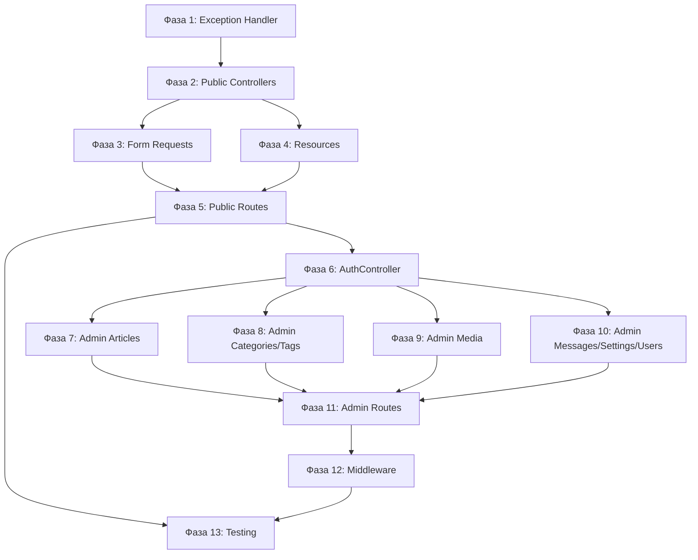

# Plan: HTTP Layer (API) Implementation

**Дата:** 2026-03-19
**Pipeline этап:** Implement (5/7)
**Design:** 02-design-http-api.md
**Research:** research-http-api.md

---

## Обзор

Имплементация REST API для блога с разделением на Public API и Admin API, Laravel Sanctum для аутентификации и типизированными Request/Response объектами.

**Цель:** Создать HTTP слой, который экспозит Application Services через REST API.

---

## Ключевые находки Research

- 5 Application Services уже реализованы (ArticleService, ContactService, AuthenticationService, MediaService, SettingsService)
- DTOs, Commands, Queries существуют
- Laravel Sanctum уже установлен и настроен для cookie-based auth
- HealthController уже существует

---

## Ключевые решения Design

- **Паттерны:** Controller (тонкий), Form Request (валидация), API Resource (трансформация)
- **Аутентификация:** Laravel Sanctum с cookie-based auth для SPA
- **Rate Limiting:** Public 60/мин, Contact 3/час, Login 5/мин
- **Exception Handling:** EntityNotFoundException → HTTP 404

---

## Фазы реализации

### Фаза 1: Exception Handler

**Задачи:**
- Обновить Handler для API exception handling
- Добавить JSON responses для EntityNotFoundException, ValidationException, AuthenticationException

**Файлы:**
- `laravel/app/Exceptions/Handler.php` (изменить)

**Критерий готовности:**
- [ ] EntityNotFoundException → 404 JSON response
- [ ] ValidationException → 422 JSON response с errors
- [ ] AuthenticationException → 401 JSON response
- [ ] Production mode скрывает stack traces

**Риски:**
| Риск | Митигация |
|------|-----------|
| Нарушение web routes | Проверять $request->is('api/*') |

---

### Фаза 2: Public API - Controllers

**Задачи:**
- Создать ArticleController (index, show)
- Создать CategoryController (index, show)
- Создать TagController (index, show)
- Создать ContactController (store)
- Создать SettingsController (index, show)

**Файлы:**
- `laravel/app/Infrastructure/Http/Controllers/Api/ArticleController.php` (создать)
- `laravel/app/Infrastructure/Http/Controllers/Api/CategoryController.php` (создать)
- `laravel/app/Infrastructure/Http/Controllers/Api/TagController.php` (создать)
- `laravel/app/Infrastructure/Http/Controllers/Api/ContactController.php` (создать)
- `laravel/app/Infrastructure/Http/Controllers/Api/SettingsController.php` (создать)

**Зависимости:**
- Application Services уже существуют
- DTOs уже существуют

**Критерий готовности:**
- [ ] Все контроллеры делегируют логику Services
- [ ] Контроллеры возвращают JsonResponse
- [ ] ArticleController использует GetPublishedArticlesQuery
- [ ] ContactController создаёт SendMessageCommand

---

### Фаза 3: Public API - Form Requests

**Задачи:**
- Создать ContactRequest для валидации контактной формы

**Файлы:**
- `laravel/app/Infrastructure/Http/Requests/Api/ContactRequest.php` (создать)

**Правила валидации:**
```php
'name' => ['required', 'string', 'min:1', 'max:100'],
'email' => ['required', 'email', 'max:254'],
'subject' => ['required', 'string', 'min:1', 'max:200'],
'message' => ['required', 'string', 'min:10', 'max:5000'],
```

**Критерий готовности:**
- [ ] authorize() возвращает true (public endpoint)
- [ ] rules() содержит все правила валидации
- [ ] messages() содержит кастомные сообщения

---

### Фаза 4: Public API - Resources

**Задачи:**
- Создать ArticleResource (полный формат)
- Создать ArticleListResource (легковесный формат)
- Создать CategoryResource
- Создать CategoryCollectionResource
- Создать TagResource
- Создать TagCollectionResource
- Создать SettingsResource
- Создать SettingsCollectionResource
- Создать ContactMessageResource
- Создать PaginatedResource (generic wrapper)

**Файлы:**
- `laravel/app/Infrastructure/Http/Resources/ArticleResource.php` (создать)
- `laravel/app/Infrastructure/Http/Resources/ArticleListResource.php` (создать)
- `laravel/app/Infrastructure/Http/Resources/CategoryResource.php` (создать)
- `laravel/app/Infrastructure/Http/Resources/CategoryCollectionResource.php` (создать)
- `laravel/app/Infrastructure/Http/Resources/TagResource.php` (создать)
- `laravel/app/Infrastructure/Http/Resources/TagCollectionResource.php` (создать)
- `laravel/app/Infrastructure/Http/Resources/SettingsResource.php` (создать)
- `laravel/app/Infrastructure/Http/Resources/SettingsCollectionResource.php` (создать)
- `laravel/app/Infrastructure/Http/Resources/ContactMessageResource.php` (создать)
- `laravel/app/Infrastructure/Http/Resources/PaginatedResource.php` (создать)

**Критерий готовности:**
- [ ] Все Resources трансформируют DTOs в array
- [ ] ArticleResource содержит все поля ArticleDTO
- [ ] ArticleListResource содержит минимальный набор полей
- [ ] PaginatedResource оборачивает items + meta

---

### Фаза 5: Public API - Routes

**Задачи:**
- Добавить routes для Public API в api.php
- Настроить middleware throttle
- Настроить rate limiting для contact

**Файлы:**
- `laravel/routes/api.php` (изменить)

**Endpoints:**
```
GET  /api/articles           - throttle:60,1
GET  /api/articles/{slug}    - throttle:60,1
GET  /api/categories         - throttle:60,1
GET  /api/categories/{slug}  - throttle:60,1
GET  /api/tags               - throttle:60,1
GET  /api/tags/{slug}        - throttle:60,1
GET  /api/settings           - throttle:60,1
POST /api/contact            - throttle:3,60 (3/час)
GET  /api/health             - no throttle
```

**Критерий готовности:**
- [ ] php artisan route:list показывает все маршруты
- [ ] throttle middleware применён
- [ ] Contact имеет строгий rate limiting
- [ ] slug validation regex работает

---

### Фаза 6: Admin API - AuthController

**Задачи:**
- Создать AuthController с login, logout, user методами
- Создать LoginRequest для валидации

**Файлы:**
- `laravel/app/Infrastructure/Http/Controllers/Admin/AuthController.php` (создать)
- `laravel/app/Infrastructure/Http/Requests/Admin/LoginRequest.php` (создать)

**Правила валидации LoginRequest:**
```php
'email' => ['required', 'email', 'max:254'],
'password' => ['required', 'string', 'min:8', 'max:72'],
```

**Критерий готовности:**
- [ ] login создаёт сессию через session()->regenerate()
- [ ] logout инвалидирует сессию
- [ ] user возвращает текущего пользователя
- [ ] Login имеет throttle:5,1 (5 попыток/мин)

---

### Фаза 7: Admin API - Article Management

**Задачи:**
- Создать AdminArticleController (CRUD + publish/archive/syncTags)
- Создать CreateArticleRequest
- Создать UpdateArticleRequest
- Создать ArticleTagsRequest
- Создать UserResource (для author)

**Файлы:**
- `laravel/app/Infrastructure/Http/Controllers/Admin/AdminArticleController.php` (создать)
- `laravel/app/Infrastructure/Http/Requests/Api/CreateArticleRequest.php` (создать)
- `laravel/app/Infrastructure/Http/Requests/Api/UpdateArticleRequest.php` (создать)
- `laravel/app/Infrastructure/Http/Requests/Admin/ArticleTagsRequest.php` (создать)
- `laravel/app/Infrastructure/Http/Resources/UserResource.php` (создать)

**CreateArticleRequest rules:**
```php
'title' => ['required', 'string', 'min:1', 'max:255'],
'content' => ['required', 'string', 'min:1'],
'slug' => ['nullable', 'string', 'regex:/^[a-z0-9]+(?:-[a-z0-9]+)*$/', 'unique:articles,slug'],
'category_id' => ['nullable', 'uuid', 'exists:categories,id'],
'cover_image_id' => ['nullable', 'uuid', 'exists:media_files,id'],
```

**Критерий готовности:**
- [ ] CRUD операции работают
- [ ] publish/archive вызывают соответствующие Commands
- [ ] syncTags синхронизирует теги статьи
- [ ] Валидация slug работает

---

### Фаза 8: Admin API - Category & Tag Management

**Задачи:**
- Создать AdminCategoryController (CRUD)
- Создать AdminTagController (CRUD)
- Создать CategoryRequest
- Создать TagRequest

**Файлы:**
- `laravel/app/Infrastructure/Http/Controllers/Admin/AdminCategoryController.php` (создать)
- `laravel/app/Infrastructure/Http/Controllers/Admin/AdminTagController.php` (создать)
- `laravel/app/Infrastructure/Http/Requests/Admin/CategoryRequest.php` (создать)
- `laravel/app/Infrastructure/Http/Requests/Admin/TagRequest.php` (создать)

**Критерий готовности:**
- [ ] Category CRUD работает
- [ ] Tag CRUD работает
- [ ] Slug auto-generation (если не указан)

---

### Фаза 9: Admin API - Media Management

**Задачи:**
- Создать AdminMediaController (CRUD + recent + unused)
- Создать MediaRequest
- Создать MediaResource
- Создать MediaCollectionResource

**Файлы:**
- `laravel/app/Infrastructure/Http/Controllers/Admin/AdminMediaController.php` (создать)
- `laravel/app/Infrastructure/Http/Requests/Admin/MediaRequest.php` (создать)
- `laravel/app/Infrastructure/Http/Resources/MediaResource.php` (создать)
- `laravel/app/Infrastructure/Http/Resources/MediaCollectionResource.php` (создать)

**Критерий готовности:**
- [ ] Upload обрабатывает multipart/form-data
- [ ] recent возвращает последние файлы
- [ ] unused возвращает неиспользуемые файлы

---

### Фаза 10: Admin API - Message & Settings & User Management

**Задачи:**
- Создать AdminMessageController (index, show, destroy, markAsRead, markAsUnread)
- Создать AdminSettingsController (index, show, update, destroy, byGroup, deleteGroup)
- Создать AdminUserController (CRUD)
- Создать SettingsRequest
- Создать UserRequest

**Файлы:**
- `laravel/app/Infrastructure/Http/Controllers/Admin/AdminMessageController.php` (создать)
- `laravel/app/Infrastructure/Http/Controllers/Admin/AdminSettingsController.php` (создать)
- `laravel/app/Infrastructure/Http/Controllers/Admin/AdminUserController.php` (создать)
- `laravel/app/Infrastructure/Http/Requests/Api/SettingsRequest.php` (создать)
- `laravel/app/Infrastructure/Http/Requests/Admin/UserRequest.php` (создать)

**Критерий готовности:**
- [ ] Messages read/unread toggle работает
- [ ] Settings group operations работают
- [ ] User CRUD работает

---

### Фаза 11: Admin API - Routes

**Задачи:**
- Добавить Admin API routes в api.php
- Настроить auth:sanctum middleware
- Настроить rate limiting

**Файлы:**
- `laravel/routes/api.php` (изменить)

**Endpoints:**
```
POST   /api/admin/auth/login      - throttle:5,1
POST   /api/admin/auth/logout     - auth:sanctum
GET    /api/admin/user            - auth:sanctum

GET    /api/admin/articles        - auth:sanctum, throttle:120,1
POST   /api/admin/articles        - auth:sanctum
GET    /api/admin/articles/{id}   - auth:sanctum
PUT    /api/admin/articles/{id}   - auth:sanctum
DELETE /api/admin/articles/{id}   - auth:sanctum
POST   /api/admin/articles/{id}/publish  - auth:sanctum
POST   /api/admin/articles/{id}/archive  - auth:sanctum
PUT    /api/admin/articles/{id}/tags     - auth:sanctum

... (остальные admin routes)
```

**Критерий готовности:**
- [ ] Все admin routes защищены auth:sanctum
- [ ] Login route не требует auth
- [ ] Rate limiting настроен

---

### Фаза 12: Middleware Configuration

**Задачи:**
- Проверить Sanctum configuration
- Настроить CORS для SPA
- Проверить CSRF protection

**Файлы:**
- `laravel/config/sanctum.php` (проверить)
- `laravel/config/cors.php` (изменить)
- `laravel/config/app.php` (проверить)

**CORS config:**
```php
'paths' => ['api/*'],
'allowed_origins' => ['http://localhost:3000', env('FRONTEND_URL')],
'supports_credentials' => true, // Required for Sanctum
```

**Критерий готовности:**
- [ ] Sanctum stateful domains настроены
- [ ] CORS supports_credentials = true
- [ ] CSRF token работает

---

### Фаза 13: Feature Testing

**Задачи:**
- Создать feature тесты для Public API
- Создать feature тесты для Admin API
- Создать feature тесты для Auth

**Файлы:**
- `laravel/tests/Feature/Api/Public/ArticleApiTest.php` (создать)
- `laravel/tests/Feature/Api/Public/CategoryApiTest.php` (создать)
- `laravel/tests/Feature/Api/Public/TagApiTest.php` (создать)
- `laravel/tests/Feature/Api/Public/ContactApiTest.php` (создать)
- `laravel/tests/Feature/Api/Public/SettingsApiTest.php` (создать)
- `laravel/tests/Feature/Api/Admin/AuthTest.php` (создать)
- `laravel/tests/Feature/Api/Admin/ArticleManagementTest.php` (создать)
- `laravel/tests/Feature/Api/Admin/CategoryManagementTest.php` (создать)
- `laravel/tests/Feature/Api/Admin/MediaManagementTest.php` (создать)

**Критерий готовности:**
- [ ] Public endpoints возвращают 200
- [ ] Admin endpoints без auth возвращают 401
- [ ] Validation errors возвращают 422
- [ ] Rate limiting работает (429)

---

## Зависимости между фазами



---

## Порядок имплементации (рекомендуемый)

### День 1: Foundation
1. `app/Exceptions/Handler.php` - API exception handling
2. Public Controllers (5 файлов)
3. `ContactRequest.php`

### День 2: Public API
4. API Resources (10 файлов)
5. `routes/api.php` - Public routes
6. Тестирование Public API через Postman

### День 3: Auth
7. `AuthController.php`
8. `LoginRequest.php`
9. `UserResource.php`
10. Auth routes

### День 4: Admin Articles
11. `AdminArticleController.php`
12. `CreateArticleRequest.php`
13. `UpdateArticleRequest.php`
14. `ArticleTagsRequest.php`

### День 5: Admin Categories & Tags
15. `AdminCategoryController.php`
16. `AdminTagController.php`
17. `CategoryRequest.php`
18. `TagRequest.php`

### День 6: Admin Media & Messages & Settings & Users
19. `AdminMediaController.php`
20. `MediaRequest.php`
21. `MediaResource.php`
22. `AdminMessageController.php`
23. `AdminSettingsController.php`
24. `AdminUserController.php`

### День 7: Routes & Config & Testing
25. Admin routes в `api.php`
26. CORS configuration
27. Feature tests

---

## Список файлов

### Новые файлы (36):

**Controllers (13):**
- `Infrastructure/Http/Controllers/Api/ArticleController.php`
- `Infrastructure/Http/Controllers/Api/CategoryController.php`
- `Infrastructure/Http/Controllers/Api/TagController.php`
- `Infrastructure/Http/Controllers/Api/ContactController.php`
- `Infrastructure/Http/Controllers/Api/SettingsController.php`
- `Infrastructure/Http/Controllers/Admin/AuthController.php`
- `Infrastructure/Http/Controllers/Admin/AdminArticleController.php`
- `Infrastructure/Http/Controllers/Admin/AdminCategoryController.php`
- `Infrastructure/Http/Controllers/Admin/AdminTagController.php`
- `Infrastructure/Http/Controllers/Admin/AdminMediaController.php`
- `Infrastructure/Http/Controllers/Admin/AdminMessageController.php`
- `Infrastructure/Http/Controllers/Admin/AdminSettingsController.php`
- `Infrastructure/Http/Controllers/Admin/AdminUserController.php`

**Requests (10):**
- `Infrastructure/Http/Requests/Api/ContactRequest.php`
- `Infrastructure/Http/Requests/Api/CreateArticleRequest.php`
- `Infrastructure/Http/Requests/Api/UpdateArticleRequest.php`
- `Infrastructure/Http/Requests/Api/SettingsRequest.php`
- `Infrastructure/Http/Requests/Admin/LoginRequest.php`
- `Infrastructure/Http/Requests/Admin/ArticleTagsRequest.php`
- `Infrastructure/Http/Requests/Admin/CategoryRequest.php`
- `Infrastructure/Http/Requests/Admin/TagRequest.php`
- `Infrastructure/Http/Requests/Admin/MediaRequest.php`
- `Infrastructure/Http/Requests/Admin/UserRequest.php`

**Resources (13):**
- `Infrastructure/Http/Resources/ArticleResource.php`
- `Infrastructure/Http/Resources/ArticleListResource.php`
- `Infrastructure/Http/Resources/CategoryResource.php`
- `Infrastructure/Http/Resources/CategoryCollectionResource.php`
- `Infrastructure/Http/Resources/TagResource.php`
- `Infrastructure/Http/Resources/TagCollectionResource.php`
- `Infrastructure/Http/Resources/SettingsResource.php`
- `Infrastructure/Http/Resources/SettingsCollectionResource.php`
- `Infrastructure/Http/Resources/ContactMessageResource.php`
- `Infrastructure/Http/Resources/MediaResource.php`
- `Infrastructure/Http/Resources/MediaCollectionResource.php`
- `Infrastructure/Http/Resources/UserResource.php`
- `Infrastructure/Http/Resources/PaginatedResource.php`

### Изменяемые файлы (3):
- `app/Exceptions/Handler.php`
- `routes/api.php`
- `config/cors.php`

### Тесты (9):
- `tests/Feature/Api/Public/ArticleApiTest.php`
- `tests/Feature/Api/Public/CategoryApiTest.php`
- `tests/Feature/Api/Public/TagApiTest.php`
- `tests/Feature/Api/Public/ContactApiTest.php`
- `tests/Feature/Api/Public/SettingsApiTest.php`
- `tests/Feature/Api/Admin/AuthTest.php`
- `tests/Feature/Api/Admin/ArticleManagementTest.php`
- `tests/Feature/Api/Admin/CategoryManagementTest.php`
- `tests/Feature/Api/Admin/MediaManagementTest.php`

---

## Команды для проверки

### После Фазы 1-4:
```bash
cd laravel
./vendor/bin/phpstan analyse
php artisan route:list | grep api
```

### После Фазы 5:
```bash
# Test Public API
curl http://localhost:8000/api/articles
curl http://localhost:8000/api/categories
curl http://localhost:8000/api/tags
curl http://localhost:8000/api/health
```

### После Фазы 6:
```bash
# Test Auth
curl -X POST http://localhost:8000/api/admin/auth/login \
  -H "Content-Type: application/json" \
  -d '{"email":"admin@example.com","password":"password"}'
```

### После Фазы 11:
```bash
php artisan route:list | grep admin

# Test unauthorized access
curl http://localhost:8000/api/admin/articles
# Expected: 401 Unauthorized
```

### После Фазы 13:
```bash
php artisan test --filter Api
```

---

## Общая оценка

- **Файлов новых:** ~40
- **Файлов изменяемых:** ~3
- **Фаз:** 13
- **Критичных рисков:** 2

---

## Критичные замечания

### 1. Sanctum Session vs Token

**Важно:** Используем cookie-based session auth для SPA, НЕ API tokens.

**Конфигурация:**
```php
// config/sanctum.php
'guard' => ['web'],
'stateful' => ['localhost', 'localhost:3000'],
```

**Frontend должен:**
- Отправлять credentials: 'include' в fetch
- Читать XSRF-TOKEN cookie
- Отправлять X-XSRF-TOKEN header

### 2. Slug Validation Regex

**Регулярное выражение для slug:**
```php
'regex:/^[a-z0-9]+(?:-[a-z0-9]+)*$/'
```

**Требования:**
- Только строчные буквы, цифры, дефисы
- Не может начинаться/заканчиваться дефисом
- Не может иметь последовательные дефисы

### 3. Rate Limiting Values

| Endpoint | Limit | Обоснование |
|----------|-------|-------------|
| Public API | 60/мин | Нормальное использование |
| Contact | 3/час | Защита от спама |
| Login | 5/мин | Защита от brute force |
| Admin API | 120/мин | Увеличенный лимит для админки |

---

## Выводы Sequential Thinking

1. **Порядок реализации:** Exception Handler → Public API → Auth → Admin API → Testing

2. **Критический путь:** Exception Handler → Controllers → Resources → Routes

3. **Блокирующие зависимости:**
   - Resources зависят от DTOs (уже существуют)
   - Controllers зависят от Services (уже существуют)
   - Admin routes зависят от auth:sanctum

4. **Главные риски:**
   - Sanctum configuration (cookie vs token)
   - CORS + CSRF для SPA
   - Rate limiting values

5. **Тестируемость:**
   - Feature tests для всех endpoints
   - Unit tests для Resources
   - Integration tests для full flow

---

## Следующий шаг

**Утверждение плана** -> **dev-coder** для имплементации Фазы 1 (Exception Handler).