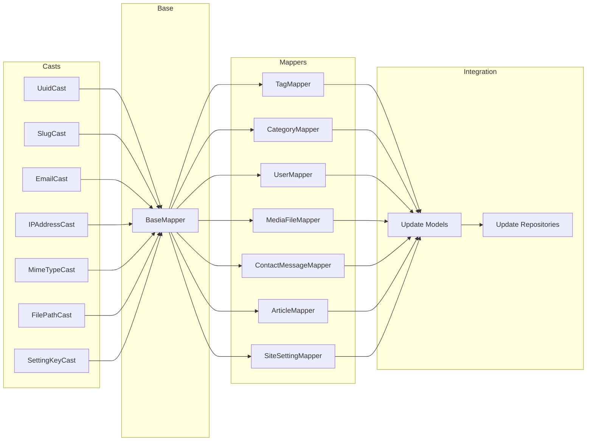

# Plan: Data Mappers Implementation

**Дата:** 2026-03-19
**Pipeline этап:** Implement (5/7) - Phase 5: Infrastructure Layer
**Основано на:** design-mappers.md

---

## Обзор

Детальный план имплементации Data Mapper паттерна с Custom Casts для типобезопасной трансформации между доменными сущностями и Eloquent моделями.

**Ключевые решения из дизайна:**
- Типизированные мапперы (без общего интерфейса MapperInterface)
- Custom Casts для single-field Value Objects
- BaseMapper trait для общих методов маппинга

---

## Общая статистика

| Категория | Количество |
|-----------|------------|
| Custom Casts | 7 |
| Mappers | 7 |
| BaseMapper Trait | 1 |
| Обновлений Eloquent Models | 7 |
| **Всего файлов** | **15 новых + 7 обновлений** |

---

## Порядок имплементации

```
Custom Casts (7) --> BaseMapper Trait --> Mappers (7) --> Интеграция Models
```

---

## Шаг 1-7: Custom Casts

### Структура директории
```
laravel/app/Infrastructure/Persistence/Casts/
```

### 1.1 UuidCast

**Файл:** `laravel/app/Infrastructure/Persistence/Casts/UuidCast.php`

**Доменный VO:** `App\Domain\Shared\Uuid`

**Методы:**
```php
public function get($model, string $key, $value, array $attributes): ?Uuid
public function set($model, string $key, $value, array $attributes): ?string
```

**Используется в моделях:**
- ArticleModel (uuid)
- CategoryModel (uuid)
- TagModel (uuid)
- UserModel (uuid)
- MediaFileModel (uuid, uploader_id)
- ContactMessageModel (uuid)
- SiteSettingModel (uuid)

---

### 1.2 SlugCast

**Файл:** `laravel/app/Infrastructure/Persistence/Casts/SlugCast.php`

**Доменный VO:** `App\Domain\Article\ValueObjects\Slug`

**Методы:**
```php
public function get($model, string $key, $value, array $attributes): ?Slug
public function set($model, string $key, $value, array $attributes): ?string
```

**Используется в моделях:**
- ArticleModel (slug)
- CategoryModel (slug)
- TagModel (slug)

---

### 1.3 EmailCast

**Файл:** `laravel/app/Infrastructure/Persistence/Casts/EmailCast.php`

**Доменный VO:** `App\Domain\Contact\ValueObjects\Email`

**Методы:**
```php
public function get($model, string $key, $value, array $attributes): ?Email
public function set($model, string $key, $value, array $attributes): ?string
```

**Используется в моделях:**
- UserModel (email)
- ContactMessageModel (email)

---

### 1.4 IPAddressCast

**Файл:** `laravel/app/Infrastructure/Persistence/Casts/IPAddressCast.php`

**Доменный VO:** `App\Domain\Contact\ValueObjects\IPAddress`

**Методы:**
```php
public function get($model, string $key, $value, array $attributes): ?IPAddress
public function set($model, string $key, $value, array $attributes): ?string
```

**Используется в моделях:**
- ContactMessageModel (ip_address)

---

### 1.5 MimeTypeCast

**Файл:** `laravel/app/Infrastructure/Persistence/Casts/MimeTypeCast.php`

**Доменный VO:** `App\Domain\Media\ValueObjects\MimeType`

**Методы:**
```php
public function get($model, string $key, $value, array $attributes): ?MimeType
public function set($model, string $key, $value, array $attributes): ?string
```

**Используется в моделях:**
- MediaFileModel (mime_type)

---

### 1.6 FilePathCast

**Файл:** `laravel/app/Infrastructure/Persistence/Casts/FilePathCast.php`

**Доменный VO:** `App\Domain\Media\ValueObjects\FilePath`

**Методы:**
```php
public function get($model, string $key, $value, array $attributes): ?FilePath
public function set($model, string $key, $value, array $attributes): ?string
```

**Используется в моделях:**
- MediaFileModel (path)

---

### 1.7 SettingKeyCast

**Файл:** `laravel/app/Infrastructure/Persistence/Casts/SettingKeyCast.php`

**Доменный VO:** `App\Domain\Settings\ValueObjects\SettingKey`

**Методы:**
```php
public function get($model, string $key, $value, array $attributes): ?SettingKey
public function set($model, string $key, $value, array $attributes): ?string
```

**Используется в моделях:**
- SiteSettingModel (key)

---

## Шаг 8: BaseMapper Trait

**Файл:** `laravel/app/Infrastructure/Persistence/Eloquent/Mappers/BaseMapper.php`

**Зависимости (use statements):**
```php
use App\Domain\Article\ValueObjects\Slug;
use App\Domain\Contact\ValueObjects\{Email, IPAddress};
use App\Domain\Media\ValueObjects\{FilePath, MimeType};
use App\Domain\Settings\ValueObjects\SettingKey;
use App\Domain\Shared\{Timestamps, Uuid};
use DateTimeImmutable;
use Illuminate\Database\Eloquent\Model;
```

**Методы:**

| Метод | Вход | Выход | Описание |
|-------|------|-------|----------|
| `mapUuid()` | `Uuid\|string` | `Uuid` | Конвертация в Uuid VO |
| `mapNullableUuid()` | `Uuid\|string\|null` | `?Uuid` | Nullable конвертация |
| `getUuidValue()` | `?Uuid` | `?string` | Сериализация для БД |
| `mapTimestamps()` | `Model` | `Timestamps` | Извлечение created_at/updated_at |
| `mapSlug()` | `Slug\|string` | `Slug` | Конвертация в Slug VO |
| `getSlugValue()` | `Slug` | `string` | Сериализация для БД |
| `mapEmail()` | `Email\|string` | `Email` | Конвертация в Email VO |
| `getEmailValue()` | `Email` | `string` | Сериализация для БД |
| `mapIPAddress()` | `IPAddress\|string` | `IPAddress` | Конвертация в IPAddress VO |
| `getIPAddressValue()` | `IPAddress` | `string` | Сериализация для БД |
| `mapMimeType()` | `MimeType\|string` | `MimeType` | Конвертация в MimeType VO |
| `getMimeTypeValue()` | `MimeType` | `string` | Сериализация для БД |
| `mapFilePath()` | `FilePath\|string` | `FilePath` | Конвертация в FilePath VO |
| `getFilePathValue()` | `FilePath` | `string` | Сериализация для БД |
| `mapSettingKey()` | `SettingKey\|string` | `SettingKey` | Конвертация в SettingKey VO |
| `getSettingKeyValue()` | `SettingKey` | `string` | Сериализация для БД |
| `formatDateTime()` | `?DateTimeImmutable` | `?string` | Форматирование для БД |
| `parseDateTime()` | `string\|null` | `?DateTimeImmutable` | Парсинг из БД |

---

## Шаг 9-15: Mappers

### Структура директории
```
laravel/app/Infrastructure/Persistence/Eloquent/Mappers/
```

**Важно:** Удалить или задокументировать как deprecated существующий `MapperInterface.php`.

---

### 9.1 TagMapper (простой)

**Файл:** `laravel/app/Infrastructure/Persistence/Eloquent/Mappers/TagMapper.php`

**Доменная сущность:** `App\Domain\Article\Entities\Tag`

**Eloquent модель:** `App\Infrastructure\Persistence\Eloquent\Models\TagModel`

**Используемые VO:**
- `Uuid` (id)
- `Slug` (slug)
- `Timestamps`

**Публичные методы:**
```php
public function toDomain(TagModel $model): Tag
public function toEloquent(Tag $entity): array
/**
 * @param TagModel[] $models
 * @return Tag[]
 */
public function toDomainCollection(array $models): array
```

**Приватные методы:** нет (все через BaseMapper)

**Маппинг toDomain():**
```
id          -> mapUuid($model->uuid)
name        -> $model->name
slug        -> mapSlug($model->slug)
timestamps  -> mapTimestamps($model)
```

**Маппинг toEloquent():**
```
uuid        -> $entity->getId()->getValue()
name        -> $entity->getName()
slug        -> $entity->getSlug()->getValue()
```

---

### 9.2 CategoryMapper (простой)

**Файл:** `laravel/app/Infrastructure/Persistence/Eloquent/Mappers/CategoryMapper.php`

**Доменная сущность:** `App\Domain\Article\Entities\Category`

**Eloquent модель:** `App\Infrastructure\Persistence\Eloquent\Models\CategoryModel`

**Используемые VO:**
- `Uuid` (id)
- `Slug` (slug)
- `Timestamps`

**Публичные методы:**
```php
public function toDomain(CategoryModel $model): Category
public function toEloquent(Category $entity): array
/**
 * @param CategoryModel[] $models
 * @return Category[]
 */
public function toDomainCollection(array $models): array
```

**Приватные методы:** нет

**Маппинг toDomain():**
```
id          -> mapUuid($model->uuid)
name        -> $model->name
slug        -> mapSlug($model->slug)
description -> $model->description
timestamps  -> mapTimestamps($model)
```

**Маппинг toEloquent():**
```
uuid        -> $entity->getId()->getValue()
name        -> $entity->getName()
slug        -> $entity->getSlug()->getValue()
description -> $entity->getDescription()
```

---

### 9.3 UserMapper (средний)

**Файл:** `laravel/app/Infrastructure/Persistence/Eloquent/Mappers/UserMapper.php`

**Доменная сущность:** `App\Domain\User\Entities\User`

**Eloquent модель:** `App\Infrastructure\Persistence\Eloquent\Models\UserModel`

**Используемые VO:**
- `Uuid` (id)
- `Email` (email)
- `Password` (password) - **в Mapper, не Cast!**
- `UserRole` (role) - Enum
- `Timestamps`

**Публичные методы:**
```php
public function toDomain(UserModel $model): User
public function toEloquent(User $entity): array
/**
 * @param UserModel[] $models
 * @return User[]
 */
public function toDomainCollection(array $models): array
```

**Приватные методы:**
```php
private function mapPassword(string $hashedPassword): Password
private function mapRole(UserRole|string $role): UserRole
```

**Маппинг toDomain():**
```
id          -> mapUuid($model->uuid)
name        -> $model->name
email       -> mapEmail($model->email)
password    -> mapPassword($model->password)  // Password::fromHash()
role        -> mapRole($model->role)          // UserRole::fromString()
timestamps  -> mapTimestamps($model)
```

**Маппинг toEloquent():**
```
uuid        -> $entity->getId()->getValue()
name        -> $entity->getName()
email       -> $entity->getEmail()->getValue()
password    -> $entity->getPassword()->getValue()  // Already hashed
role        -> $entity->getRole()->value
```

---

### 9.4 MediaFileMapper (средний)

**Файл:** `laravel/app/Infrastructure/Persistence/Eloquent/Mappers/MediaFileMapper.php`

**Доменная сущность:** `App\Domain\Media\Entities\MediaFile`

**Eloquent модель:** `App\Infrastructure\Persistence\Eloquent\Models\MediaFileModel`

**Используемые VO:**
- `Uuid` (id, uploader_id)
- `FilePath` (path)
- `MimeType` (mime_type)
- `ImageDimensions` (width + height) - **в Mapper, не Cast!**
- `Timestamps`

**Публичные методы:**
```php
public function toDomain(MediaFileModel $model): MediaFile
public function toEloquent(MediaFile $entity): array
/**
 * @param MediaFileModel[] $models
 * @return MediaFile[]
 */
public function toDomainCollection(array $models): array
```

**Приватные методы:**
```php
private function mapDimensions(?int $width, ?int $height): ?ImageDimensions
```

**Маппинг toDomain():**
```
id          -> mapUuid($model->uuid)
filename    -> $model->filename
path        -> mapFilePath($model->path)
mimeType    -> mapMimeType($model->mime_type)
sizeBytes   -> $model->size_bytes
dimensions  -> mapDimensions($model->width, $model->height)
altText     -> $model->alt_text
timestamps  -> mapTimestamps($model)
```

**Маппинг toEloquent():**
```
uuid        -> $entity->getId()->getValue()
filename    -> $entity->getFilename()
path        -> $entity->getPath()->getValue()
url         -> $entity->getPublicUrl()
mime_type   -> $entity->getMimeType()->getValue()
size_bytes  -> $entity->getSizeBytes()
width       -> $entity->getDimensions()?->getWidth()
height      -> $entity->getDimensions()?->getHeight()
alt_text    -> $entity->getAltText()
```

---

### 9.5 ContactMessageMapper (средний)

**Файл:** `laravel/app/Infrastructure/Persistence/Eloquent/Mappers/ContactMessageMapper.php`

**Доменная сущность:** `App\Domain\Contact\Entities\ContactMessage`

**Eloquent модель:** `App\Infrastructure\Persistence\Eloquent\Models\ContactMessageModel`

**Используемые VO:**
- `Uuid` (id)
- `Email` (email)
- `IPAddress` (ip_address)
- `Timestamps`

**Публичные методы:**
```php
public function toDomain(ContactMessageModel $model): ContactMessage
public function toEloquent(ContactMessage $entity): array
/**
 * @param ContactMessageModel[] $models
 * @return ContactMessage[]
 */
public function toDomainCollection(array $models): array
```

**Приватные методы:** нет

**Маппинг toDomain():**
```
id          -> mapUuid($model->uuid)
name        -> $model->name
email       -> mapEmail($model->email)
subject     -> $model->subject
message     -> $model->message
ipAddress   -> mapIPAddress($model->ip_address)
userAgent   -> $model->user_agent
isRead      -> $model->is_read
timestamps  -> mapTimestamps($model)
```

**Маппинг toEloquent():**
```
uuid        -> $entity->getId()->getValue()
name        -> $entity->getName()
email       -> $entity->getEmail()->getValue()
subject     -> $entity->getSubject()
message     -> $entity->getMessage()
ip_address  -> $entity->getIpAddress()->getValue()
user_agent  -> $entity->getUserAgent()
is_read     -> $entity->isRead()
```

---

### 9.6 ArticleMapper (сложный)

**Файл:** `laravel/app/Infrastructure/Persistence/Eloquent/Mappers/ArticleMapper.php`

**Доменная сущность:** `App\Domain\Article\Entities\Article`

**Eloquent модель:** `App\Infrastructure\Persistence\Eloquent\Models\ArticleModel`

**Используемые VO:**
- `Uuid` (id, category_id, author_id, cover_image_id)
- `Slug` (slug)
- `ArticleStatus` (status) - Enum
- `ArticleContent` (content) - **в Mapper, не Cast!**
- `Timestamps`

**Публичные методы:**
```php
public function toDomain(ArticleModel $model): Article
public function toEloquent(Article $entity): array
/**
 * @param ArticleModel[] $models
 * @return Article[]
 */
public function toDomainCollection(array $models): array
```

**Приватные методы:**
```php
private function mapContent(string $content): ArticleContent
private function mapStatus(ArticleStatus|string $status): ArticleStatus
```

**Маппинг toDomain():**
```
id            -> mapUuid($model->uuid)
title         -> $model->title
slug          -> mapSlug($model->slug)
content       -> mapContent($model->content)     // ArticleContent::fromString()
excerpt       -> $model->excerpt
status        -> mapStatus($model->status)       // ArticleStatus::fromString()
categoryId    -> mapNullableUuid($model->category_id)
authorId      -> mapNullableUuid($model->author_id)
coverImageId  -> mapNullableUuid($model->cover_image_id)
publishedAt   -> parseDateTime($model->published_at)
timestamps    -> mapTimestamps($model)
```

**Маппинг toEloquent():**
```
uuid            -> $entity->getId()->getValue()
title           -> $entity->getTitle()
slug            -> $entity->getSlug()->getValue()
content         -> $entity->getContent()->getValue()
excerpt         -> $entity->getExcerpt()
status          -> $entity->getStatus()->value
category_id     -> getUuidValue($entity->getCategoryId())
author_id       -> getUuidValue($entity->getAuthorId())
cover_image_id  -> getUuidValue($entity->getCoverImageId())
published_at    -> formatDateTime($entity->getPublishedAt())
```

---

### 9.7 SiteSettingMapper (сложный)

**Файл:** `laravel/app/Infrastructure/Persistence/Eloquent/Mappers/SiteSettingMapper.php`

**Доменная сущность:** `App\Domain\Settings\Entities\SiteSetting`

**Eloquent модель:** `App\Infrastructure\Persistence\Eloquent\Models\SiteSettingModel`

**Используемые VO:**
- `Uuid` (id)
- `SettingKey` (key)
- `SettingValue` (value) - **в Mapper, не Cast!** (полиморфный тип)
- `Timestamps`

**Публичные методы:**
```php
public function toDomain(SiteSettingModel $model): SiteSetting
public function toEloquent(SiteSetting $entity): array
/**
 * @param SiteSettingModel[] $models
 * @return SiteSetting[]
 */
public function toDomainCollection(array $models): array
```

**Приватные методы:**
```php
private function mapSettingValue(string $value, string $type): SettingValue
```

**Маппинг toDomain():**
```
id          -> mapUuid($model->uuid)
key         -> mapSettingKey($model->key)
value       -> mapSettingValue($model->value, $model->type)
timestamps  -> mapTimestamps($model)
```

**Маппинг toEloquent():**
```
uuid        -> $entity->getId()->getValue()
key         -> $entity->getKey()->getValue()
value       -> $entity->getValue()->toString()
type        -> $entity->getValue()->getType()
```

---

## Шаг 16: Интеграция с Eloquent Models

### 16.1 ArticleModel

**Обновить $casts:**
```php
protected $casts = [
    'uuid' => UuidCast::class,
    'slug' => SlugCast::class,
    'status' => ArticleStatus::class,  // Enum cast
    'published_at' => 'datetime',
    'created_at' => 'datetime',
    'updated_at' => 'datetime',
];
```

**Добавить use statements:**
```php
use App\Domain\Article\ValueObjects\ArticleStatus;
use App\Infrastructure\Persistence\Casts\{SlugCast, UuidCast};
```

---

### 16.2 CategoryModel

**Обновить $casts:**
```php
protected $casts = [
    'uuid' => UuidCast::class,
    'slug' => SlugCast::class,
    'created_at' => 'datetime',
    'updated_at' => 'datetime',
];
```

**Добавить use statements:**
```php
use App\Infrastructure\Persistence\Casts\{SlugCast, UuidCast};
```

---

### 16.3 TagModel

**Обновить $casts:**
```php
protected $casts = [
    'uuid' => UuidCast::class,
    'slug' => SlugCast::class,
    'created_at' => 'datetime',
    'updated_at' => 'datetime',
];
```

**Добавить use statements:**
```php
use App\Infrastructure\Persistence\Casts\{SlugCast, UuidCast};
```

---

### 16.4 UserModel

**Обновить $casts:**
```php
protected $casts = [
    'uuid' => UuidCast::class,
    'email' => EmailCast::class,
    'role' => UserRole::class,  // Enum cast
    'created_at' => 'datetime',
    'updated_at' => 'datetime',
];
```

**Добавить use statements:**
```php
use App\Domain\User\ValueObjects\UserRole;
use App\Infrastructure\Persistence\Casts\{EmailCast, UuidCast};
```

---

### 16.5 MediaFileModel

**Обновить $casts:**
```php
protected $casts = [
    'uuid' => UuidCast::class,
    'path' => FilePathCast::class,
    'mime_type' => MimeTypeCast::class,
    'size_bytes' => 'integer',
    'width' => 'integer',
    'height' => 'integer',
    'created_at' => 'datetime',
    'updated_at' => 'datetime',
];
```

**Добавить use statements:**
```php
use App\Infrastructure\Persistence\Casts\{FilePathCast, MimeTypeCast, UuidCast};
```

---

### 16.6 ContactMessageModel

**Обновить $casts:**
```php
protected $casts = [
    'uuid' => UuidCast::class,
    'email' => EmailCast::class,
    'ip_address' => IPAddressCast::class,
    'is_read' => 'boolean',
    'created_at' => 'datetime',
    'updated_at' => 'datetime',
];
```

**Добавить use statements:**
```php
use App\Infrastructure\Persistence\Casts\{EmailCast, IPAddressCast, UuidCast};
```

---

### 16.7 SiteSettingModel

**Обновить $casts:**
```php
protected $casts = [
    'uuid' => UuidCast::class,
    'key' => SettingKeyCast::class,
    'created_at' => 'datetime',
    'updated_at' => 'datetime',
];
```

**Добавить use statements:**
```php
use App\Infrastructure\Persistence\Casts\{SettingKeyCast, UuidCast};
```

---

## Шаг 17: Интеграция с Repositories

### Обновление репозиториев для использования мапперов

**Пример: EloquentArticleRepository**

```php
<?php

declare(strict_types=1);

namespace App\Infrastructure\Persistence\Eloquent\Repositories;

use App\Domain\Article\Entities\Article;
use App\Domain\Article\Repositories\ArticleRepositoryInterface;
use App\Domain\Shared\Uuid;
use App\Infrastructure\Persistence\Eloquent\Mappers\ArticleMapper;
use App\Infrastructure\Persistence\Eloquent\Models\ArticleModel;

final class EloquentArticleRepository implements ArticleRepositoryInterface
{
    public function __construct(
        private readonly ArticleMapper $mapper,
    ) {}

    public function findById(Uuid $id): ?Article
    {
        $model = ArticleModel::where('uuid', $id->getValue())->first();

        if ($model === null) {
            return null;
        }

        return $this->mapper->toDomain($model);
    }

    public function save(Article $article): void
    {
        $data = $this->mapper->toEloquent($article);

        ArticleModel::updateOrCreate(
            ['uuid' => $data['uuid']],
            $data
        );
    }

    // ... остальные методы
}
```

**Репозитории для обновления:**
1. `EloquentArticleRepository` - ArticleMapper
2. `EloquentCategoryRepository` - CategoryMapper
3. `EloquentTagRepository` - TagMapper
4. `EloquentUserRepository` - UserMapper
5. `EloquentMediaRepository` - MediaFileMapper
6. `EloquentContactRepository` - ContactMessageMapper
7. `EloquentSettingsRepository` - SiteSettingMapper

---

## Чек-лист прогресса

### Custom Casts
- [ ] UuidCast
- [ ] SlugCast
- [ ] EmailCast
- [ ] IPAddressCast
- [ ] MimeTypeCast
- [ ] FilePathCast
- [ ] SettingKeyCast

### BaseMapper
- [ ] BaseMapper trait

### Mappers
- [ ] TagMapper
- [ ] CategoryMapper
- [ ] UserMapper
- [ ] MediaFileMapper
- [ ] ContactMessageMapper
- [ ] ArticleMapper
- [ ] SiteSettingMapper

### Интеграция Models
- [ ] ArticleModel
- [ ] CategoryModel
- [ ] TagModel
- [ ] UserModel
- [ ] MediaFileModel
- [ ] ContactMessageModel
- [ ] SiteSettingModel

### Интеграция Repositories
- [ ] EloquentArticleRepository
- [ ] EloquentCategoryRepository
- [ ] EloquentTagRepository
- [ ] EloquentUserRepository
- [ ] EloquentMediaRepository
- [ ] EloquentContactRepository
- [ ] EloquentSettingsRepository

---

## Риски

| Риск | Уровень | Митигация |
|------|---------|-----------|
| MapperInterface уже существует | Low | Удалить или deprecated, использовать типизированные мапперы |
| Отсутствие Domain Value Objects | Medium | Проверить наличие VO перед имплементацией |
| Отсутствие метода reconstitute в Entities | Medium | Убедиться, что Entity::reconstitute() существует |
| Enum методы fromString() | Low | Проверить наличие ArticleStatus::fromString(), UserRole::fromString() |
| ImageDimensions VO может не существовать | Medium | Создать VO или адаптировать маппер |

---

## Критерий готовности

1. **Custom Casts:**
   - Все 7 кастов созданы
   - Каждый каст корректно конвертирует string <-> VO
   - PHPStan/Psalm не выдают ошибок

2. **BaseMapper:**
   - Trait создан с всеми методами
   - Покрывает все базовые VO

3. **Mappers:**
   - Все 7 мапперов созданы
   - toDomain() корректно создаёт Entity
   - toEloquent() корректно сериализует в array
   - toDomainCollection() работает для массивов

4. **Интеграция:**
   - Все 7 моделей обновлены с $casts
   - Репозитории используют мапперы
   - Все тесты проходят

---

## Зависимости между шагами



---

**Статус:** READY FOR IMPLEMENTATION