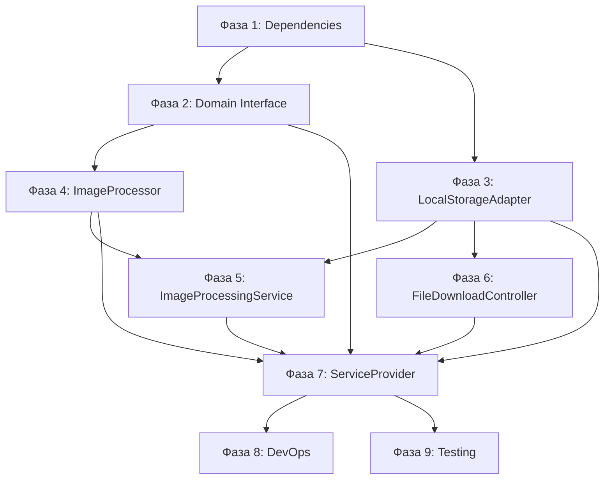

# Plan: Local Storage Implementation

**Дата:** 2026-03-19
**Pipeline этап:** Implement (5/7)
**Design:** 02-design-storage.md
**Research:** research-storage.md

---

## Обзор

Имплементация Local Storage для файлов с поддержкой публичных и приватных файлов, обработки изображений и X-Accel-Redirect для эффективной отдачи.

**Цель:** Заменить S3 на локальное хранилище без изменения Domain/Application слоёв.

---

## Ключевые находки Research

- FileStorageInterface уже определён в Domain/Media/Services/
- FilePath, MimeType, ImageDimensions Value Objects существуют
- Intervention Image v3 - оптимальная библиотека для обработки изображений
- X-Accel-Redirect - стандартный паттерн для отдачи приватных файлов через Nginx

---

## Ключевые решения Design

- **Паттерн:** Adapter (LocalStorageAdapter реализует FileStorageInterface)
- **Архитектура:** Hexagonal Architecture (Ports & Adapters)
- **Два диска:** public (storage/app/public) и private (storage/app/private)
- **Signed URLs:** Laravel URL::temporarySignedRoute() для приватных файлов
- **X-Accel-Redirect:** Nginx internal location для эффективной отдачи

---

## Фазы реализации

### Фаза 1: Dependencies & Configuration

**Задачи:**
- Добавить intervention/image:^3.0 в composer.json
- Обновить config/filesystems.php с public/private дисками

**Файлы:**
- `laravel/composer.json` (изменение)
- `laravel/config/filesystems.php` (изменение)

**Команды:**
```bash
cd laravel && composer require intervention/image:^3.0
```

**Критерий готовности:**
- [ ] composer install проходит без ошибок
- [ ] config/filesystems.php содержит диски 'public' и 'private'
- [ ] php artisan config:cache работает

**Риски:**
| Риск | Митигация |
|------|-----------|
| Конфликт версий intervention/image | Использовать ^3.0 для совместимости с PHP 8.3 |

---

### Фаза 2: Domain Layer - ImageProcessorInterface

**Задачи:**
- Создать интерфейс для обработки изображений
- Определить методы: resize, crop, convertToWebP, convertToAVIF, optimize, getDimensions

**Файлы:**
- `laravel/app/Domain/Media/Services/ImageProcessorInterface.php` (создать)

**Критерий готовности:**
- [ ] Интерфейс создан с всеми методами из дизайна
- [ ] PHPDoc документация полная
- [ ] Статический анализ проходит: `./vendor/bin/phpstan analyse`

**Риски:**
| Риск | Митигация |
|------|-----------|
| Изменение API Intervention Image v3 | Проверить документацию intervention/image:^3.0 |

---

### Фаза 3: Infrastructure - LocalStorageAdapter

**Задачи:**
- Реализовать FileStorageInterface для локальной файловой системы
- Маршрутизация между public/private дисками
- Генерация signed URLs для приватных файлов

**Файлы:**
- `laravel/app/Infrastructure/Storage/LocalStorageAdapter.php` (создать)

**Важно:** Сигнатура setVisibility в интерфейсе:
```php
public function setVisibility(FilePath $path, bool $public): bool;
```
Реализация должна создавать новый FilePath с префиксом public/ или private/ и вызывать move().

**Критерий готовности:**
- [ ] Все методы FileStorageInterface реализованы
- [ ] isPublic() определяет диск по префиксу пути
- [ ] getTemporaryUrl() генерирует signed route
- [ ] Cross-disk move работает (copy + delete)

**Риски:**
| Риск | Митигация |
|------|-----------|
| Directory traversal атаки | FilePath VO уже валидирует ".." |
| Несовпадение сигнатуры setVisibility | Адаптировать реализацию под интерфейс |

---

### Фаза 4: Infrastructure - InterventionImageProcessor

**Задачи:**
- Реализовать ImageProcessorInterface с Intervention Image v3
- Поддержка GD и Imagick драйверов
- Fallback на GD если Imagick недоступен

**Файлы:**
- `laravel/app/Infrastructure/Storage/InterventionImageProcessor.php` (создать)

**Зависимости:**
- Фаза 1: intervention/image установлен
- Фаза 2: ImageProcessorInterface создан

**Критерий готовности:**
- [ ] resize() масштабирует с сохранением пропорций
- [ ] crop() обрезает по центру
- [ ] convertToWebP() создаёт WebP файл
- [ ] getDimensions() возвращает ImageDimensions
- [ ] isProcessableImage() проверяет расширение

**Риски:**
| Риск | Митигация |
|------|-----------|
| GD не установлен в Docker | Проверить Dockerfile, добавить `docker-php-ext-install gd` |
| Imagick недоступен | Fallback на GD в конструкторе |

---

### Фаза 5: Application Layer - ImageProcessingService

**Задачи:**
- Координация обработки изображений
- Создание thumbnails разных размеров
- Конвертация в WebP

**Файлы:**
- `laravel/app/Application/Media/Services/ImageProcessingService.php` (создать)

**Зависимости:**
- Фаза 2: ImageProcessorInterface
- Фаза 3: LocalStorageAdapter (FileStorageInterface)
- Фаза 4: InterventionImageProcessor

**Критерий готовности:**
- [ ] processImage() создаёт 4 размера thumbnails
- [ ] WebP версия генерируется
- [ ] Оригинал оптимизируется

---

### Фаза 6: HTTP Layer - FileDownloadController

**Задачи:**
- Обработка запросов на скачивание приватных файлов
- Проверка signed URL signature
- Отдача через X-Accel-Redirect

**Файлы:**
- `laravel/app/Infrastructure/Http/Controllers/FileDownloadController.php` (создать)
- `laravel/routes/web.php` (изменить - добавить маршрут)

**Зависимости:**
- Фаза 3: LocalStorageAdapter (FileStorageInterface)

**Критерий готовности:**
- [ ] Signature валидируется через $request->hasValidSignature()
- [ ] Path декодируется из base64
- [ ] X-Accel-Redirect header формируется правильно
- [ ] Route 'files.download' регистрирован с middleware 'signed'

**Риски:**
| Риск | Митигация |
|------|-----------|
| Invalid base64 decode | Проверить strict: true в base64_decode |
| Path traversal в decoded path | FilePath VO валидация |

---

### Фаза 7: DI & Providers

**Задачи:**
- Создать StorageServiceProvider с DI bindings
- Создать config/image.php для конфигурации обработки

**Файлы:**
- `laravel/app/Infrastructure/Providers/StorageServiceProvider.php` (создать)
- `laravel/config/image.php` (создать)
- `laravel/bootstrap/providers.php` (изменить - добавить провайдер)

**Зависимости:**
- Все предыдущие фазы

**Критерий готовности:**
- [ ] FileStorageInterface -> LocalStorageAdapter binding
- [ ] ImageProcessorInterface -> InterventionImageProcessor binding
- [ ] Storage directories создаются при boot()
- [ ] php artisan config:cache работает

---

### Фаза 8: DevOps - Nginx & Docker

**Задачи:**
- Настроить Nginx для отдачи public файлов
- Настроить X-Accel-Redirect для private файлов
- Добавить Docker volume для storage/app

**Файлы:**
- `docker/nginx/dev.conf` (изменить - добавить locations)
- `docker-compose.prod.yml` (изменить - добавить volume)

**Критерий готовности:**
- [ ] /storage location отдаёт файлы из storage/app/public
- [ ] /private-files/ internal location настроен
- [ ] PHP execution запрещён в storage
- [ ] Named volume blog_storage_data добавлен

**Риски:**
| Риск | Митигация |
|------|-----------|
| Потеря файлов при redeploy | Named volume в docker-compose.prod.yml |
| Direct access к private files | Nginx internal directive |

---

### Фаза 9: Integration Testing

**Задачи:**
- Unit тесты для LocalStorageAdapter
- Integration тесты для загрузки/скачивания
- Feature тесты для signed URLs

**Файлы:**
- `laravel/tests/Unit/Infrastructure/Storage/LocalStorageAdapterTest.php` (создать)
- `laravel/tests/Integration/Storage/FileUploadTest.php` (создать)
- `laravel/tests/Feature/Storage/SignedUrlTest.php` (создать)

**Критерий готовности:**
- [ ] php artisan test --filter LocalStorageAdapter проходит
- [ ] Загрузка public файла создаёт файл в storage/app/public
- [ ] Signed URL валиден в течение expiration времени
- [ ] X-Accel-Redirect header присутствует в response

---

## Зависимости между фазами



---

## Порядок имплементации (рекомендуемый)

### День 1: Foundation
1. `composer.json` - добавить intervention/image
2. `config/filesystems.php` - public/private диски
3. `Domain/Media/Services/ImageProcessorInterface.php`

### День 2: Core Storage
4. `Infrastructure/Storage/LocalStorageAdapter.php`
5. `Infrastructure/Storage/InterventionImageProcessor.php`

### День 3: Services & HTTP
6. `Application/Media/Services/ImageProcessingService.php`
7. `Infrastructure/Http/Controllers/FileDownloadController.php`
8. `routes/web.php` - добавить маршрут

### День 4: DI & Config
9. `Infrastructure/Providers/StorageServiceProvider.php`
10. `config/image.php`
11. `bootstrap/providers.php` - зарегистрировать провайдер

### День 5: DevOps & Testing
12. `docker/nginx/dev.conf` - добавить locations
13. `docker-compose.prod.yml` - добавить volume
14. Unit/Integration/Feature тесты

---

## Команды для проверки

### После Фазы 1-2:
```bash
cd laravel
composer install
./vendor/bin/phpstan analyse
```

### После Фазы 3-5:
```bash
php artisan tinker
>>> app(\App\Domain\Media\Services\FileStorageInterface::class)
>>> app(\App\Domain\Media\Services\ImageProcessorInterface::class)
```

### После Фазы 6-7:
```bash
php artisan route:list | grep files.download
php artisan config:cache
```

### После Фазы 8:
```bash
# Проверить Nginx конфигурацию
docker compose exec web nginx -t

# Перезагрузить Nginx
docker compose exec web nginx -s reload
```

### После Фазы 9:
```bash
php artisan test --filter Storage
```

---

## Общая оценка

- **Файлов новых:** ~10
- **Файлов изменяемых:** ~5
- **Фаз:** 9
- **Критичных рисков:** 3

---

## Критичные замечания

### 1. Расхождение setVisibility

**Проблема:** В интерфейсе FileStorageInterface:
```php
public function setVisibility(FilePath $path, bool $public): bool;
```

В дизайне LocalStorageAdapter:
```php
public function setVisibility(FilePath $from, FilePath $to): bool
```

**Решение:** Реализовать согласно интерфейсу:
```php
public function setVisibility(FilePath $path, bool $public): bool
{
    $prefix = $public ? 'public/' : 'private/';
    $currentPrefix = $this->isPublic($path) ? 'public/' : 'private/';

    if (str_starts_with($path->getValue(), $currentPrefix)) {
        $relativePath = substr($path->getValue(), strlen($currentPrefix));
    } else {
        $relativePath = $path->getValue();
    }

    $newPath = FilePath::fromString($prefix . $relativePath);
    return $this->move($path, $newPath);
}
```

### 2. Docker Extensions

**Проверить Dockerfile** на наличие:
```dockerfile
RUN docker-php-ext-install gd
# Или для Imagick:
RUN apt-get install -y libmagickwand-dev && \
    pecl install imagick && \
    docker-php-ext-enable imagick
```

### 3. Docker Volume

**Обязательно добавить** в docker-compose.prod.yml:
```yaml
volumes:
  storage_data:
    name: blog_storage_data
    driver: local
```

---

## Выводы Sequential Thinking

1. **Порядок реализации:** Сначала зависимости и конфигурация, затем Domain интерфейсы, потом Infrastructure реализации, наконец HTTP и DevOps.

2. **Критический путь:** LocalStorageAdapter - основной компонент, без которого не работает ничего.

3. **Блокирующие зависимости:** StorageServiceProvider требует все интерфейсы и реализации.

4. **Главные риски:** Расхождение setVisibility, Docker extensions, Docker volumes.

5. **Тестируемость:** Unit тесты для LocalStorageAdapter, Integration для загрузки, Feature для signed URLs.

---

## Следующий шаг

**Утверждение плана** -> **dev-coder** для имплементации Фазы 1 (Dependencies & Configuration).