# Design: Data Mappers для Infrastructure Layer

**Дата:** 2026-03-19
**Этап:** Design (дополнительный)
**Основано на:** research-model-map.md

---

## Обзор

Детальный архитектурный дизайн Data Mapper паттерна с полной типобезопасностью для трансформации между доменными сущностями и Eloquent моделями.

---

## 1. Архитектурные решения

### 1.1 Типизированные мапперы вместо обобщённого интерфейса

**Решение:** Использовать отдельные final class для каждого маппера с типизированными сигнатурами методов, без общего интерфейса.

**Обоснование:**

| Подход | Плюсы | Минусы | Вердикт |
|--------|-------|--------|---------|
| Общий MapperInterface с `object` | Полиморфизм | Нет типобезопасности, assert() в runtime | Отклонён |
| PHPDoc @template generics | Документация | Не работает в runtime | Отклонён |
| Типизированные классы | Полная типобезопасность, IDE support | Дублирование сигнатур | **Принят** |

**Сигнатуры методов:**

```php
// ArticleMapper - типизированные сигнатуры
final class ArticleMapper
{
    public function toDomain(ArticleModel $model): Article;
    public function toEloquent(Article $entity): array;

    /**
     * @param ArticleModel[] $models
     * @return Article[]
     */
    public function toDomainCollection(array $models): array;
}
```

### 1.2 Паттерн проверки типов

Используем union types и type-hints вместо `assert()`:

```php
// Неправильно (из research):
protected function mapUuid($uuid): Uuid
{
    if ($uuid instanceof Uuid) {
        return $uuid;
    }
    return Uuid::fromString($uuid);
}

// Правильно (типобезопасно):
protected function mapUuid(Uuid|string $value): Uuid
{
    return $value instanceof Uuid ? $value : Uuid::fromString($value);
}
```

### 1.3 Разделение ответственности Custom Casts vs Mapper

| Value Object | Обработка | Причина |
|--------------|-----------|---------|
| Uuid, Slug, Email, IPAddress, MimeType, FilePath, SettingKey | **Custom Casts** | Single-field, простая конвертация |
| ArticleStatus, UserRole | **Enum Casts** | Встроенная поддержка Laravel |
| Timestamps | **Mapper** | Два поля (created_at + updated_at) |
| ArticleContent | **Mapper** | Сложная логика (getExcerpt, readingTime) |
| ImageDimensions | **Mapper** | Два поля (width + height), nullable |
| SettingValue | **Mapper** | Полиморфный тип, сложная логика |
| Password | **Mapper** | Хеширование, нельзя использовать Cast |

---

## 2. Диаграмма зависимостей

```mermaid
graph TB
    subgraph Domain Layer
        Article[Article Entity]
        Category[Category Entity]
        Tag[Tag Entity]
        User[User Entity]
        MediaFile[MediaFile Entity]
        ContactMessage[ContactMessage Entity]
        SiteSetting[SiteSetting Entity]

        UuidVO[Uuid VO]
        SlugVO[Slug VO]
        TimestampsVO[Timestamps VO]
        EmailVO[Email VO]
        IPAddressVO[IPAddress VO]
        MimeTypeVO[MimeType VO]
        FilePathVO[FilePath VO]
        ImageDimensionsVO[ImageDimensions VO]
        ArticleStatusEnum[ArticleStatus Enum]
        UserRoleEnum[UserRole Enum]
        PasswordVO[Password VO]
        ArticleContentVO[ArticleContent VO]
        SettingKeyVO[SettingKey VO]
        SettingValueVO[SettingValue VO]
    end

    subgraph Infrastructure Layer
        subgraph Eloquent Models
            ArticleModel[ArticleModel]
            CategoryModel[CategoryModel]
            TagModel[TagModel]
            UserModel[UserModel]
            MediaFileModel[MediaFileModel]
            ContactMessageModel[ContactMessageModel]
            SiteSettingModel[SiteSettingModel]
        end

        subgraph Mappers
            BaseMapper[BaseMapper Trait]
            ArticleMapper[ArticleMapper]
            CategoryMapper[CategoryMapper]
            TagMapper[TagMapper]
            UserMapper[UserMapper]
            MediaFileMapper[MediaFileMapper]
            ContactMessageMapper[ContactMessageMapper]
            SiteSettingMapper[SiteSettingMapper]
        end

        subgraph Casts
            UuidCast[UuidCast]
            SlugCast[SlugCast]
            EmailCast[EmailCast]
            IPAddressCast[IPAddressCast]
            MimeTypeCast[MimeTypeCast]
            FilePathCast[FilePathCast]
            SettingKeyCast[SettingKeyCast]
        end

        subgraph Repositories
            EloquentArticleRepository[EloquentArticleRepository]
        end
    end

    %% Mapper -> Model relationships
    ArticleMapper --> ArticleModel
    ArticleMapper --> Article
    ArticleMapper --> BaseMapper

    CategoryMapper --> CategoryModel
    CategoryMapper --> Category
    CategoryMapper --> BaseMapper

    TagMapper --> TagModel
    TagMapper --> Tag
    TagMapper --> BaseMapper

    UserMapper --> UserModel
    UserMapper --> User
    UserMapper --> BaseMapper

    MediaFileMapper --> MediaFileModel
    MediaFileMapper --> MediaFile
    MediaFileMapper --> BaseMapper

    ContactMessageMapper --> ContactMessageModel
    ContactMessageMapper --> ContactMessage
    ContactMessageMapper --> BaseMapper

    SiteSettingMapper --> SiteSettingModel
    SiteSettingMapper --> SiteSetting
    SiteSettingMapper --> BaseMapper

    %% Repository -> Mapper relationships
    EloquentArticleRepository --> ArticleMapper

    %% Model -> Cast relationships
    ArticleModel --> UuidCast
    ArticleModel --> SlugCast
    UserModel --> EmailCast
    ContactMessageModel --> IPAddressCast
    MediaFileModel --> MimeTypeCast
    MediaFileModel --> FilePathCast
    SiteSettingModel --> SettingKeyCast
```



---

## 3. BaseMapper Trait

Полный код с типизированными методами:

```php
<?php

declare(strict_types=1);

namespace App\Infrastructure\Persistence\Eloquent\Mappers;

use App\Domain\Article\ValueObjects\Slug;
use App\Domain\Contact\ValueObjects\{Email, IPAddress};
use App\Domain\Media\ValueObjects\{FilePath, MimeType};
use App\Domain\Settings\ValueObjects\SettingKey;
use App\Domain\Shared\{Timestamps, Uuid};
use DateTimeImmutable;
use Illuminate\Database\Eloquent\Model;

/**
 * Base mapper trait with common mapping methods.
 *
 * Provides type-safe conversion methods for shared Value Objects.
 */
trait BaseMapper
{
    /**
     * Map value to Uuid VO.
     */
    protected function mapUuid(Uuid|string $value): Uuid
    {
        return $value instanceof Uuid ? $value : Uuid::fromString($value);
    }

    /**
     * Map nullable value to Uuid VO.
     */
    protected function mapNullableUuid(Uuid|string|null $value): ?Uuid
    {
        if ($value === null) {
            return null;
        }

        return $this->mapUuid($value);
    }

    /**
     * Get string value from nullable Uuid for database storage.
     */
    protected function getUuidValue(?Uuid $uuid): ?string
    {
        return $uuid?->getValue();
    }

    /**
     * Map Eloquent timestamps to Timestamps VO.
     */
    protected function mapTimestamps(Model $model): Timestamps
    {
        return Timestamps::fromStrings(
            $model->created_at->format('Y-m-d H:i:s'),
            $model->updated_at->format('Y-m-d H:i:s')
        );
    }

    /**
     * Map value to Slug VO.
     */
    protected function mapSlug(Slug|string $value): Slug
    {
        return $value instanceof Slug ? $value : Slug::fromString($value);
    }

    /**
     * Get string value from Slug for database storage.
     */
    protected function getSlugValue(Slug $slug): string
    {
        return $slug->getValue();
    }

    /**
     * Map value to Email VO.
     */
    protected function mapEmail(Email|string $value): Email
    {
        return $value instanceof Email ? $value : Email::fromString($value);
    }

    /**
     * Get string value from Email for database storage.
     */
    protected function getEmailValue(Email $email): string
    {
        return $email->getValue();
    }

    /**
     * Map value to IPAddress VO.
     */
    protected function mapIPAddress(IPAddress|string $value): IPAddress
    {
        return $value instanceof IPAddress ? $value : IPAddress::fromString($value);
    }

    /**
     * Get string value from IPAddress for database storage.
     */
    protected function getIPAddressValue(IPAddress $ipAddress): string
    {
        return $ipAddress->getValue();
    }

    /**
     * Map value to MimeType VO.
     */
    protected function mapMimeType(MimeType|string $value): MimeType
    {
        return $value instanceof MimeType ? $value : MimeType::fromString($value);
    }

    /**
     * Get string value from MimeType for database storage.
     */
    protected function getMimeTypeValue(MimeType $mimeType): string
    {
        return $mimeType->getValue();
    }

    /**
     * Map value to FilePath VO.
     */
    protected function mapFilePath(FilePath|string $value): FilePath
    {
        return $value instanceof FilePath ? $value : FilePath::fromString($value);
    }

    /**
     * Get string value from FilePath for database storage.
     */
    protected function getFilePathValue(FilePath $filePath): string
    {
        return $filePath->getValue();
    }

    /**
     * Map value to SettingKey VO.
     */
    protected function mapSettingKey(SettingKey|string $value): SettingKey
    {
        return $value instanceof SettingKey ? $value : SettingKey::fromString($value);
    }

    /**
     * Get string value from SettingKey for database storage.
     */
    protected function getSettingKeyValue(SettingKey $key): string
    {
        return $key->getValue();
    }

    /**
     * Format DateTimeImmutable for database storage.
     */
    protected function formatDateTime(?DateTimeImmutable $dateTime): ?string
    {
        return $dateTime?->format('Y-m-d H:i:s');
    }

    /**
     * Parse datetime string to DateTimeImmutable.
     */
    protected function parseDateTime(string|null $dateTime): ?DateTimeImmutable
    {
        if ($dateTime === null) {
            return null;
        }

        return new DateTimeImmutable($dateTime);
    }
}
```

---

## 4. Полный код мапперов

### 4.1 ArticleMapper

```php
<?php

declare(strict_types=1);

namespace App\Infrastructure\Persistence\Eloquent\Mappers;

use App\Domain\Article\Entities\Article;
use App\Domain\Article\ValueObjects\{ArticleContent, ArticleStatus, Slug};
use App\Domain\Shared\{Timestamps, Uuid};
use App\Infrastructure\Persistence\Eloquent\Models\ArticleModel;
use DateTimeImmutable;

/**
 * Mapper for Article entity <-> ArticleModel transformation.
 */
final class ArticleMapper
{
    use BaseMapper;

    /**
     * Transform ArticleModel to Article domain entity.
     */
    public function toDomain(ArticleModel $model): Article
    {
        return Article::reconstitute(
            id: $this->mapUuid($model->uuid),
            title: $model->title,
            slug: $this->mapSlug($model->slug),
            content: $this->mapContent($model->content),
            excerpt: $model->excerpt,
            status: $this->mapStatus($model->status),
            categoryId: $this->mapNullableUuid($model->category_id),
            authorId: $this->mapNullableUuid($model->author_id),
            coverImageId: $this->mapNullableUuid($model->cover_image_id),
            publishedAt: $this->parseDateTime($model->published_at?->format('Y-m-d H:i:s')),
            timestamps: $this->mapTimestamps($model),
        );
    }

    /**
     * Transform Article domain entity to Eloquent attributes array.
     *
     * @return array<string, mixed>
     */
    public function toEloquent(Article $entity): array
    {
        return [
            'uuid' => $entity->getId()->getValue(),
            'title' => $entity->getTitle(),
            'slug' => $entity->getSlug()->getValue(),
            'content' => $entity->getContent()->getValue(),
            'excerpt' => $entity->getExcerpt(),
            'status' => $entity->getStatus()->value,
            'category_id' => $this->getUuidValue($entity->getCategoryId()),
            'author_id' => $this->getUuidValue($entity->getAuthorId()),
            'cover_image_id' => $this->getUuidValue($entity->getCoverImageId()),
            'published_at' => $this->formatDateTime($entity->getPublishedAt()),
        ];
    }

    /**
     * Transform collection of models to domain entities.
     *
     * @param ArticleModel[] $models
     * @return Article[]
     */
    public function toDomainCollection(array $models): array
    {
        return array_map(fn(ArticleModel $model): Article => $this->toDomain($model), $models);
    }

    /**
     * Map content string to ArticleContent VO.
     */
    private function mapContent(string $content): ArticleContent
    {
        return ArticleContent::fromString($content);
    }

    /**
     * Map status string to ArticleStatus enum.
     */
    private function mapStatus(ArticleStatus|string $status): ArticleStatus
    {
        return $status instanceof ArticleStatus ? $status : ArticleStatus::fromString($status);
    }
}
```

### 4.2 CategoryMapper

```php
<?php

declare(strict_types=1);

namespace App\Infrastructure\Persistence\Eloquent\Mappers;

use App\Domain\Article\Entities\Category;
use App\Domain\Article\ValueObjects\Slug;
use App\Domain\Shared\{Timestamps, Uuid};
use App\Infrastructure\Persistence\Eloquent\Models\CategoryModel;

/**
 * Mapper for Category entity <-> CategoryModel transformation.
 */
final class CategoryMapper
{
    use BaseMapper;

    /**
     * Transform CategoryModel to Category domain entity.
     */
    public function toDomain(CategoryModel $model): Category
    {
        return Category::reconstitute(
            id: $this->mapUuid($model->uuid),
            name: $model->name,
            slug: $this->mapSlug($model->slug),
            description: $model->description,
            timestamps: $this->mapTimestamps($model),
        );
    }

    /**
     * Transform Category domain entity to Eloquent attributes array.
     *
     * @return array<string, mixed>
     */
    public function toEloquent(Category $entity): array
    {
        return [
            'uuid' => $entity->getId()->getValue(),
            'name' => $entity->getName(),
            'slug' => $entity->getSlug()->getValue(),
            'description' => $entity->getDescription(),
        ];
    }

    /**
     * Transform collection of models to domain entities.
     *
     * @param CategoryModel[] $models
     * @return Category[]
     */
    public function toDomainCollection(array $models): array
    {
        return array_map(fn(CategoryModel $model): Category => $this->toDomain($model), $models);
    }
}
```

### 4.3 TagMapper

```php
<?php

declare(strict_types=1);

namespace App\Infrastructure\Persistence\Eloquent\Mappers;

use App\Domain\Article\Entities\Tag;
use App\Domain\Article\ValueObjects\Slug;
use App\Domain\Shared\{Timestamps, Uuid};
use App\Infrastructure\Persistence\Eloquent\Models\TagModel;

/**
 * Mapper for Tag entity <-> TagModel transformation.
 */
final class TagMapper
{
    use BaseMapper;

    /**
     * Transform TagModel to Tag domain entity.
     */
    public function toDomain(TagModel $model): Tag
    {
        return Tag::reconstitute(
            id: $this->mapUuid($model->uuid),
            name: $model->name,
            slug: $this->mapSlug($model->slug),
            timestamps: $this->mapTimestamps($model),
        );
    }

    /**
     * Transform Tag domain entity to Eloquent attributes array.
     *
     * @return array<string, mixed>
     */
    public function toEloquent(Tag $entity): array
    {
        return [
            'uuid' => $entity->getId()->getValue(),
            'name' => $entity->getName(),
            'slug' => $entity->getSlug()->getValue(),
        ];
    }

    /**
     * Transform collection of models to domain entities.
     *
     * @param TagModel[] $models
     * @return Tag[]
     */
    public function toDomainCollection(array $models): array
    {
        return array_map(fn(TagModel $model): Tag => $this->toDomain($model), $models);
    }
}
```

### 4.4 UserMapper

```php
<?php

declare(strict_types=1);

namespace App\Infrastructure\Persistence\Eloquent\Mappers;

use App\Domain\Contact\ValueObjects\Email;
use App\Domain\Shared\{Timestamps, Uuid};
use App\Domain\User\Entities\User;
use App\Domain\User\ValueObjects\{Password, UserRole};
use App\Infrastructure\Persistence\Eloquent\Models\UserModel;

/**
 * Mapper for User entity <-> UserModel transformation.
 */
final class UserMapper
{
    use BaseMapper;

    /**
     * Transform UserModel to User domain entity.
     */
    public function toDomain(UserModel $model): User
    {
        return User::reconstitute(
            id: $this->mapUuid($model->uuid),
            name: $model->name,
            email: $this->mapEmail($model->email),
            password: $this->mapPassword($model->password),
            role: $this->mapRole($model->role),
            timestamps: $this->mapTimestamps($model),
        );
    }

    /**
     * Transform User domain entity to Eloquent attributes array.
     *
     * @return array<string, mixed>
     */
    public function toEloquent(User $entity): array
    {
        return [
            'uuid' => $entity->getId()->getValue(),
            'name' => $entity->getName(),
            'email' => $entity->getEmail()->getValue(),
            'password' => $entity->getPassword()->getValue(),
            'role' => $entity->getRole()->value,
        ];
    }

    /**
     * Transform collection of models to domain entities.
     *
     * @param UserModel[] $models
     * @return User[]
     */
    public function toDomainCollection(array $models): array
    {
        return array_map(fn(UserModel $model): User => $this->toDomain($model), $models);
    }

    /**
     * Map hashed password string to Password VO.
     */
    private function mapPassword(string $hashedPassword): Password
    {
        return Password::fromHash($hashedPassword);
    }

    /**
     * Map role string to UserRole enum.
     */
    private function mapRole(UserRole|string $role): UserRole
    {
        return $role instanceof UserRole ? $role : UserRole::fromString($role);
    }
}
```

### 4.5 MediaFileMapper

```php
<?php

declare(strict_types=1);

namespace App\Infrastructure\Persistence\Eloquent\Mappers;

use App\Domain\Media\Entities\MediaFile;
use App\Domain\Media\ValueObjects\{FilePath, ImageDimensions, MimeType};
use App\Domain\Shared\{Timestamps, Uuid};
use App\Infrastructure\Persistence\Eloquent\Models\MediaFileModel;

/**
 * Mapper for MediaFile entity <-> MediaFileModel transformation.
 */
final class MediaFileMapper
{
    use BaseMapper;

    /**
     * Transform MediaFileModel to MediaFile domain entity.
     */
    public function toDomain(MediaFileModel $model): MediaFile
    {
        return MediaFile::reconstitute(
            id: $this->mapUuid($model->uuid),
            filename: $model->filename,
            path: $this->mapFilePath($model->path),
            mimeType: $this->mapMimeType($model->mime_type),
            sizeBytes: $model->size_bytes,
            dimensions: $this->mapDimensions($model->width, $model->height),
            altText: $model->alt_text,
            timestamps: $this->mapTimestamps($model),
        );
    }

    /**
     * Transform MediaFile domain entity to Eloquent attributes array.
     *
     * @return array<string, mixed>
     */
    public function toEloquent(MediaFile $entity): array
    {
        $dimensions = $entity->getDimensions();

        return [
            'uuid' => $entity->getId()->getValue(),
            'filename' => $entity->getFilename(),
            'path' => $entity->getPath()->getValue(),
            'url' => $entity->getPublicUrl(),
            'mime_type' => $entity->getMimeType()->getValue(),
            'size_bytes' => $entity->getSizeBytes(),
            'width' => $dimensions?->getWidth(),
            'height' => $dimensions?->getHeight(),
            'alt_text' => $entity->getAltText(),
        ];
    }

    /**
     * Transform collection of models to domain entities.
     *
     * @param MediaFileModel[] $models
     * @return MediaFile[]
     */
    public function toDomainCollection(array $models): array
    {
        return array_map(fn(MediaFileModel $model): MediaFile => $this->toDomain($model), $models);
    }

    /**
     * Map width/height to ImageDimensions VO.
     */
    private function mapDimensions(?int $width, ?int $height): ?ImageDimensions
    {
        if ($width === null || $height === null) {
            return null;
        }

        return ImageDimensions::fromIntegers($width, $height);
    }
}
```

### 4.6 ContactMessageMapper

```php
<?php

declare(strict_types=1);

namespace App\Infrastructure\Persistence\Eloquent\Mappers;

use App\Domain\Contact\Entities\ContactMessage;
use App\Domain\Contact\ValueObjects\{Email, IPAddress};
use App\Domain\Shared\{Timestamps, Uuid};
use App\Infrastructure\Persistence\Eloquent\Models\ContactMessageModel;

/**
 * Mapper for ContactMessage entity <-> ContactMessageModel transformation.
 */
final class ContactMessageMapper
{
    use BaseMapper;

    /**
     * Transform ContactMessageModel to ContactMessage domain entity.
     */
    public function toDomain(ContactMessageModel $model): ContactMessage
    {
        return ContactMessage::reconstitute(
            id: $this->mapUuid($model->uuid),
            name: $model->name,
            email: $this->mapEmail($model->email),
            subject: $model->subject,
            message: $model->message,
            ipAddress: $this->mapIPAddress($model->ip_address),
            userAgent: $model->user_agent,
            isRead: $model->is_read,
            timestamps: $this->mapTimestamps($model),
        );
    }

    /**
     * Transform ContactMessage domain entity to Eloquent attributes array.
     *
     * @return array<string, mixed>
     */
    public function toEloquent(ContactMessage $entity): array
    {
        return [
            'uuid' => $entity->getId()->getValue(),
            'name' => $entity->getName(),
            'email' => $entity->getEmail()->getValue(),
            'subject' => $entity->getSubject(),
            'message' => $entity->getMessage(),
            'ip_address' => $entity->getIpAddress()->getValue(),
            'user_agent' => $entity->getUserAgent(),
            'is_read' => $entity->isRead(),
        ];
    }

    /**
     * Transform collection of models to domain entities.
     *
     * @param ContactMessageModel[] $models
     * @return ContactMessage[]
     */
    public function toDomainCollection(array $models): array
    {
        return array_map(fn(ContactMessageModel $model): ContactMessage => $this->toDomain($model), $models);
    }
}
```

### 4.7 SiteSettingMapper

```php
<?php

declare(strict_types=1);

namespace App\Infrastructure\Persistence\Eloquent\Mappers;

use App\Domain\Settings\Entities\SiteSetting;
use App\Domain\Settings\ValueObjects\{SettingKey, SettingValue};
use App\Domain\Shared\{Timestamps, Uuid};
use App\Infrastructure\Persistence\Eloquent\Models\SiteSettingModel;

/**
 * Mapper for SiteSetting entity <-> SiteSettingModel transformation.
 */
final class SiteSettingMapper
{
    use BaseMapper;

    /**
     * Transform SiteSettingModel to SiteSetting domain entity.
     */
    public function toDomain(SiteSettingModel $model): SiteSetting
    {
        return SiteSetting::reconstitute(
            id: $this->mapUuid($model->uuid),
            key: $this->mapSettingKey($model->key),
            value: $this->mapSettingValue($model->value, $model->type),
            timestamps: $this->mapTimestamps($model),
        );
    }

    /**
     * Transform SiteSetting domain entity to Eloquent attributes array.
     *
     * @return array<string, mixed>
     */
    public function toEloquent(SiteSetting $entity): array
    {
        return [
            'uuid' => $entity->getId()->getValue(),
            'key' => $entity->getKey()->getValue(),
            'value' => $entity->getValue()->toString(),
            'type' => $entity->getValue()->getType(),
        ];
    }

    /**
     * Transform collection of models to domain entities.
     *
     * @param SiteSettingModel[] $models
     * @return SiteSetting[]
     */
    public function toDomainCollection(array $models): array
    {
        return array_map(fn(SiteSettingModel $model): SiteSetting => $this->toDomain($model), $models);
    }

    /**
     * Map string value to SettingValue VO.
     */
    private function mapSettingValue(string $value, string $type): SettingValue
    {
        return SettingValue::fromString($value, $type);
    }
}
```

---

## 5. Custom Casts

### 5.1 UuidCast

```php
<?php

declare(strict_types=1);

namespace App\Infrastructure\Persistence\Casts;

use App\Domain\Shared\Uuid;
use Illuminate\Contracts\Database\Eloquent\CastsAttributes;
use Illuminate\Database\Eloquent\Model;

/**
 * Cast for Uuid Value Object.
 *
 * Converts between string (database) and Uuid (domain).
 */
final class UuidCast implements CastsAttributes
{
    /**
     * Cast the given value to Uuid.
     *
     * @param Model $model
     * @param string $key
     * @param string|null $value
     * @param array<string, mixed> $attributes
     */
    public function get($model, string $key, $value, array $attributes): ?Uuid
    {
        if ($value === null) {
            return null;
        }

        return Uuid::fromString($value);
    }

    /**
     * Prepare the given value for storage.
     *
     * @param Model $model
     * @param string $key
     * @param Uuid|string|null $value
     * @param array<string, mixed> $attributes
     */
    public function set($model, string $key, $value, array $attributes): ?string
    {
        if ($value === null) {
            return null;
        }

        if ($value instanceof Uuid) {
            return $value->getValue();
        }

        return (string) $value;
    }
}
```

### 5.2 SlugCast

```php
<?php

declare(strict_types=1);

namespace App\Infrastructure\Persistence\Casts;

use App\Domain\Article\ValueObjects\Slug;
use Illuminate\Contracts\Database\Eloquent\CastsAttributes;
use Illuminate\Database\Eloquent\Model;

/**
 * Cast for Slug Value Object.
 *
 * Converts between string (database) and Slug (domain).
 */
final class SlugCast implements CastsAttributes
{
    /**
     * Cast the given value to Slug.
     *
     * @param Model $model
     * @param string $key
     * @param string|null $value
     * @param array<string, mixed> $attributes
     */
    public function get($model, string $key, $value, array $attributes): ?Slug
    {
        if ($value === null) {
            return null;
        }

        return Slug::fromString($value);
    }

    /**
     * Prepare the given value for storage.
     *
     * @param Model $model
     * @param string $key
     * @param Slug|string|null $value
     * @param array<string, mixed> $attributes
     */
    public function set($model, string $key, $value, array $attributes): ?string
    {
        if ($value === null) {
            return null;
        }

        if ($value instanceof Slug) {
            return $value->getValue();
        }

        return (string) $value;
    }
}
```

### 5.3 EmailCast

```php
<?php

declare(strict_types=1);

namespace App\Infrastructure\Persistence\Casts;

use App\Domain\Contact\ValueObjects\Email;
use Illuminate\Contracts\Database\Eloquent\CastsAttributes;
use Illuminate\Database\Eloquent\Model;

/**
 * Cast for Email Value Object.
 *
 * Converts between string (database) and Email (domain).
 */
final class EmailCast implements CastsAttributes
{
    /**
     * Cast the given value to Email.
     *
     * @param Model $model
     * @param string $key
     * @param string|null $value
     * @param array<string, mixed> $attributes
     */
    public function get($model, string $key, $value, array $attributes): ?Email
    {
        if ($value === null) {
            return null;
        }

        return Email::fromString($value);
    }

    /**
     * Prepare the given value for storage.
     *
     * @param Model $model
     * @param string $key
     * @param Email|string|null $value
     * @param array<string, mixed> $attributes
     */
    public function set($model, string $key, $value, array $attributes): ?string
    {
        if ($value === null) {
            return null;
        }

        if ($value instanceof Email) {
            return $value->getValue();
        }

        return (string) $value;
    }
}
```

### 5.4 IPAddressCast

```php
<?php

declare(strict_types=1);

namespace App\Infrastructure\Persistence\Casts;

use App\Domain\Contact\ValueObjects\IPAddress;
use Illuminate\Contracts\Database\Eloquent\CastsAttributes;
use Illuminate\Database\Eloquent\Model;

/**
 * Cast for IPAddress Value Object.
 *
 * Converts between string (database) and IPAddress (domain).
 */
final class IPAddressCast implements CastsAttributes
{
    /**
     * Cast the given value to IPAddress.
     *
     * @param Model $model
     * @param string $key
     * @param string|null $value
     * @param array<string, mixed> $attributes
     */
    public function get($model, string $key, $value, array $attributes): ?IPAddress
    {
        if ($value === null) {
            return null;
        }

        return IPAddress::fromString($value);
    }

    /**
     * Prepare the given value for storage.
     *
     * @param Model $model
     * @param string $key
     * @param IPAddress|string|null $value
     * @param array<string, mixed> $attributes
     */
    public function set($model, string $key, $value, array $attributes): ?string
    {
        if ($value === null) {
            return null;
        }

        if ($value instanceof IPAddress) {
            return $value->getValue();
        }

        return (string) $value;
    }
}
```

### 5.5 MimeTypeCast

```php
<?php

declare(strict_types=1);

namespace App\Infrastructure\Persistence\Casts;

use App\Domain\Media\ValueObjects\MimeType;
use Illuminate\Contracts\Database\Eloquent\CastsAttributes;
use Illuminate\Database\Eloquent\Model;

/**
 * Cast for MimeType Value Object.
 *
 * Converts between string (database) and MimeType (domain).
 */
final class MimeTypeCast implements CastsAttributes
{
    /**
     * Cast the given value to MimeType.
     *
     * @param Model $model
     * @param string $key
     * @param string|null $value
     * @param array<string, mixed> $attributes
     */
    public function get($model, string $key, $value, array $attributes): ?MimeType
    {
        if ($value === null) {
            return null;
        }

        return MimeType::fromString($value);
    }

    /**
     * Prepare the given value for storage.
     *
     * @param Model $model
     * @param string $key
     * @param MimeType|string|null $value
     * @param array<string, mixed> $attributes
     */
    public function set($model, string $key, $value, array $attributes): ?string
    {
        if ($value === null) {
            return null;
        }

        if ($value instanceof MimeType) {
            return $value->getValue();
        }

        return (string) $value;
    }
}
```

### 5.6 FilePathCast

```php
<?php

declare(strict_types=1);

namespace App\Infrastructure\Persistence\Casts;

use App\Domain\Media\ValueObjects\FilePath;
use Illuminate\Contracts\Database\Eloquent\CastsAttributes;
use Illuminate\Database\Eloquent\Model;

/**
 * Cast for FilePath Value Object.
 *
 * Converts between string (database) and FilePath (domain).
 */
final class FilePathCast implements CastsAttributes
{
    /**
     * Cast the given value to FilePath.
     *
     * @param Model $model
     * @param string $key
     * @param string|null $value
     * @param array<string, mixed> $attributes
     */
    public function get($model, string $key, $value, array $attributes): ?FilePath
    {
        if ($value === null) {
            return null;
        }

        return FilePath::fromString($value);
    }

    /**
     * Prepare the given value for storage.
     *
     * @param Model $model
     * @param string $key
     * @param FilePath|string|null $value
     * @param array<string, mixed> $attributes
     */
    public function set($model, string $key, $value, array $attributes): ?string
    {
        if ($value === null) {
            return null;
        }

        if ($value instanceof FilePath) {
            return $value->getValue();
        }

        return (string) $value;
    }
}
```

### 5.7 SettingKeyCast

```php
<?php

declare(strict_types=1);

namespace App\Infrastructure\Persistence\Casts;

use App\Domain\Settings\ValueObjects\SettingKey;
use Illuminate\Contracts\Database\Eloquent\CastsAttributes;
use Illuminate\Database\Eloquent\Model;

/**
 * Cast for SettingKey Value Object.
 *
 * Converts between string (database) and SettingKey (domain).
 */
final class SettingKeyCast implements CastsAttributes
{
    /**
     * Cast the given value to SettingKey.
     *
     * @param Model $model
     * @param string $key
     * @param string|null $value
     * @param array<string, mixed> $attributes
     */
    public function get($model, string $key, $value, array $attributes): ?SettingKey
    {
        if ($value === null) {
            return null;
        }

        return SettingKey::fromString($value);
    }

    /**
     * Prepare the given value for storage.
     *
     * @param Model $model
     * @param string $key
     * @param SettingKey|string|null $value
     * @param array<string, mixed> $attributes
     */
    public function set($model, string $key, $value, array $attributes): ?string
    {
        if ($value === null) {
            return null;
        }

        if ($value instanceof SettingKey) {
            return $value->getValue();
        }

        return (string) $value;
    }
}
```

---

## 6. Интеграция с Eloquent моделями

### 6.1 Обновлённая ArticleModel

```php
<?php

declare(strict_types=1);

namespace App\Infrastructure\Persistence\Eloquent\Models;

use App\Domain\Article\ValueObjects\ArticleStatus;
use App\Infrastructure\Persistence\Casts\{SlugCast, UuidCast};
use Illuminate\Database\Eloquent\Model;
use Illuminate\Database\Eloquent\Relations\{BelongsTo, BelongsToMany};

/**
 * Eloquent Model for Article persistence.
 */
final class ArticleModel extends Model
{
    protected $table = 'articles';

    protected $fillable = [
        'uuid',
        'title',
        'slug',
        'content',
        'excerpt',
        'status',
        'category_id',
        'author_id',
        'cover_image_id',
        'published_at',
    ];

    protected $casts = [
        'uuid' => UuidCast::class,
        'slug' => SlugCast::class,
        'status' => ArticleStatus::class,  // Enum cast
        'published_at' => 'datetime',
        'created_at' => 'datetime',
        'updated_at' => 'datetime',
    ];

    // ... relationships and scopes remain the same
}
```

### 6.2 Обновлённая UserModel

```php
<?php

declare(strict_types=1);

namespace App\Infrastructure\Persistence\Eloquent\Models;

use App\Domain\User\ValueObjects\UserRole;
use App\Infrastructure\Persistence\Casts\{EmailCast, UuidCast};
use Illuminate\Database\Eloquent\Model;
use Illuminate\Database\Eloquent\Relations\HasMany;

/**
 * Eloquent Model for User persistence.
 */
final class UserModel extends Model
{
    protected $table = 'users';

    protected $fillable = [
        'uuid',
        'name',
        'email',
        'password',
        'role',
        'remember_token',
    ];

    protected $casts = [
        'uuid' => UuidCast::class,
        'email' => EmailCast::class,
        'role' => UserRole::class,  // Enum cast
        'created_at' => 'datetime',
        'updated_at' => 'datetime',
    ];

    protected $hidden = [
        'password',
        'remember_token',
    ];

    // ... relationships and scopes remain the same
}
```

### 6.3 Обновлённая ContactMessageModel

```php
<?php

declare(strict_types=1);

namespace App\Infrastructure\Persistence\Eloquent\Models;

use App\Infrastructure\Persistence\Casts\{EmailCast, IPAddressCast, UuidCast};
use Illuminate\Database\Eloquent\Model;

/**
 * Eloquent Model for ContactMessage persistence.
 */
final class ContactMessageModel extends Model
{
    protected $table = 'contact_messages';

    protected $fillable = [
        'uuid',
        'name',
        'email',
        'subject',
        'message',
        'ip_address',
        'user_agent',
        'is_read',
    ];

    protected $casts = [
        'uuid' => UuidCast::class,
        'email' => EmailCast::class,
        'ip_address' => IPAddressCast::class,
        'is_read' => 'boolean',
        'created_at' => 'datetime',
        'updated_at' => 'datetime',
    ];

    // ... relationships and scopes remain the same
}
```

### 6.4 Обновлённая MediaFileModel

```php
<?php

declare(strict_types=1);

namespace App\Infrastructure\Persistence\Eloquent\Models;

use App\Infrastructure\Persistence\Casts\{FilePathCast, MimeTypeCast, UuidCast};
use Illuminate\Database\Eloquent\Model;
use Illuminate\Database\Eloquent\Relations\BelongsTo;

/**
 * Eloquent Model for MediaFile persistence.
 */
final class MediaFileModel extends Model
{
    protected $table = 'media_files';

    protected $fillable = [
        'uuid',
        'filename',
        'path',
        'url',
        'mime_type',
        'size_bytes',
        'width',
        'height',
        'alt_text',
        'uploader_id',
    ];

    protected $casts = [
        'uuid' => UuidCast::class,
        'path' => FilePathCast::class,
        'mime_type' => MimeTypeCast::class,
        'size_bytes' => 'integer',
        'width' => 'integer',
        'height' => 'integer',
        'created_at' => 'datetime',
        'updated_at' => 'datetime',
    ];

    // ... relationships and scopes remain the same
}
```

### 6.5 Обновлённая SiteSettingModel

```php
<?php

declare(strict_types=1);

namespace App\Infrastructure\Persistence\Eloquent\Models;

use App\Infrastructure\Persistence\Casts\{SettingKeyCast, UuidCast};
use Illuminate\Database\Eloquent\Model;

/**
 * Eloquent Model for SiteSetting persistence.
 */
final class SiteSettingModel extends Model
{
    protected $table = 'site_settings';

    protected $fillable = [
        'uuid',
        'key',
        'value',
        'type',
    ];

    protected $casts = [
        'uuid' => UuidCast::class,
        'key' => SettingKeyCast::class,
        'created_at' => 'datetime',
        'updated_at' => 'datetime',
    ];

    // ... relationships and scopes remain the same
}
```

---

## 7. Пример использования в Repository

```php
<?php

declare(strict_types=1);

namespace App\Infrastructure\Persistence\Eloquent\Repositories;

use App\Domain\Article\Entities\Article;
use App\Domain\Article\Repositories\ArticleRepositoryInterface;
use App\Domain\Article\ValueObjects\ArticleFilters;
use App\Domain\Shared\{PaginatedResult, Uuid};
use App\Infrastructure\Persistence\Eloquent\Mappers\ArticleMapper;
use App\Infrastructure\Persistence\Eloquent\Models\ArticleModel;

final class EloquentArticleRepository implements ArticleRepositoryInterface
{
    public function __construct(
        private readonly ArticleMapper $mapper
    ) {}

    public function findById(Uuid $id): ?Article
    {
        $model = ArticleModel::where('uuid', $id->getValue())->first();

        if ($model === null) {
            return null;
        }

        return $this->mapper->toDomain($model);
    }

    public function save(Article $article): void
    {
        $data = $this->mapper->toEloquent($article);

        ArticleModel::updateOrCreate(
            ['uuid' => $article->getId()->getValue()],
            $data
        );
    }

    public function findByFilters(
        ArticleFilters $filters,
        int $page = 1,
        int $perPage = 12
    ): PaginatedResult {
        $query = ArticleModel::query()
            ->with(['category', 'author', 'coverImage', 'tags']);

        // Apply filters...

        $paginator = $query->paginate($perPage, ['*'], 'page', $page);

        $articles = $this->mapper->toDomainCollection($paginator->items());

        return new PaginatedResult(
            items: $articles,
            total: $paginator->total(),
            perPage: $paginator->perPage(),
            currentPage: $paginator->currentPage(),
            lastPage: $paginator->lastPage(),
        );
    }
}
```

---

## 8. Риски

| Риск | Вероятность | Влияние | Митигация |
|------|-------------|---------|-----------|
| Custom Casts могут замедлить работу | Low | Medium | Кэширование VO, использовать только для простых типов |
| Дублирование логики между Casts и Mapper | Medium | Low | BaseMapper trait переиспользует те же VO |
| N+1 при маппинге коллекций | Medium | High | Eager loading в Repository |
| Синхронизация схем | Medium | High | Миграции + Domain вместе |

---

## 9. Проверочный список для имплементации

### Файлы для создания (порядок важен)

#### Custom Casts (7 файлов)
1. `laravel/app/Infrastructure/Persistence/Casts/UuidCast.php`
2. `laravel/app/Infrastructure/Persistence/Casts/SlugCast.php`
3. `laravel/app/Infrastructure/Persistence/Casts/EmailCast.php`
4. `laravel/app/Infrastructure/Persistence/Casts/IPAddressCast.php`
5. `laravel/app/Infrastructure/Persistence/Casts/MimeTypeCast.php`
6. `laravel/app/Infrastructure/Persistence/Casts/FilePathCast.php`
7. `laravel/app/Infrastructure/Persistence/Casts/SettingKeyCast.php`

#### Mappers (8 файлов)
8. `laravel/app/Infrastructure/Persistence/Eloquent/Mappers/BaseMapper.php` (trait)
9. `laravel/app/Infrastructure/Persistence/Eloquent/Mappers/ArticleMapper.php`
10. `laravel/app/Infrastructure/Persistence/Eloquent/Mappers/CategoryMapper.php`
11. `laravel/app/Infrastructure/Persistence/Eloquent/Mappers/TagMapper.php`
12. `laravel/app/Infrastructure/Persistence/Eloquent/Mappers/UserMapper.php`
13. `laravel/app/Infrastructure/Persistence/Eloquent/Mappers/MediaFileMapper.php`
14. `laravel/app/Infrastructure/Persistence/Eloquent/Mappers/ContactMessageMapper.php`
15. `laravel/app/Infrastructure/Persistence/Eloquent/Mappers/SiteSettingMapper.php`

#### Обновить Eloquent Models (7 файлов)
16. `laravel/app/Infrastructure/Persistence/Eloquent/Models/ArticleModel.php` - добавить casts
17. `laravel/app/Infrastructure/Persistence/Eloquent/Models/CategoryModel.php` - добавить casts
18. `laravel/app/Infrastructure/Persistence/Eloquent/Models/TagModel.php` - добавить casts
19. `laravel/app/Infrastructure/Persistence/Eloquent/Models/UserModel.php` - добавить casts
20. `laravel/app/Infrastructure/Persistence/Eloquent/Models/MediaFileModel.php` - добавить casts
21. `laravel/app/Infrastructure/Persistence/Eloquent/Models/ContactMessageModel.php` - добавить casts
22. `laravel/app/Infrastructure/Persistence/Eloquent/Models/SiteSettingModel.php` - добавить casts

### Порядок имплементации

1. **Создать директории:**
   - `laravel/app/Infrastructure/Persistence/Casts/`
   - `laravel/app/Infrastructure/Persistence/Eloquent/Mappers/`

2. **Имплементировать Custom Casts:**
   - Начать с UuidCast (используется везде)
   - Затем SlugCast, EmailCast
   - Остальные по необходимости

3. **Имплементировать BaseMapper trait**

4. **Имплементировать Mappers:**
   - Начать с CategoryMapper, TagMapper (простые)
   - Затем UserMapper, MediaFileMapper
   - Потом ContactMessageMapper, SiteSettingMapper
   - В конце ArticleMapper (самый сложный)

5. **Обновить Eloquent Models:**
   - Добавить casts в каждую модель
   - Убедиться, что enum casts работают

6. **Тестирование:**
   - Unit тесты для каждого маппера
   - Интеграционные тесты для репозиториев

---

**Статус:** READY FOR IMPLEMENTATION