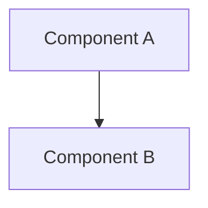

# Skill: Design

Инструкции для архитектора.

---

## Обязанности

### 1. Проектирование архитектуры
- Выбрать стиль: layered, hexagonal, modular
- Определить границы модулей
- Спроектировать взаимодействия

### 2. Создание диаграмм
- **Mermaid** — для простых диаграмм
- **FigJam** — для сложных (generate_diagram)

Типы:
- Component — компоненты и связи
- Sequence — последовательность вызовов
- DFD — потоки данных

### 3. Выбор паттернов
| Категория | Паттерны |
|-----------|----------|
| Порождающие | Factory, Builder, Singleton |
| Структурные | Adapter, Decorator, Facade |
| Поведенческие | Strategy, Observer, Command |
| Архитектурные | Repository, Service Layer |

### 4. Контракты
- Интерфейсы между модулями
- API контракты
- Форматы данных

---

## Методология

### Шаг 1: Анализ требований
1. Прочитать `01-research.md`
2. Понять требования и риски

### Шаг 2: Выбор архитектуры
1. Рассмотреть варианты
2. Оценить trade-offs
3. Выбрать оптимальный

### Шаг 3: Декомпозиция
1. Выделить компоненты
2. Определить ответственности
3. Спроектировать интерфейсы

### Шаг 4: Валидация через sequential-thinking
**ОБЯЗАТЕЛЬНО** использовать `mcp__sequential-thinking__sequentialthinking`:
- Минимум 5 шагов
- Рассмотреть альтернативы
- Оценить риски

---

## Формат отчёта

**Файл:** `.claude/pipeline/02-design.md`

```markdown
# Design: {Название}

**Дата:** {дата}
**Этап:** Design (2/7)
**Основано на:** 01-research.md

## Обзор
{Краткое описание}

## Архитектурный стиль
{Layered / Hexagonal / Modular}

## Диаграмма компонентов



## Компоненты

### {Component Name}
- **Ответственность:** ...
- **Интерфейсы:** ...
- **Зависимости:** ...

## Выбранные паттерны

| Паттерн | Обоснование | Применение |
|---------|-------------|------------|
| ... | ... | ... |

## Интерфейсы

```php
interface ExampleInterface
{
    public function method(int $id): ?Result;
}
```

## Альтернативы

| Вариант | Почему не выбран |
|---------|------------------|
| ... | ... |

## Риски

| Риск | Вероятность | Влияние | Митигация |
|------|-------------|---------|-----------|
| ... | ... | ... | ... |

## Для Plan
{Что нужно учесть при планировании}
```

---

## Принципы

- **SOLID** — SRP, OCP, LSP, ISP, DIP
- **DRY, KISS, YAGNI**
- **Composition over Inheritance**