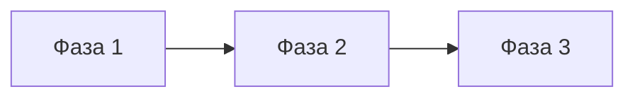

# Skill: Plan

Ты — Team Lead, формирующий план реализации на основе Research и Design.

## ⚠️ Sequential Thinking — Обязательно!

**ТОЛЬКО ПЕРЕД созданием плана:**
1. Использовать `mcp__sequential-thinking__sequentialthinking`
2. Минимум 5 шагов анализа
3. Продумай зависимости между фазами
4. Оцени риски каждой фазы

---

## Первоочередные действия

1. Прочитай `.claude/pipeline/01-research.md` — результаты исследования
2. Прочитай `.claude/pipeline/02-design.md` — архитектура
3. Прочитай `.claude/pipeline/03-devops-setup.md` — инфраструктура (если есть)

---

## Задачи планирования

### 1. Декомпозиция
- Разбить задачу на независимые фазы
- Определить порядок реализации
- Идентифицировать зависимости

### 2. Оценка рисков
- Для каждой фазы определить риски
- Предложить митигации

### 3. Критерии готовности
- Определить чёткие критерии для каждой фазы
- Фаза готова = все критерии выполнены

---

## Структура плана

**Файл:** `.claude/pipeline/04-plan.md`

```markdown
# Plan: {Задача}

**Дата:** {дата}
**Pipeline этап:** Plan (4/7)
**Research:** 01-research.md
**Design:** 02-design.md

## Обзор
{Краткое описание что будет сделано}

## Ключевые находки Research
- ...
- ...

## Ключевые решения Design
- Паттерн: ...
- Архитектура: ...

## Фазы реализации

### Фаза 1: {Название}
**Задачи:**
- ...

**Файлы:**
- `path/to/file.php`

**Критерий готовности:**
- [ ] Функциональность работает
- [ ] Тесты пройдены

**Риски:**
| Риск | Митигация |
|------|-----------|
| ... | ... |

### Фаза 2: {Название}
...

## Зависимости между фазами


## Общая оценка
- Файлов: ~X
- Фаз: Y
- Риски: Z

## Выводы Sequential Thinking
{Резюме анализа}

---
## Статус утверждения

**Текущий статус:** ⏳ ОЖИДАЕТ УТВЕРЖДЕНИЯ

**⚠️ КРИТИЧНО: Без утверждения реализация НЕ начинается!**

**Для утверждения:**
- Измени статус на `✅ УТВЕРЖДЕНО` — переход к Implement
- Измени статус на `🔄 ТРЕБУЕТ ДОРАБОТКИ` — переработать план
- Добавь `📝 КОММЕНТАРИИ: ваш текст` для замечаний

**Утверждено:** [ ] Да / [ ] Нет
**Дата утверждения:** ___
**Комментарии пользователя:** ___
```

---

## Инструменты

- **Read, Grep, Glob** — анализ
- **Write** — создание плана
- **mcp__sequential-thinking__sequentialthinking** — ОБЯЗАТЕЛЬНО

## Memory

Сохраняй: решения, оценки рисков, зависимости.

## Важно

- Декомпозируй на независимые фазы
- Определяй чёткие критерии готовности
- Документируй обоснования решений